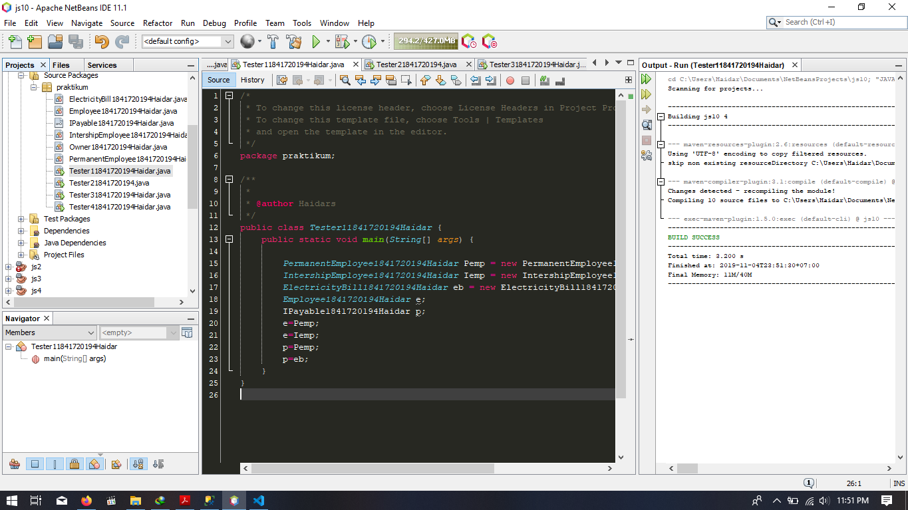
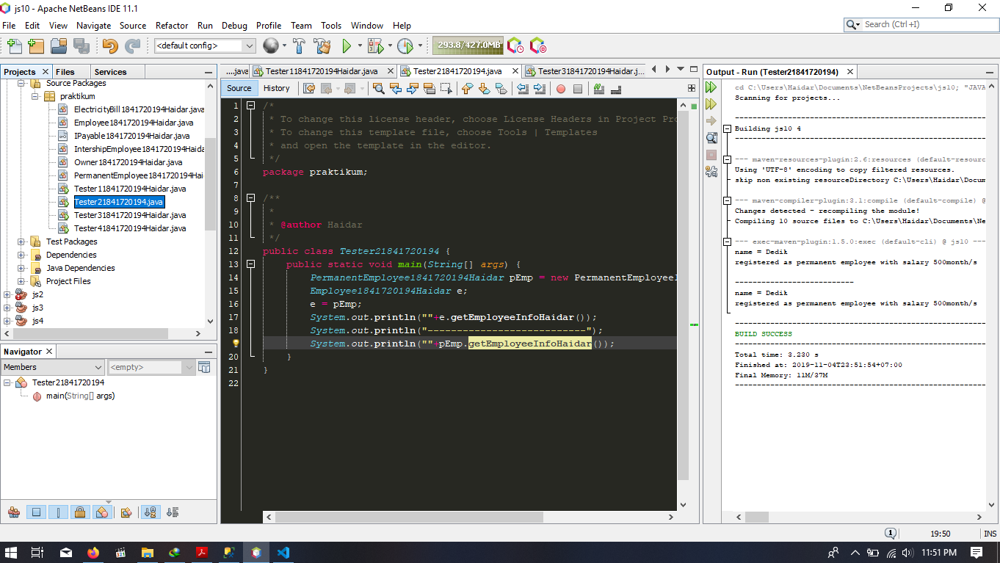
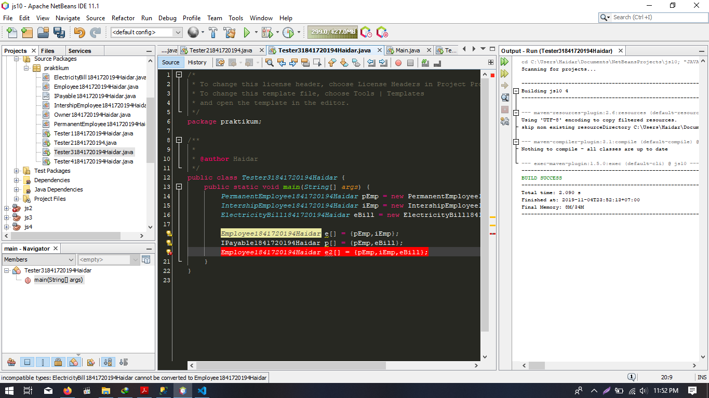
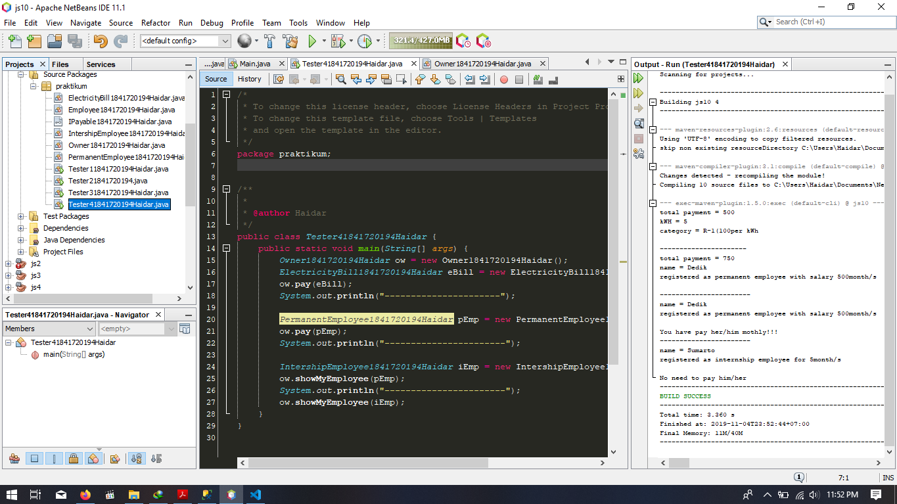
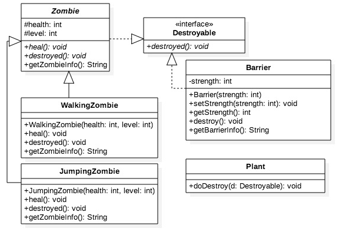
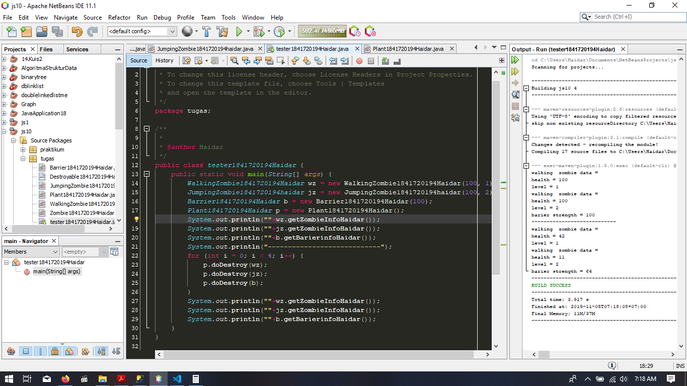

# Laporan Praktikum #10 - Polimorfisme

## Kompetensi

Setelah melakukan percobaan pada jobsheet ini, diharapkan mahasiswa
mampu:
a. Memahami konsep dan bentuk dasar polimorfisme
b. Memahami konsep virtual method invication
c. Menerapkan polimorfisme pada pembuatan heterogeneous collection
d. Menerapkan polimorfisme pada parameter/argument method
e. Menerapkan object casting untuk meng-ubah bentuk objek

## Ringkasan Materi

dalam jobsheet ini kita akan mendapatkan pemahaman tentang :

* Virtual Method Invocation 
> Virtual method invocation terjadi ketika ada pemanggilan overriding method dari suatu objek polimorfisme. Disebut virtual karena antara method yang dikenali oleh compiler dan method yang dijalankan oleh JVM berbeda.

* Heterogeneous Collection
> Dengan adanya konsep polimorfisme, maka variabel array bisa dibuat heterogen. Artinya di dalam array tersebut bisa berisi berbagai macam objek yang berbeda

* Polymorphic Argument
> Polimorfisme juga bisa diterapkan pada argument suatu method. Tujuannyaagar method tersebut bisa menerima nilai argument dari berbagai bentuk objek.

* Operator Instanceof
> Operator instanceof bisa digunakan untuk mengecek apakah suatu objek merupakan hasil instansiasi dari suatu class tertentu. Hasil dari instanceof berupa nilai boolean.

* Object Casting
> Casting objek digunakan untuk mengubah tipe dari suatu objek. Jika ada suatu objek dari subclass kemudian tipenya diubah ke superclass, maka hal ini termasuk ke upcasting. Downcast terjadi jika ada suatu objek superclass, kemudian diubah menjadi objek dari subclass. Proses downcasting sering disebut juga sebagai explicit casting, karena bentuk tujuan dari casting harus dituliskan dalam tanda kurung, di depan objek yang akan di-casting.

   

## Percobaan 1

Penjelasan :

* pengenalan dasar dari polimorfisme akan di lakukan pada percobaan kali ini, dimana parent / implement dari suatu objek bisa menjadi wadah dari anak-anak ataupun yang meng-implement pada class tersebut

>

Link Program Untuk Percobaan Pertama
> 1. (Tester1) : [link ke kode program](../../src/10_Polimorfisme/Tester11841720194Haidar.java)

> 2. (ElectricityBill) : [link ke kode program](../../src/10_Polimorfisme/ElectricityBill1841720194Haidar.java)

> 3. (Employee) : [link ke kode program](../../src/10_Polimorfisme/EmployeeBill1841720194Haidar.java)

> 4. (IntershipEmployee) : [link ke kode program](../../src/10_Polimorfisme/IntershipEmployee1841720194Haidar.java)

> 5. (IPayable) : [link ke kode program](../../src/10_Polimorfisme/IPayable1841720194Haidar.java)

> 6. (PermanentEmployee) : [link ke kode program](../../src/10_Polimorfisme/PermanentEmployee1841720194Haidar.java)

#### Pertanyaan Percobaan 1

1. Class apa sajakah yang merupakan turunan dari class Employee?

>Internship dan Permanent Employee

2. Class apa sajakah yang implements ke interface Payable?

>PermanentEmployee dan ElectricityBill

3. Perhatikan class Tester1, baris ke-10 dan 11. Mengapa e, bisa diisi dengan objek pEmp (merupakan objek dari class PermanentEmployee) dan objek iEmp (merupakan objek dari class InternshipEmploye) ?

>karena menerapkan konsep polimorfisme dan juga karena class tersebut inheritance dari class Employee

4. Perhatikan class Tester1, baris ke-12 dan 13. Mengapa p, bisa diisi dengan objek pEmp (merupakan objek dari class PermanentEmployee) dan objek eBill (merupakan objek dari class ElectricityBill) ?

> Karena class-class tersebut Mengimplement pada class Payable

5. Coba tambahkan sintaks: p = iEmp; e = eBill; pada baris 14 dan 15 (baris terakhir dalam method main) ! Apa yang menyebabkan error?

>ya karena mereka tidak meng-implementasikan syarat dari polimorfisme yaitu saling berhubungan melalui extend atau implements

6. Ambil kesimpulan tentang konsep/bentuk dasar polimorfisme!

>class parent atau implement bisa di gunakan sebagai wadah dari anak-anak atau objek yang meng-implements kepadanya
   

## Percobaan 2

Penjelasan :

* kita akan di kenalkan dengan Virtual Method Invocation

>

Link Program Untuk Percobaan kedua:

> 1. (Tester2) : [link ke kode program](../../src/10_Polimorfisme/Tester21841720194Haidar.java)

#### Pertanyaan Percobaan 2

1. Perhatikan class Tester2 di atas, mengapa pemanggilan e.getEmployeeInfo() pada baris 8 dan pEmp.getEmployeeInfo() pada baris 10 menghasilkan hasil sama?
2. Mengapa pemanggilan method e.getEmployeeInfo() disebut sebagai pemanggilan method virtual (virtual method invication), sedangkan pEmp.getEmployeeInfo() tidak?
3. Jadi apakah yang dimaksud dari virtual method invocation? Mengapa disebut virtual?

#### Jawaban Pertanyaan Percobaan 2

1. karena pada sebelumnya telah di deklarasikan bahwa e berisi Pemp sehingga ketika pemanggilan fungsi dalam e akan berubah sesuai dengan isinya, dan merujuk pada class Pemp
2. karena objek e telah berubah menjadi pemp
3. disebut virtual karena merepresentasikan bentuk yang berbeda dari dirinya, namun tetap bisa menjadi dirinya sendiri bila tidak di ubah menjadi objek yang lain
   

## Percobaan 3

Penjelasan :

* 

>

Link Program Untuk Percobaan Pertama Ketiga
> 1. (Tester3) : [link ke kode program](../../src/10_Polimorfisme/Tester31841720194Haidar.java)

#### Pertanyaan Percobaan 3

1. Perhatikan array e pada baris ke-8, mengapa ia bisa diisi dengan objek-objek dengan tipe yang berbeda, yaitu objek pEmp (objek dari PermanentEmployee) dan objek iEmp (objek dari InternshipEmployee) ?
2. Perhatikan juga baris ke-9, mengapa array p juga biisi dengan objekobjek dengan tipe yang berbeda, yaitu objek pEmp (objek dari PermanentEmployee) dan objek eBill (objek dari ElectricityBilling) ?
3. Perhatikan baris ke-10, mengapa terjadi error?

#### Jawaban Pertanyaan Percobaan 3

1. karena bisa di isi dengan mereka berdua, penjelasan kan ada pada percobaan 1 konsep dasar polimorfisme dimana class parent atau impelementasi bisa di isi dengan child / implement class tersebut
2. alhamdulillah jawabannya sama dengan yang di atas
3. karena ebill tidak memiliki direct relation sama sekali terhadap class Employee
   

## Percobaan 4

penjelasan :

* 

>

Link Program Untuk Percobaan Keempat

> 1. (Tester4) : [link ke kode program](../../src/10_Polimorfisme/Tester41841720194Haidar.java)
> 2. (Owner) : [link ke kode program](../../src/10_Polimorfisme/Owner1841720194Haidar.java)

#### Pertanyaan Percobaan 4

1. Perhatikan class Tester4 baris ke-7 dan baris ke-11, mengapa pemanggilan ow.pay(eBill) dan ow.pay(pEmp) bisa dilakukan, padahal jika diperhatikan method pay() yang ada di dalam class Owner memiliki argument/parameter bertipe Payable? Jika diperhatikan lebih detil eBill merupakan objek dari ElectricityBill dan pEmp merupakan objek dari PermanentEmployee?
2. Jadi apakah tujuan membuat argument bertipe Payable pada method pay() yang ada di dalam class Owner?
3. Coba pada baris terakhir method main() yang ada di dalam class Tester4 ditambahkan perintah ow.pay(iEmp); Mengapa terjadi error?
4. Perhatikan class Owner, diperlukan untuk apakah sintaks p instanceof ElectricityBill pada baris ke-6 ?
5. Perhatikan kembali class Owner baris ke-7, untuk apakah casting objek disana (ElectricityBill eb = (ElectricityBill) p) diperlukan ? Mengapa objek p yang bertipe Payable harus di-casting ke dalam objek eb yang bertipe ElectricityBill ?

#### Jawaban Pertanyaan Percobaan 4

1. karena PermanentEmployee dan ElectricityBill mengimplemen class Payable
2. Supaya method pay() hanya bisa dijalankan pada class yang mengimplement Payable
3. karena class InternshipEmployee tidak mengimplement Payable
4. untuk mengecek hubungan apakah objek p yang merupakan hasil instansiasi dari interface Payable terhadap class ElectricityBill
5. Untuk dikembalikan ke instansiasi sesungguhnya sehingga dapat memanggil method getBillInfo() yang hanya ada di class ElectricityBill

   

## Tugas

Class Diagram Soal
>

#### Jawaban Tugas

>

Link Program Untuk Tugas

> 1. (tester) : [link ke kode program](../../src/10_polimorfisme/tugas/tester1841720194Haidar.java)

> 2. (Destroyable) : [link ke kode program](../../src/10_polimorfisme/tugas/Destroyable1841720194Haidar.java)

> 3. (JumpingZombie) : [link ke kode program](../../src/10_polimorfisme/tugas/JumpingZombie1841720194Haidar.java)

> 4. (WalkingZombie) : [link ke kode program](../../src/10_polimorfisme/tugas/WalkingZombie1841720194Haidar.java)

> 5. (Plant) : [link ke kode program](../../src/10_polimorfisme/tugas/Plant1841720194Haidar.java)

> 6. (Barrier) : [link ke kode program](../../src/10_polimorfisme/tugas/Barrier1841720194Haidar.java)

## Kesimpulan

* Dari berbagai Percobaan di atas kita belajar banyak hal tentang polimorfisme lebih detail dari bentuk polimorfisme, penggunaan, dan fungsi-fungsi penting yang pastinya berguna bagi pemrograman, sehingga strukturalisasi pemrograman dan limitasi program menjadi lebih simple dan efisien, pengurangan terjadinya pemborosan memori dan percepatan kompilasi program karena menghemat resource yang ada dengan cara menggunakan bentuk2 polimorfisme

## Pernyataan Diri

Saya menyatakan isi tugas, kode program, dan laporan praktikum ini dibuat oleh saya sendiri. Saya tidak melakukan plagiasi, kecurangan, menyalin/menggandakan milik orang lain.

Jika saya melakukan plagiasi, kecurangan, atau melanggar hak kekayaan intelektual, saya siap untuk mendapat sanksi atau hukuman sesuai peraturan perundang-undangan yang berlaku.

Ttd,

***(Haidar Sakti Oktafiansyah)***
