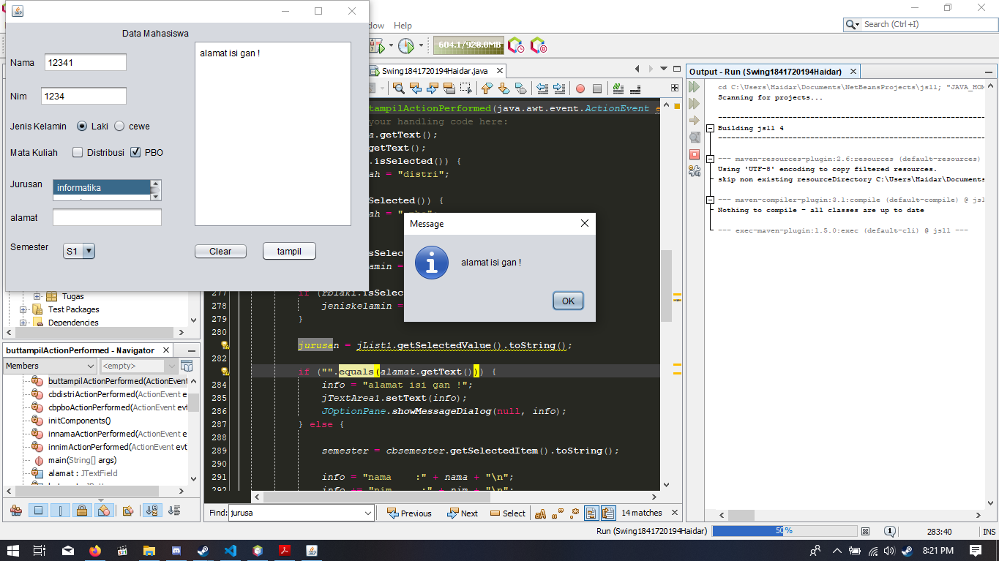

# Laporan Praktikum #11 - GUI

## Kompetensi

Setelah menempuh pokok bahasan ini, mahasiswa mampu:

Setelah menyelesaikan lembar kerja ini mahasiswa diharapkan mampu:
1. Membuat aplikasi Graphical User Interface sederhana dengan bahasa pemrograman java;
2. Mengenal komponen GUI seperti frame, label, textfield, combobox, radiobutton, checkbox, textarea, menu, serta table;
3. Menambahkan event handling pada aplikasi GUI.

## Ringkasan Materi

Java Swing merupakan bagian dari JFC (Java Foundation Classes) yang menyediakan API untuk menangani hal yang berkaitan dengan GUI bagi program Java. Kita bisa membedakan komponen Swing dengan komponen AWT, di mana pada umumnya kelas-kelas yang berada dalam komponen Swing diawali dengan huruf J, misal: JButton, JLabel, JTextField, JRadioButton.

   

## Percobaan 1

Penjelasan :

Untuk membuat aplikasi Java berbasis GUI, kita butuh sebuah frame atau applet untuk media eksekusi aplikasi GUI. Pada Java sebuah frame dapat diwakili oleh sebuah kelas, yaitu JFrame. Melalui kelas JFrame kita bisa mendesain tampilan Java GUI sesuai kebutuhan. Beberapa method yang penting dan sering dipakai yaitu:

a. setSize() : menentukan ukuran frame

b. setLocation() : menentukan lokasi frame pada bagian pojok kiri atas

c. setVisible() : menampilkan frame

d. setDefaultCloseOperation() : menentukan operasi ketika frame ditutup

e. setLocationRelativeTo() : menentukan lokasi frame relatif terhadap parameter komponen yang diinputkan

f. Pack() : menentukan secara otomatis ukuran frame sesuai komponen yang dimasukkan

>

Link Program Untuk Percobaan Pertama
> 1. (HelloGUI) : [link ke kode program](../../src/11_GUI/Prak/HelloGui1841720194Haidar.java)

   

## Percobaan 2

Penjelasan :

Selanjutnya adalah bagaimana memanfaatkan komponen-komponen GUI pada Java untuk menangani inputan, dengan memanfaatkan JFrame, JButton, JLabel, JTextField, JPanel

>

Link Program Untuk Percobaan kedua:

> 1. (HelloGUI) : [link ke kode program](../../src/11_GUI/Prak/InputGui1841720194Haidar.java)

## Pertanyaan Percobaan 2

* Modifikasi kode program dengan menambahkan JButton baru untuk melakukan fungsi perhitungan penambahan, sehingga ketika button di klik (event click) maka akan menampilkan hasil penambahan dari nilai A dan B

>

   

## Percobaan 3

Penjelasan :

Java GUI menyediakan beberapa layout yang dapat digunakan pada program. Pada modul praktikum ini akan dijelaskan 3 contoh GUI layout, yaitu:

a) Border layout

b) Grid layout

c) Box layout

Sebuah layout border dapat diilustrasikan pada Gambar dibawah, di mana kita dapat meletakkan komponen GUI pada lokasi tertentu misal utara, barat, tengah, timur, dan selatan. Untuk menentukan jenis layout yang akan digunakan, kita dapat memanggil method setLayout() dan selanjutnya memasukkan objek Border Layout.

>

Link Program Untuk Percobaan Pertama Ketiga:

> 1. (Layout) : [link ke kode program](../../src/11_GUI/MGUI/LayoutGui1841720194Haidar.java)

> 2. (Border) : [link ke kode program](../../src/11_GUI/MGUI/Border1841720194Haidar.java)

> 3. (Box) : [link ke kode program](../../src/11_GUI/MGUI/Box1841720194Haidar.java)

> 4. (Grid) : [link ke kode program](../../src/11_GUI/MGUI/Grid1841720194Haidar.java)

## Pertanyaan Percobaan 3

a) Apa perbedaan dari Grid Layout, Box Layout dan Border Layout?
b) Apakah fungsi dari masing-masing kode berikut?
>

Jawab : 

a)

    Border menggunakan fungsi arah mata angin north, north, south, west dll lalu hasilnya akan menempel pada ujung dari arah tersebut

    Grid membagi rata secara sepadan

    Box membagi persegi tiap konten

b)

    Baris Pertama Instansiasi Objek

    Baris Kedua code untuk menghentikan program jika di tutup

    Baris ketiga untuk menampilkan JFrame

   

## Percobaan 4

penjelasan :

* Swing merupakan cara gampang untuk mendesain GUI, tinggal drag and drop untuk mendapatkan bentuk GUI yang di inginkan

>

Link Program Untuk Percobaan Keempat

> 1. (Swing) : [link ke kode program](../../src/11_GUI/JFrame/Swing1841720194Haidar.java)

## Pertanyaan Percobaan 4

a) Apakah fungsi dari kode berikut?
>

b) Mengapa pada bagian logika checkbox dan radio button digunakan multiple if ?

c) Lakukan modifikasi pada program untuk melakukan menambahkan inputan berupa alamat dan berikan fungsi pemeriksaan pada nilai Alamat tersebut jika belum diisi dengan menampilkan pesan peringatan

Jawaban :

a) membuat dan menampilkan form

b) karena pilihan dan pastinya membutuhkan percabangan

c) >

   

## Percobaan 5

>

Link Program Untuk Percobaan Keempat

> 1. (Swing2) : [link ke kode program](../../src/11_GUI/JFrame/Swing21841720194Haidar.java)

## Pertanyaan Percobaan 5

a) Apa kegunaan komponen swing JTabPane, JTtree, pada percobaan 5?

b) Modifikasi program untuk menambahkan komponen JTable pada tab Halaman 1 dan tab Halaman 2

Jawab :

a) membuat tab panelm dan membuat menu tree

b) >

   

## Tugas

b) >

Link Program Untuk Tugas

> 1. (Tugas) : [link ke kode program](../../src/11_GUI/JFrame/Kalkulator1841720194Haidar.java)

## Kesimpulan

* saya jadi faham bagiamana membuat suatu GUI, mengambil nilai, mengelurakan penggunaan JPanel dan lain-lain
* praktikum ini membantu bagainaman menggunakan JForm dengan baik dan benar
* paratikum ini membantu membuat aplikasi sederhana sehingga hasilnya tidak monoton layaknya menggunakan command line

## Pernyataan Diri

Saya menyatakan isi tugas, kode program, dan laporan praktikum ini dibuat oleh saya sendiri. Saya tidak melakukan plagiasi, kecurangan, menyalin/menggandakan milik orang lain.

Jika saya melakukan plagiasi, kecurangan, atau melanggar hak kekayaan intelektual, saya siap untuk mendapat sanksi atau hukuman sesuai peraturan perundang-undangan yang berlaku.

Ttd,

***(Haidar Sakti Oktafiansyah)***
