# Laporan Praktikum #12 - Java_API

## Kompetensi

Setelah menempuh pokok bahasan ini, mahasiswa mampu:

* Memahami cara penyimpanan objek menggunakan Collection dan Map.
* Mengetahui pengelompokan dari Collection.
* Mengetahui perbedaan dari interface Set, List dan Map.
* Mengetahui penggunaan class-class dari interface Set, List, dan Map.
* Memahami koneksi database menggunakan JDBC dan JDBC API
  
## Ringkasan Materi

* saya mengetahui java API
* mengetahui library dari macam macam penyimpanan objek
* saya tahu bagaimana penggunaan dan perbedaan menggunakan collection dan Map
* memahami pengkoneksian JDBC

   

## Percobaan 1 (Set-HashSet)

Penjelasan :

Set mengikuti model himpunan, dimana objek/anggota yang tersimpan dalam Set harus unik. Urutan maupun letak dari anggota tidak penting, hanya keberadaan anggota saja yang penting. Kelas konkrit yang mengimplementasikan Set harus memastikan bahwa tidak terdapat elemen duplikat yang dapat ditambahkan ke dalam set. Yaitu, tidak terdapat dua elemen e1 dan e2 yang berada di dalam set yang membuat e1.equals(e2) bernilai true. Class- Class yang mengimplementasikan interface Set adalah HashSet. 

>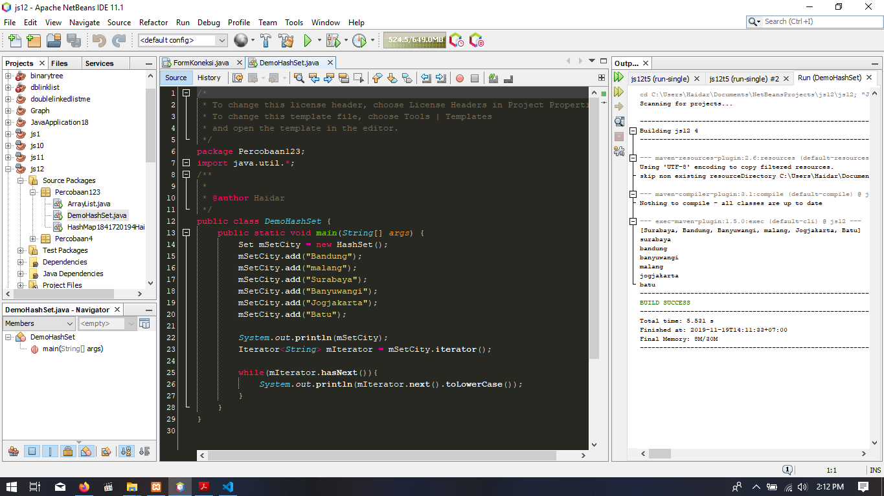

Link Program Untuk Percobaan Pertama
> 1. (DemoHashSet) : [link ke kode program](../../src/13_Java_API/DemoHashSet.java)

#### Pertanyaan
 1. Apakah fungsi import java.util.*; pada program diatas!
 2. Pada baris program keberapakah yang berfungsi untuk menciptakan object HashSet?
 3. Apakah fungsi potongan program dibawah ini pada percobaan 1!
    
    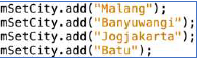
 4. Tambahkan set.add(“Malang”); kemudian jalankan program! Amati hasilnya dan jelaskan mengapa terjadi error!
 5. Jelaskan fungsi potongan program dibawah ini pada percobaan 1!

    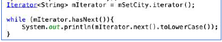

#### Jawaban

 1. Untuk meng-import library util yang berisi berbagai macam class seperti: HashSet, ArrayList, HashMap, dan lain-lain.
 2. 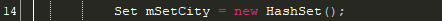
 3. Untuk menambahkan element kedalam HashSet bernama mSetCity.
 4. Terjadi error dikarenakan HashSet / Set bernama set belum ada, sehingga terjadi error.
 5. Fungsi dari interface Iterator mIterator = mSetCity.iterator(); adalah untuk memperbolehkan kita traverse, akses data dan menghapus data dari collection (mSetCity).

   

## Percobaan 2 (List)

Penjelasan :

List digunakan untuk menyimpan sekumpulan objek berdasarkan urutan masuk (ordered) dan menerima duplikat. Cara penyimpanannya seperti array, oleh sebab itu memiliki posisi awal dan posisi akhir, menyisipkan objek pada posisi tertentu, mengakses dan menghapus isi list, dimana semua proses ini selalu didasarkan pada urutannya. Class-class yang mengimplementasikan interface List adalah Vector, Stack, Linked List dan Array List. Pada jobsheet ini yang akan dibahas adalah ArrayList.

>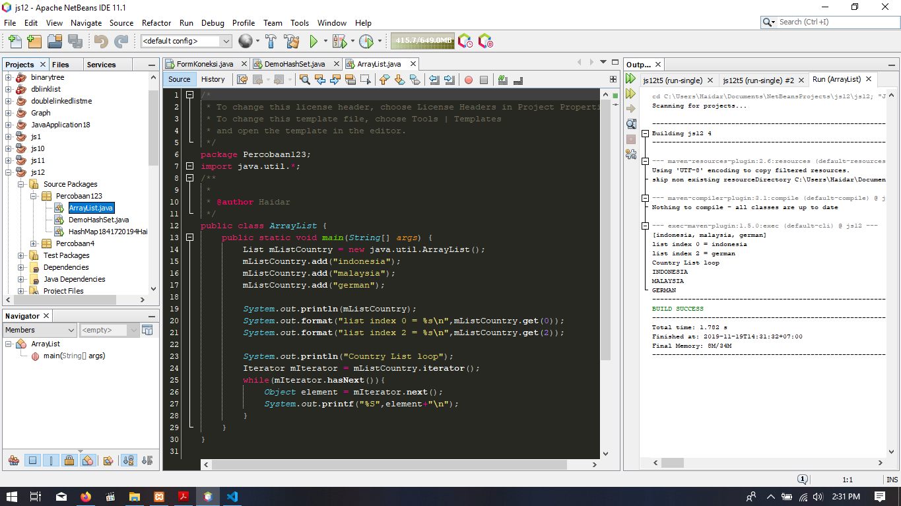

Link Program Untuk Percobaan kedua:

> 1. (ArrayList) : [link ke kode program](../../src/12_Java_API/Prak/ArrayList.java)

#### Pertanyaan Percobaan 2

1. Apakah fungsi potongan program dibawah ini!

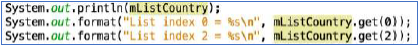
2. Ganti potongan program pada soal no 1 menjadi sebagai berikut

3. Jelaskan perbedaan menampilkan data pada ArrayList menggunakan potongan program pada
soal no 1 dan no 2!

#### Jawaban Pertanyaan Percobaan 2

1. Untuk mencetak seluruh data dari mListArray dan pada program system.out.format berfungsi untuk print data secara spesifik, pada potongan kode diatas diambil data dari mListArray index 0 dan index 2.

2. sudah pak, coba lihat pada gambar di atas

3. nomer satu di akses per index sedangkan nomer 2 di loop untuk seluruh isinya 

   

## Percobaan 3 (Map)

Penjelasan :

Perbedaaan mendasar map dengan collection yang lain, untuk menyimpan objek pada Map, perlu sepasang objek, yaitu key yang bersifat unik dan nilai yang disimpan. Untuk mengakses nilai tersebut maka kita perlu mengetahui key dari nilai tersebut. Map juga dikenal sebagai dictionary/kamus. Pada saat menggunakan kamus, perlu suatu kata yang digunakan untuk pencarian. Class-class yang mengimplementasikan Map adalah Hashtable,HashMap, LinkedHashMap. Pada jobsheet ini yang akan dibahas adalah HashMap. Pembuatan objek HashMap adalah sebagai berikut:

>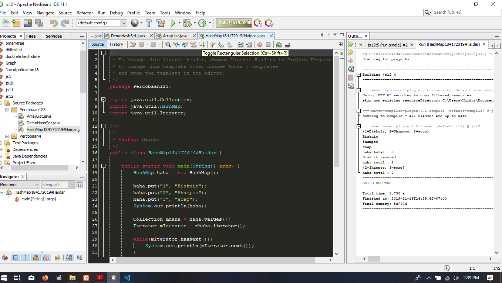

Link Program Untuk Percobaan Pertama Ketiga:

> 1. (HashMap) : [link ke kode program](../../src/12_java_API/HashMap1841720194Haidar.java)

#### Pertanyaan Percobaan 3

1. Jelaskan fungsi hMapItem.put("1","Biskuit") pada program!
2. Jelaskan fungsi hMapItem.size() pada program!
3. Jelaskan fungsi hMapItem.remove("1") pada program!
4. Jelaskan fungsi hMapItem.clear() pada program!
5. Tambahkan kode program yang di blok pada program yang sudah anda buat!

>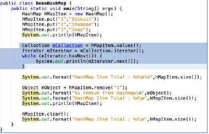
6. Jalankan program dan amati apa yang terjadi!
7. Apakah perbedaan program sebelumnya dan setelah ditambahkan kode program pada soal no 5 diatas? Jelaskan!

#### Jawaban Pertanyaan Percobaan 3

1. Untuk menambahkan element pada HashMap dengan key 1 dan value Biskuit.
2. Untuk mendapatkan banyaknya data yang ada dalam HashMap.
3. Untuk menghapus data dengan acuan data yang dihapus adalah data pada key 1.
4. Untuk menghapus semua data yang ada dalam HashMap.
5. sudah pak pada gambar di atas, sudah saya tambahkan
6. ngeprintnya dengan satu iterator
7. Values dari hMapItem telah dimasukkan kedalam Collection bernama mCollection sehingga tidak perlu menggunakan key untuk mengakses value kemudian dilakukan traverse

   

## Percobaan 4 (Implementasi ArrayList dalam GUI)

penjelasan :

* array list di gunakan untuk menyimpan banyak data

>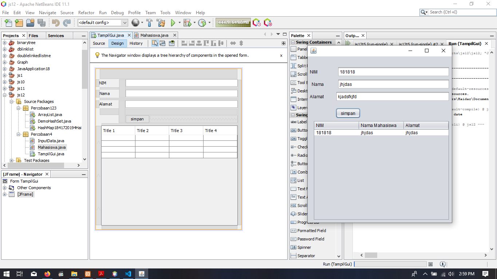

Link Program Untuk Percobaan Keempat

> 1. (Mahasiswa) : [link ke kode program](../../src/12_Java_API//Mahasiswa.java)
> 2. (InputData) : [link ke kode program](../../src/12_Java_API//InputData.java)
> 3. (TampilGui) : [link ke kode program](../../src/12_Java_API//TampilGui.java)
> 4. (TampilGui) : [link ke kode program](../../src/12_Java_API//TampilGui.form)

   

## Percobaan 5

penjelasan :

* praktikum ini akan memperkenalkan bagaimana meng-koneksikan database mysql dengan program java

>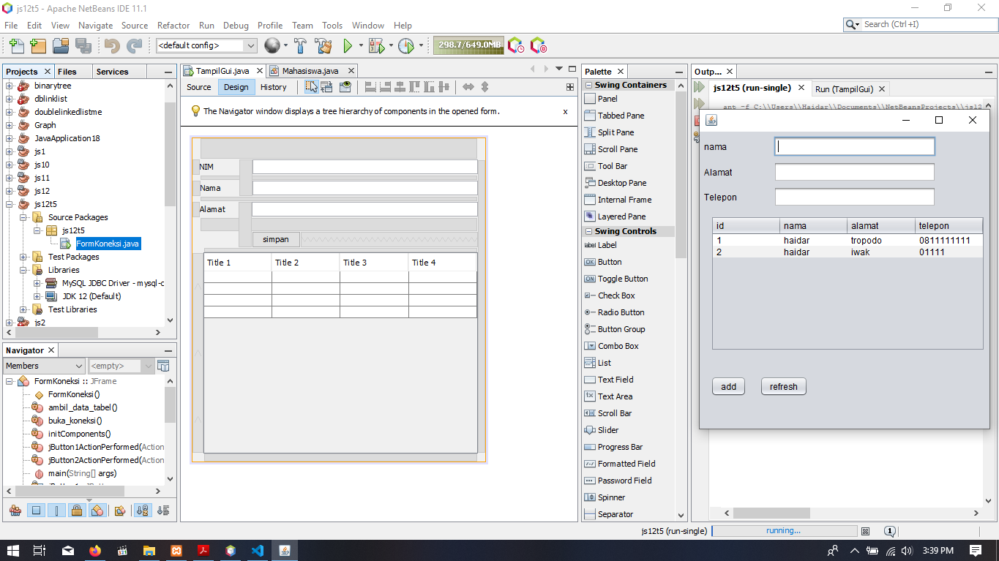
>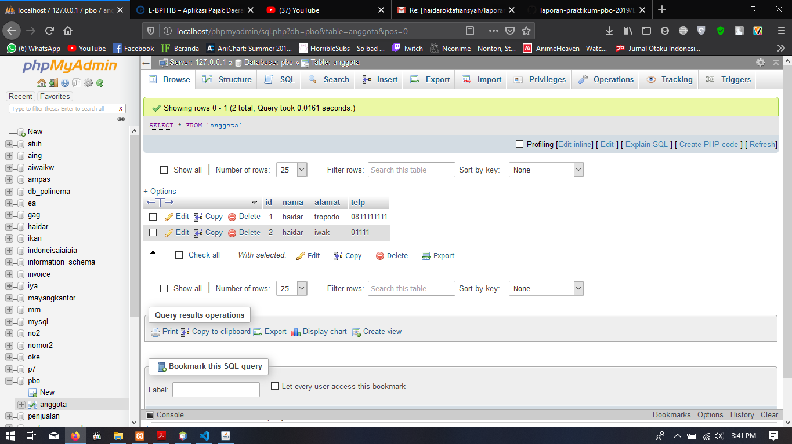

Link Program Untuk Percobaan Keempat

> 1. (FormKoneksi.java) : [link ke kode program](../../src/12_Java_API/FormKoneksi.java)
> 2. (FormKoneksi.form) : [link ke kode program](../../src/12_Java_API/FormKoneksi.form)

9. Jelaskan alur dari method ambil_data_tabel?
    
    - inisialisasi table sementara sebelum di push ke database
    - pengambilan data dan di taruh pada table sementara
    - java program di koneksikan dengan port yang terhubung dengan database, pemberian alamat
    - penambahan data dengan meng-push data sementara ke database
10. Buat fungsi untuk merefresh sehingga data yang baru dapat ditampilkan pada tabel.

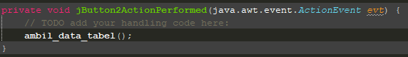

   

## Kesimpulan

* Memahami cara penyimpanan objek menggunakan Collection dan Map.
* Mengetahui pengelompokan dari Collection.
* Mengetahui perbedaan dari interface Set, List dan Map.
* Mengetahui penggunaan class-class dari interface Set, List, dan Map.
* Memahami koneksi database menggunakan JDBC dan JDBC API
* seberjuang apapun saya mendokumentasikan, nilai saya B+, Alhamdulillah

## Pernyataan Diri

Saya menyatakan isi tugas, kode program, dan laporan praktikum ini dibuat oleh saya sendiri. Saya tidak melakukan plagiasi, kecurangan, menyalin/menggandakan milik orang lain.

Jika saya melakukan plagiasi, kecurangan, atau melanggar hak kekayaan intelektual, saya siap untuk mendapat sanksi atau hukuman sesuai peraturan perundang-undangan yang berlaku.

Ttd,

***(Haidar Sakti Oktafiansyah)***
