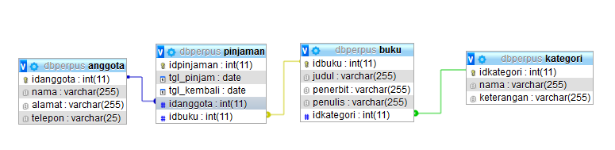
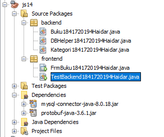
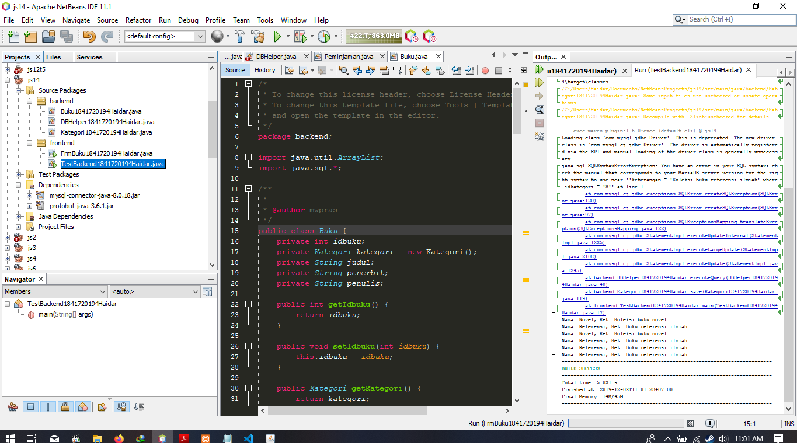
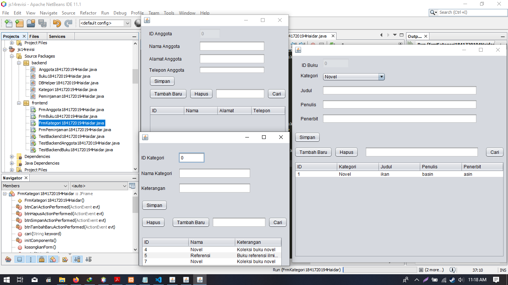
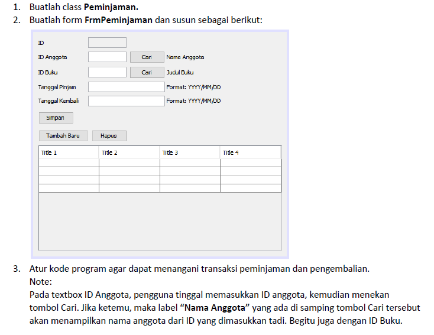
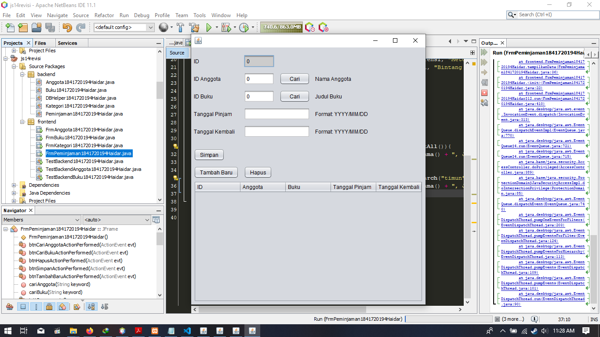

# Laporan Praktikum #14 - GUI Dan DATABASE
## Kompetensi

Setelah menempuh materi percobaan ini, mahasiswa mampu mengenal:
1. Menggunakan paradigma berorientasi objek untuk interaksi dengan database
2. Membuat backend dan frontend
3. Membuat form sebagai frontend
  
## Ringkasan Materi

* saya mengetahui apa istilah front end dan back end
* saya mengetahui pengkoneksian form ke database
* saya mengetahui penggunaan xml dalam java
* saya mengetahui dependency pada maven graddle dan jar
* saya mengetahui pengquerrian ke database dengan program java

   

## Percobaan 1 (Pembuatan Database)

Penjelasan :

Pembuatan Database Beserta Relasi

>

   

## Percobaan 2 (Penambahan Dependency)

Penjelasan :

pada source code kita harus mengimpor dependency(maven) untuk mendapatkan library yang kita butuhkan, di sini kita membutuhkan konektor mysql

>

   

## Percobaan 3 (DBHelper/connector)

Penjelasan :

membuat Koneksi antara program java dan database yang source codenya bisa di ambil pada link di bawah :

Link Program Untuk Percobaan Pertama Ketiga:

>(DBHelper) : [link ke kode program](../../src/14_GUI_dan_Database/DBHelper1841720194Haidar.java)

   

## Percobaan 4 (CRUD Handler)

penjelasan :

pemrosesan data dalam database haruslah menggunakan query yang mana akan di jelaskan dalam percobaan kali ini untuk bagaimana men-querykan suatu data agar bisa di proses dalam database sourcode contoh penghandle-an salah satu table dalam database telah saya sediakan di bawah

Link Program Untuk Percobaan Keempat

>(Kategori) : [link ke kode program](../../src/14_GUI_dan_Database/Kategori1841720194Haidar.java)

   

## Percobaan 5 (Backend Tester)

penjelasan :

proses handling database perlulah di lakukan oleh karena itu di sediakan tester untuk men-check apakah sudah terkoneksi dengan benar source code untuk melakukannya ada di bawah

>

Link Program Untuk Percobaan Keempat

>(TestBackend) : [link ke kode program](../../src/14_GUI_dan_Database/TestBackend1841720194Haidar.java)

   

## Percobaan 5,6,7,8 (Form Handler dan Backendnya)

penjelasan :

dalam percobaan kali ini di tujukan untuk membuat form handler dalam bentuk gui sehingga user pemula lebih bisa menggunakan suatu program

frontend :

>(FrmBuku) : [link ke kode program](../../src/14_GUI_dan_Database/FrmBuku1841720194Haidar.java)

>(FrmAnggota) : [link ke kode program](../../src/14_GUI_dan_Database/FrmAnggota1841720194Haidar.java)

>(FrmKategori) : [link ke kode program](../../src/14_GUI_dan_Database/FrmKategori1841720194Haidar.java)

backend :

>(Buku) : [link ke kode program](../../src/14_GUI_dan_Database/Buku1841720194Haidar.java)

>(Anggota) : [link ke kode program](../../src/14_GUI_dan_Database/Anggota1841720194Haidar.java)

>(Kategori) : [link ke kode program](../../src/14_GUI_dan_Database/Kategori1841720194Haidar.java)

Tester Backend :

>(Buku) : [link ke kode program](../../src/14_GUI_dan_Database/TestBackendBuku1841720194Haidar.java)

>(Anggota) : [link ke kode program](../../src/14_GUI_dan_Database/TestBackendAnggota1841720194Haidar.java)

>(Kategori) : [link ke kode program](../../src/14_GUI_dan_Database/TestBackendKategori1841720194Haidar.java)

   

## Tugas (Membuat Form Peminjaman)

Penjelasan :

Jawaban :

Link Program Untuk Tugas:

Frontend :

> (FrmPeminjaman) : [link ke kode program](../../src/14_GUI_dan_Database/FrmPeminjaman1841720194Haidar.java)

Backend :

>(Peminjaman) : [link ke kode program](../../src/14_GUI_dan_Database/Peminjaman1841720194Haidar.java)

   

## Kesimpulan

* Memahami pengkoneksian form dan database
* penggunaan dependency
* pembuatan gui yang terkoneksi dengan database
* import export data dari database
* tapi kok nilai saya B+ ya pak ? ini matkul PBO atau desain MD file ya pak ?

## Pernyataan Diri

Saya menyatakan isi tugas, kode program, dan laporan praktikum ini dibuat oleh saya sendiri. Saya tidak melakukan plagiasi, kecurangan, menyalin/menggandakan milik orang lain.

Jika saya melakukan plagiasi, kecurangan, atau melanggar hak kekayaan intelektual, saya siap untuk mendapat sanksi atau hukuman sesuai peraturan perundang-undangan yang berlaku.

Ttd,

***(Haidar Sakti Oktafiansyah)***
