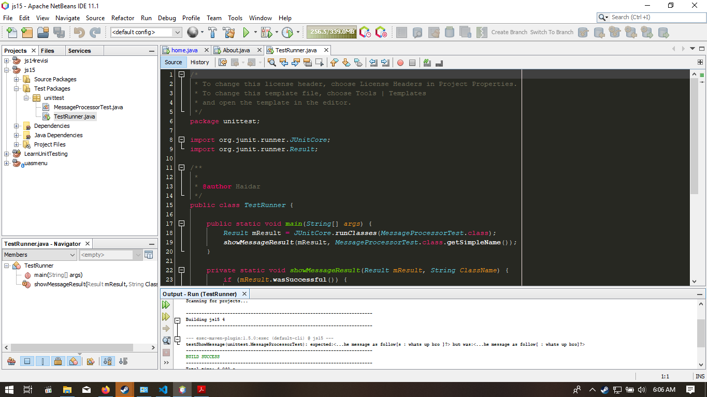
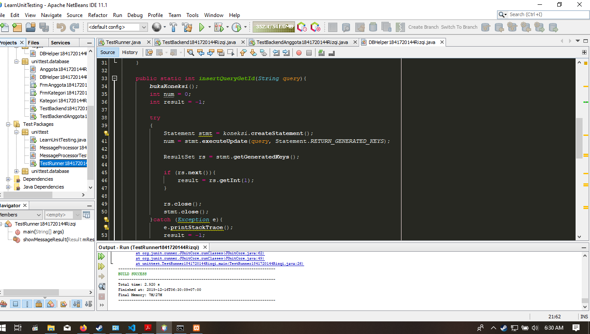

# Laporan Praktikum #15 - Unit Testing
## Kompetensi

Setelah menyelesaikan lembar kerja ini mahasiswa diharapkan mampu:
1. Memahami konsep dan fungsi unit testing
2. Menerapkan unit testing dengan JUnit pada program sederhana.
3. Menerapkan unit testing dengan JUnit pada progam yang terkoneksi database
  
## Ringkasan Materi

* belajar jobsheet unit testing 
* menggunakan Junit

   

## Percobaan 1 (Dasar Unit Testing)

Penjelasan :
Pada percobaan yang pertama ini kita akan membuat sebuah program sederhana yang mengilustrasikan sebuah aplikasi pengiriman pesan. Pada program tersebut terdapat satu class utama dimana didalamnya terdapat beberapa method sederhana yang nantinya akan dibuatkan unit test-nya.

>

   

## Percobaan 2 (Unit Testing dengan Test Case)

Penjelasan :

Pada percobaan kedua kita akan mencoba membuat test case dari salah satu percobaan pada jobsheet minggu ke 14. Struktur file dari percobaan ke satu terdiri dari 4 file class yaitu DBHelper.java, FormKategori.java, Kategori.java dan TestBackend.java.

>

   

>(Anggota) : [link ke kode program](../../src/15_Unit_Testing/Anggota1841720194Haidar.java)

>(DBHelper) : [link ke kode program](../../src/15_Unit_Testing/DbHelper1841720194Haidar.java)

>(FrmAnggota) : [link ke kode program](../../src/15_Unit_Testing/FrmAnggota1841720194Haidar.java)

>(FrmKategori) : [link ke kode program](../../src/15_Unit_Testing/FrmKategori1841720194Haidar.java)

>(Kategori) : [link ke kode program](../../src/15_Unit_Testing/Kategori1841720194Haidar.java)

>(TestBeckend) : [link ke kode program](../../src/15_Unit_Testing/TestBackend1841720194Haidar.java)

>(TestBackendanggota) : [link ke kode program](../../src/15_Unit_Testing/TestBackendAnggota1841720194Haidar.java)

## Kesimpulan

* Memahami unit test

## Pernyataan Diri

Saya menyatakan isi tugas, kode program, dan laporan praktikum ini dibuat oleh saya sendiri. Saya tidak melakukan plagiasi, kecurangan, menyalin/menggandakan milik orang lain.

Jika saya melakukan plagiasi, kecurangan, atau melanggar hak kekayaan intelektual, saya siap untuk mendapat sanksi atau hukuman sesuai peraturan perundang-undangan yang berlaku.

Ttd,

***(Haidar Sakti Oktafiansyah)***
