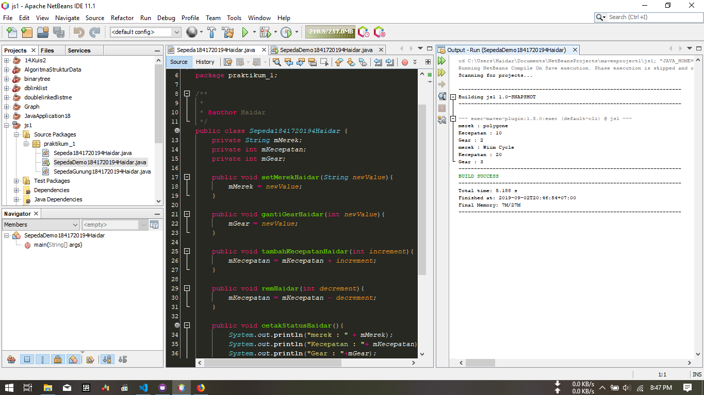
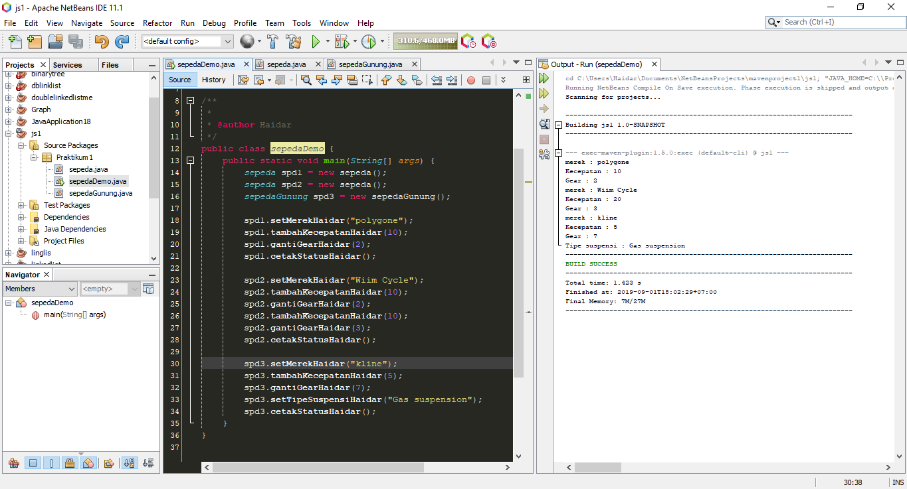
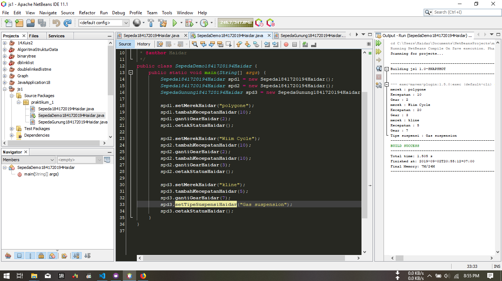
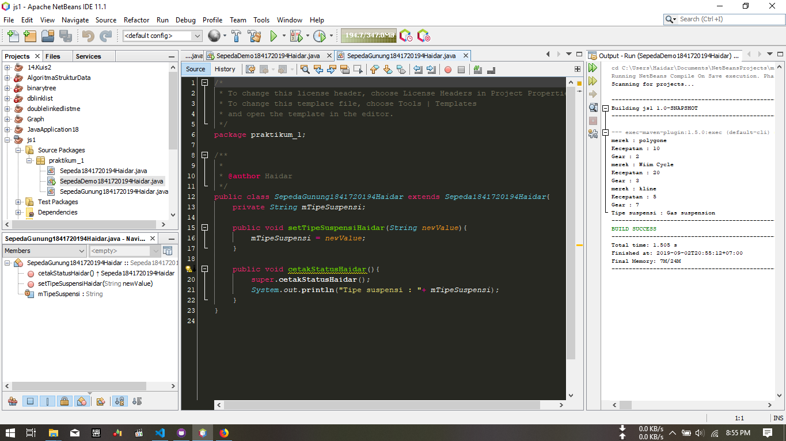
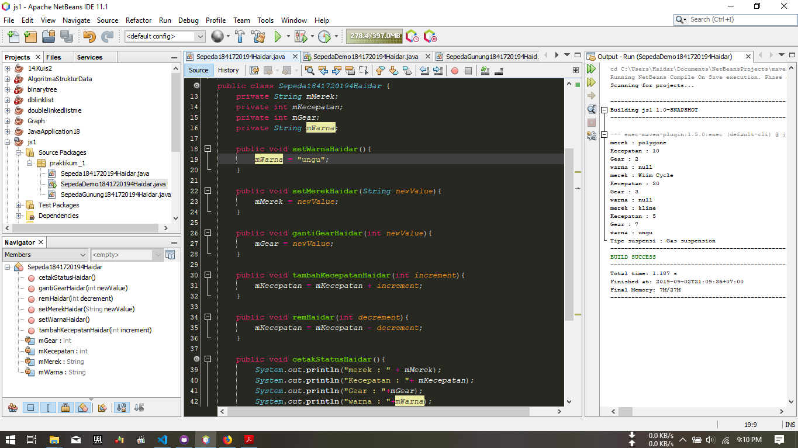
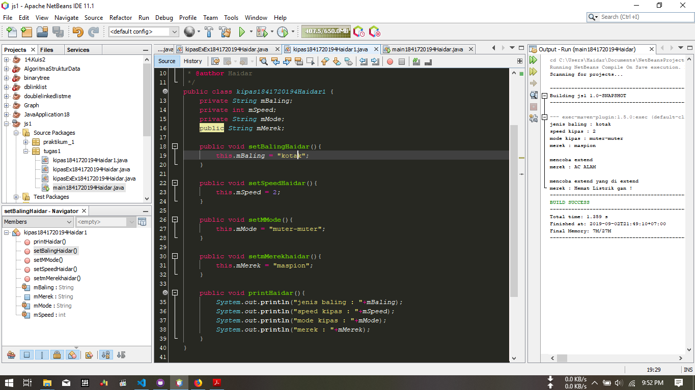
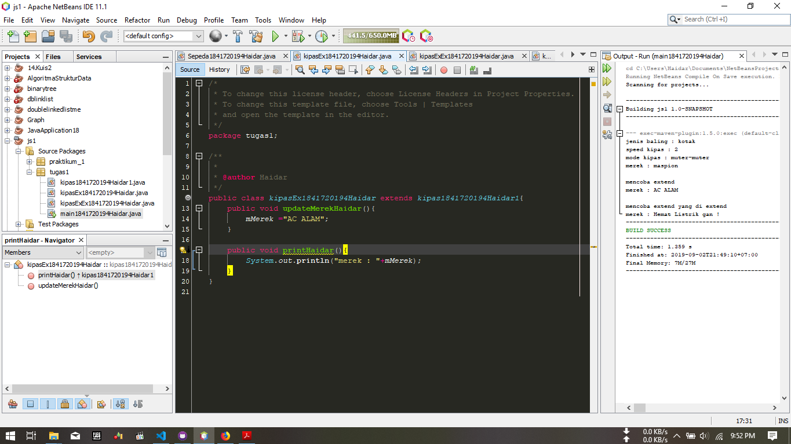
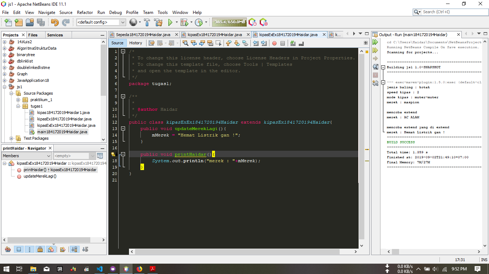
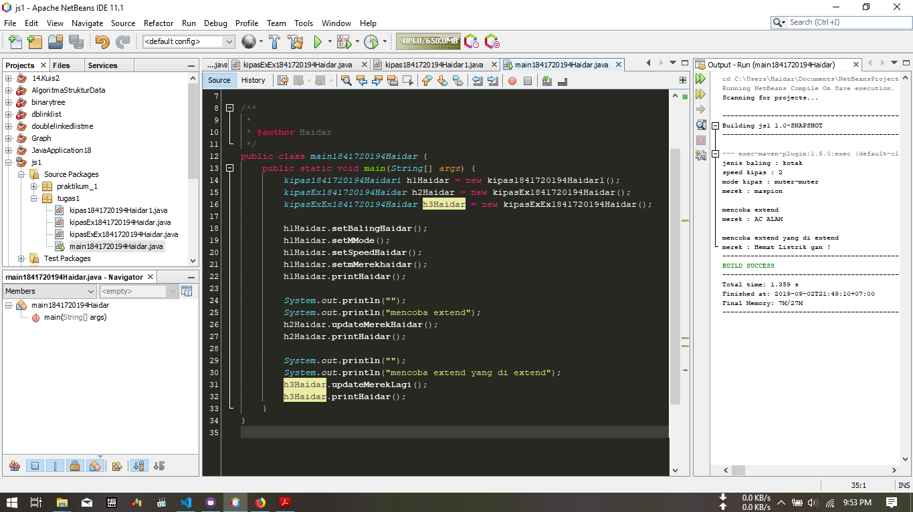

# Laporan Praktikum #1 - Pengantar Konsep PBO

## Kompetensi

Setelah menempuh materi percobaan ini, mahasiswa mampu mengenal:
1. Perbedaan paradigma berorientasi objek dengan paradigma struktural
2. Konsep dasar PBO

## Ringkasan Materi

(berisi catatan penting pribadi selama praktikum berlangsung ataupun menemukan permasalahan khusus saat melakukan percobaan)

## Percobaan

### Percobaan 1

(program mengajarkan dasar pemrograman OOP untuk menghubungkan suatu class dan class lain. berisi cara menginisialisasi suatu object dan menggunakan fungsi-fungsi yang terdapata pada object tersebut)

#### link program
1.link kode program sepedaDemo (Main) : [link ke kode program](../../src/1_Pengantar_Konsep_PBO/sepeda1841720194HaidarP1.java)

2.link kode program sepeda (object) : [link ke kode program](../../src/1_Pengantar_Konsep_PBO/sepedaDemo1841720194Haidarp12.java)

### Percobaan 2

(Percobaan kedua merupakan penjelasan dari salah sat sifat OOP yaitu inheritance atau di sebut pewarisan, dimana jika suatu class memerlukan perpanjangan kode pada salah satu methodnya, maka tidak perlu menulis ulang seluruh method melainkan bisa di aplikasikan dengan menambah kelas baru dengan "extend" dari class yang ingin di perpanjang dengan catatan seluruh property dan method akan bisa di turunkan pada class baru)

#### link program
1.link kode program sepedaDemo (Main) : [link ke kode program](../../src/1_Pengantar_Konsep_PBO/SepedaDemo1841720194Haidar.java)

2.link kode program sepeda (object) : [link ke kode program](../../src/1_Pengantar_Konsep_PBO/Sepeda1841720194Haidar.java)

3.link kode program sepedaGunung (extend object) : [link ke kode program](../../src/1_Pengantar_Konsep_PBO/SepedaGunung1841720194Haidar.java)

## Pertanyaan

1. Sebutkan dan jelaskan aspek-aspek yang ada pada pemrograman berorientasi objek!
    
    – Attribute   
    >Atribut dari sebuah kelas adalah variabel global yang dimiliki sebuah kelas, Atribut dapat memiliki hak akses private, public maupun protected.

    – Method
    >Method adalah fungsi atau prosedur yang dibuat oleh seorang programmer didalam suatu Class. Dengan kata lain, method pada sebuah kelas hampir sama dengan fungsi atau prosedur pada pemrograman prosedural.
    Pada sebuah method di dalam sebuah kelas juga memiliki izin akses seperti halnya atribut pada kelas, izin akses itu antara lain private, public dan protected yang memiliki arti sama pada izin akses atribut yang telah dibahas sebelumnya. Sebuah kelas boleh memiliki lebih dari satu method dengan nama yang sama asalkan memiliki parameter masukan yang berbeda sehingga kompiler atau interpreter dapat mengenali method mana yang dipanggil.

    – Class
    >  Class didefinisikan sebagai sebuah blueprint(denah), atau prototipe, yang mendefiniskan variabel-variabel dan metode-metode yang umum untuk semua objek dari n jenis tertentu (n maksudnya jumlah tertentu). Sebuah kelas menyerupai sebuah struktur yang merupakan tipe data sendiri, misalkan tipe data titik yang terdiri dari koordinat x dan y. Bahasa Java telah menggunakan sebuah kelas untuk menyatakan tipe data titik karena bahasa pemrograman Java merupakan bahasa pemrograman berorientasi objek murni sehingga tidak mengenal struktur, melainkan mengenal apa yang disebut dengan kelas.

    – Object
    > Object merupakan sesuatu yang memiliki identitas (nama), pada umumnya juga memiliki data tentang dirinya maupun object lain dan mempunyai kemampuan untuk melakukan sesuatu dan bisa bekerja sama dengan objek lainnya. Pada dasarnya semua benda yang ada di dunia dapat dianggap sebagai sebuah object. Rumah, mobil, sepeda motor, meja, dan komputer merupakan contoh-contoh object yang ada di dunia nyata. Object adalah implementasi dari class. Secara sederhananya, dapat dikatakan terdiri dari properti (atribut) dan method.
      
    Pemahaman singkatnya :
      
• Objek merupakan sebuah objek khusus yang digunakan untuk mengakses anggota objek (atribut atau method) dari dalam objek itu sendiri.
      
• Apabila terdapat variabel lain yang memiliki nama yang sama dengan nama atribut di dalam objek, “this” dapat digunakan untuk merujuk ke atribut objek.

    – Abstraction

    >Adalah suatu cara untuk melihat suatu object dalam bentuk yang lebih sederhana. Sebagai contoh kita tidak melihat sebuah mobil sebagai ribuan komponen elektronik, sistem mekanik dengan empat buah ban, jok, stir kemudi dan sebagainya. Dengan Abstraction, suatu sistem yang kompleks dapat dipandang sebagai kumpulan subsistem-subsistem yang lebih sederhana, seperti halnya mobil merupakan suatu sistem yang terdiri atas berbagai subsistem, seperti subsistem kemudi, subsistem pengereman dan sebagainya.

    – Encapsulation
    >Merupakan suatu mekanisme untuk menyembunyikan atau memproteksi suatu proses dari kemungkinan interferensi atau penyalahgunaan dari luar sistem dan sekaligus menyederhanakan penggunaan sistem tersebut.
    Memastikan pengguna sebuah objek tidak dapat mengganti keadaan dalam dari sebuah objek dengan cara yang tidak layak. Hanya metode dalam objek tersebut yang diberi ijin untuk mengakses keadaannya. Setiap objek mengakses interface yang menyebutkan bagaimana objek lainnya dapat berinteraksi dengannya. Objek lainnya tidak akan mengetahui dan tergantung kepada representasi dalam objek tersebut.

    – Inheritance

    >Merupakan konsep mewariskan attribute dan method yang dimiliki oleh sebuah class kepada class turunannya. Dengan konsep ini class yang dibuat cukup mendefinisikan attribute dan method yang spesifik didalamnya, sedangkan attribute dan method yang lebih umum akan didapatkan dari class yang menjadi induknya.

    – Polymorphism

    >Merupakan konsep yang memungkinkan digunakannya suatu interface yang sama untuk memerintah suatu object agar melakukan suatu tindakan yang mungkin secara prinsip sama tetapi secara proses berbeda.

2. Apa yang dimaksud dengan object dan apa bedanya dengan class?
    > Class merupakan kumpulan dari suatu fungsi-fungsi yang dibuat untuk suatu tujuan tertentu. Misalnya kita akan membuat sebuah Mobil. Maka yang perlu kita buatkan adalah beberapa class yang didalamnya berisi fungsi-fungsi yang dapat membuat Mobil itu dapat berjalan sebagaimana mestinya, misalnya class Roda, class Mesin, class Kerangka Mobil, class Body Mobil dan lain lain. Class masih merupakan sebuah konsep yang belum siap digunakan.
      
    Sedangkan Object adalah pemanfaatan dari class yang siap untuk digunakan, misalnya kita sudah membuat class Roda, yang di dalamnya itu berisi konsep bagaimana Roda itu bisa berjalan, bagaimana Roda itu bisa berputar dan lain-lain, jika semua konsep Roda sudah oke, barulah kita akan dirubah menjadi sebuah Roda yang siap untuk dipakai. Nah itulah yang dinamakan Object Roda.

3. Sebutkan salah satu kelebihan utama dari pemrograman berorientasi objek dibandingkan dengan pemrograman struktural!
   
    >program lebih mudah dibaca dan dipahami, dan pemrograman berorientasi obyek mengontrol kerumitan program hanya dengan mengijinkan rincian yang dibutuhkan untuk programmer.

4. Pada class Sepeda, terdapat state/atribut apa saja? 
    >1.mMerek 
    >2.mKecepatan 
    >3.mGear

5. Tambahkan atribut warna pada class Sepeda.
   >
6. Mengapa pada saat kita membuat class SepedaGunung, kita tidak perlu membuat class nya dari nol?
    >karena oop menyediakan fitur extend / inheretance

## Tugas

tugas ini mngenai kipas di sertai penggunaan syntax extends yang di extends

kode program  : [program kipas](../../src/1_Pengantar_Konsep_PBO/kipas1841720194Haidar1.java) 
kode program  : [program kipas extend](../../src/1_Pengantar_Konsep_PBO/kipasEx1841720194Haidar.java) 
kode program  : [program kipas extend yang di extend](../../src/1_Pengantar_Konsep_PBO/kipasExEx1841720194Haidar.java) 
kode program  : [program main](../../src/1_Pengantar_Konsep_PBO/main1841720194Haidarr.java)

## Kesimpulan

1. Dari praktikum ini saya belajar penyederhanaan program agar tidak terlalu terbelilit hingga kode program tidak terbaca
2. Dari Praktikum ini saya belajar bahwa inheritance akan sangat di butuhkan
3. dan yang terakhir bahwasanya sifat turunan bisa di turunkan pada turunan selanjutnya

## Pernyataan Diri

Saya menyatakan isi tugas, kode program, dan laporan praktikum ini dibuat oleh saya sendiri. Saya tidak melakukan plagiasi, kecurangan, menyalin/menggandakan milik orang lain.

Jika saya melakukan plagiasi, kecurangan, atau melanggar hak kekayaan intelektual, saya siap untuk mendapat sanksi atau hukuman sesuai peraturan perundang-undangan yang berlaku.

Ttd,

***(Haidar Sakti Oktafiansyah)***
