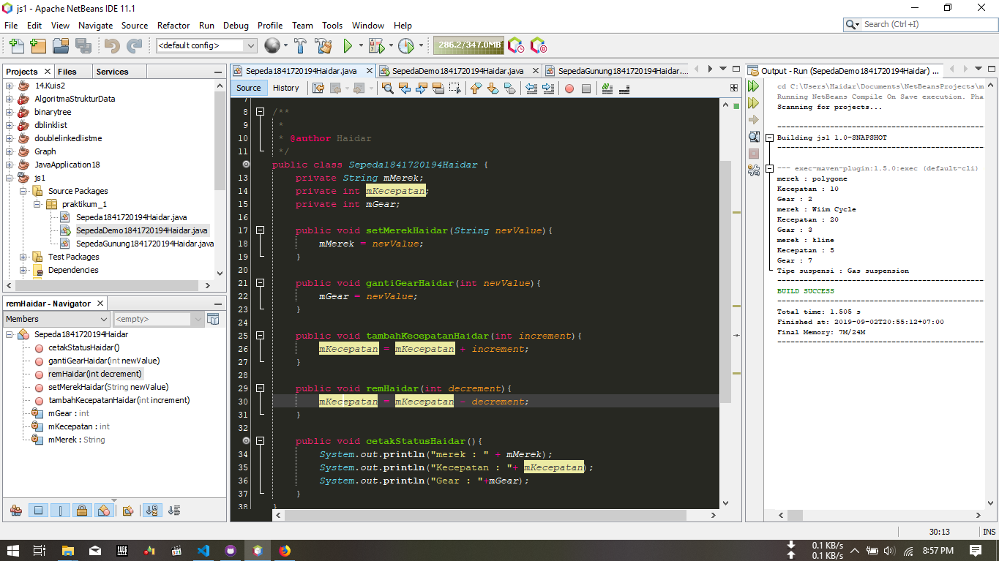

# Laporan Praktikum #1 - Pengantar Konsep PBO

## Kompetensi

Setelah menempuh materi percobaan ini, mahasiswa mampu mengenal:
1. Perbedaan paradigma berorientasi objek dengan paradigma struktural
2. Konsep dasar PBO

## Ringkasan Materi

(berisi catatan penting pribadi selama praktikum berlangsung ataupun menemukan permasalahan khusus saat melakukan percobaan)

## Percobaan

### Percobaan 1

(program mengajarkan dasar pemrograman OOP untuk menghubungkan suatu class dan class lain. berisi cara menginisialisasi suatu object dan menggunakan fungsi-fungsi yang terdapata pada object tersebut)

#### link program
1.link kode program sepedaDemo (Main) : [link ke kode program](../../src/1_Pengantar_Konsep_PBO/praktikum1-js1.java)

2.link kode program sepeda (object) : [link ke kode program](../../src/1_Pengantar_Konsep_PBO/praktikum1-js1-2.java)

### Percobaan 2

(Percobaan kedua merupakan penjelasan dari salah sat sifat OOP yaitu inheritance atau di sebut pewarisan, dimana jika suatu class memerlukan perpanjangan kode pada salah satu methodnya, maka tidak perlu menulis ulang seluruh method melainkan bisa di aplikasikan dengan menambah kelas baru dengan "extend" dari class yang ingin di perpanjang dengan catatan seluruh property dan method akan bisa di turunkan pada class baru)

#### link program
1.link kode program sepedaDemo (Main) : [link ke kode program](../../src/1_Pengantar_Konsep_PBO/praktikum2-js1-1.java)

2.link kode program sepeda (object) : [link ke kode program](../../src/1_Pengantar_Konsep_PBO/praktikum2-js1-2.java)

3.link kode program sepedaGunung (extend object) : [link ke kode program](../../src/1_Pengantar_Konsep_PBO/praktikum2-js1-3.java)

## Pertanyaan

(silakan ketik pertanyaan di sini beserta jawabannya.)

## Tugas

(silakan kerjakan tugas di sini beserta `screenshot` hasil kompilasi program. Jika ada rujukan ke file program, bisa dibuat linknya di sini.)

`contoh screenshot yang benar, menampilkan 3 komponen, yaitu struktur project, kode program, dan hasil kompilasi`

Contoh link kode program : [ini contoh link ke kode program](../../src/1_Pengantar_Konsep_PBO/Contoh12345Habibie.java)

## Kesimpulan

(Berisi simpulan yang telah diperoleh selama praktikum atau belajar pada pertemuan ini)

## Pernyataan Diri

Saya menyatakan isi tugas, kode program, dan laporan praktikum ini dibuat oleh saya sendiri. Saya tidak melakukan plagiasi, kecurangan, menyalin/menggandakan milik orang lain.

Jika saya melakukan plagiasi, kecurangan, atau melanggar hak kekayaan intelektual, saya siap untuk mendapat sanksi atau hukuman sesuai peraturan perundang-undangan yang berlaku.

Ttd,

***(silakan isi nama lengkap di sini)***