# Laporan Praktikum #2 - Class dan Object

## Kompetensi

1. Mahasiswa dapat memahami deskripsi dari class dan object
2. Mahasiswa memahami implementasi dari class
3. Mahasiswa dapat memahami implementasi dari attribute
4. Mahasiswa dapat memahami implementasi dari method
5. Mahasiswa dapat memahami implementasi dari proses instansiasi
6. Mahasiswa dapat memahami implementasi dari try-catch
7. Mahasiswa dapat memahami proses pemodelan class diagram menggunakan UML

  
## Ringkasan Materi
1. pada jobsheet ini kita diajarkan untuk membuat Unified Modeling Language ( UML ) dengan baik dan benar
2. pada jobsheet ini kita di ajarkan membuat mengakses anggota class
3. di jobsheet ini kita di ajarkan bagaimana membuat dan mengakses method suatu class baik yang memiliki parameter atau pun tidak
4. di jobsheet ini kita di ajarkan untuk membuat method dengan nilai return atau tidak

## Percobaan 1

Studi Kasus 1:
Dalam suatu perusahaan salah satu data yang diolah adalah data karyawan. 

Setiap karyawan memiliki :
1. id
2. nama 
3. jenis kelamin 
4. jabatan, jabatan
5. gaji. 

Setiap mahasiswa juga bisa menampilkan data diri pribadi dan melihat gajinya.
 
 

#### SOAL Percobaan 1
1. Gambarkan desain class diagram dari studi kasus 1!
>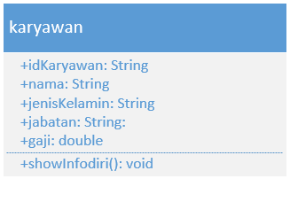

2. Sebutkan Class apa saja yang bisa dibuat dari studi kasus 1!
>class karyawan cukup untuk mencakup kebutuhan studi kasus 1

3. Sebutkan atribut beserta tipe datanya yang dapat diidentifikasi dari masing-masing class dari studi kasus 1!
>* idKaryawan - String
>* nama - String
>* jenisKelamin - String
>* jabatan - String
>* gaji - Double

4. Sebutkan method-method yang sudah anda buat dari masing-masing class pada studi kasus 1!
>* showinfodiri();

  

## Percobaan 2

(percobaan kedua merupakan penjelasan instansisasi objek dan bagaiamana cara penggunaannya )

#### SOAL Percobaan 2

1. Jalankan class TestMahasiswa
>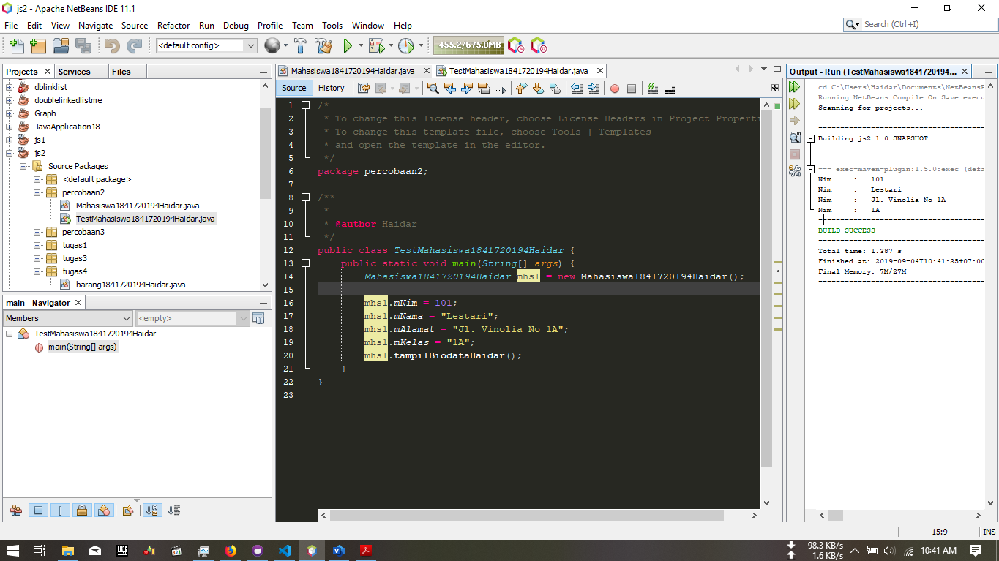
>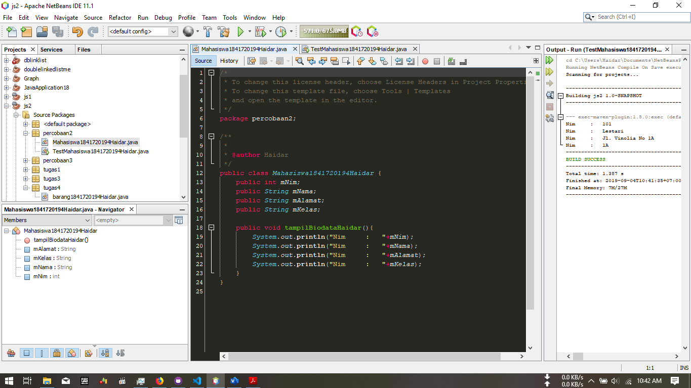

2. Jelaskan pada bagian mana proses pendeklarasian atribut pada program diatas!
>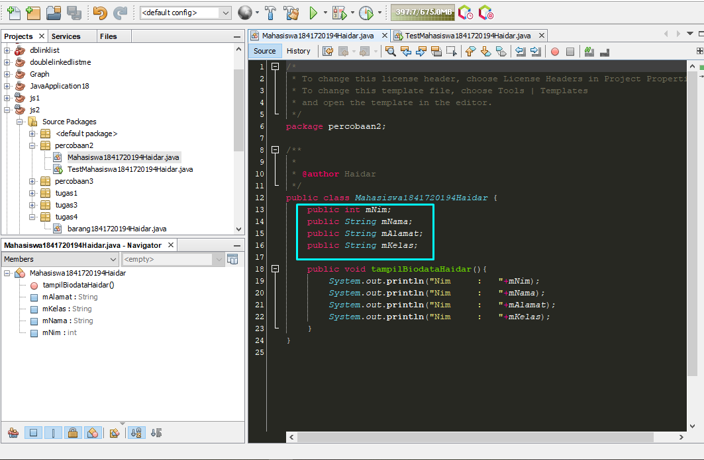

3. Jelaskan pada bagian mana proses pendeklarasian method pada program diatas!
>

4. Berapa banyak objek yang di instansiasi pada program diatas!
> hanya satu

5. Apakah yang sebenarnya dilakukan pada sintaks program “mhs1.nim=101” ?
> mengisi atribut *nim* pada class **Mahasiswa1841720194Haidar** dengan "101"

6. Apakah yang sebenarnya dilakukan pada sintaks program “mhs1.tampilBiodata()” ?
> memanggil method *tampilBiodata*

7. instansiasi 2 objek lagi pada program diatas!
>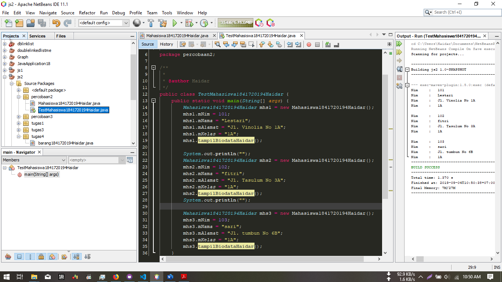

  

### Link Program Untuk Percobaan Kedua
>1.link kode program TestMahasiswa (Main) : [link ke kode program](../../src/2_Class_dan_Object/TestMahasiswa1841720194Haidar.java)

>2.link kode program Mahasiswa (object) : [link ke kode program](../../src/2_Class_dan_Object/Mahasiswa1841720194Haidar.java)

  

## Percobaan 3
1. Jalankan program tersebut!
>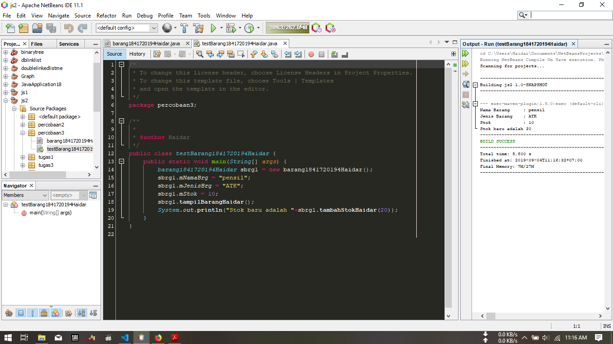
>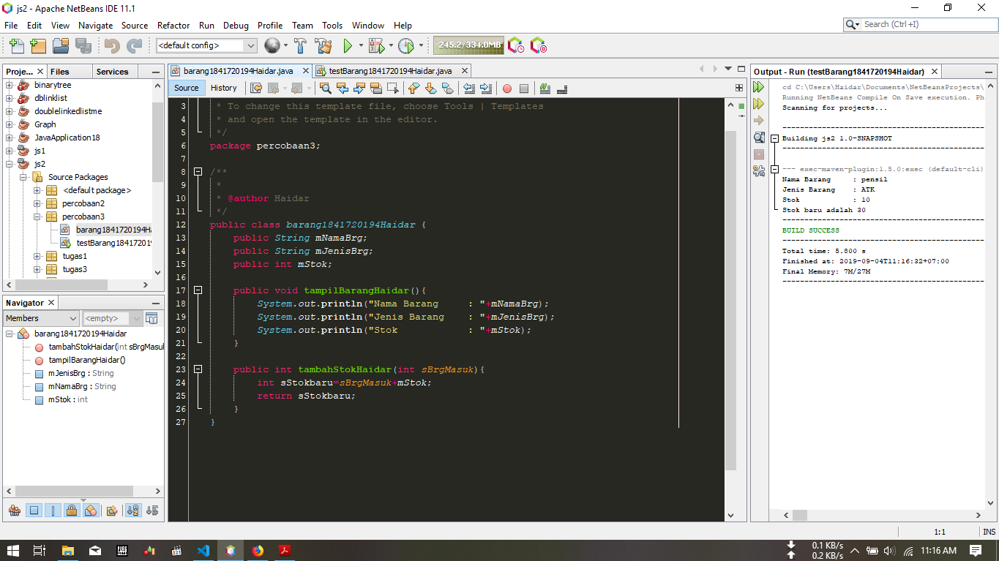

2. Apakah fungsi argumen dalam suatu method?
> memparsing suatu nilai ke dalam suatu method

3. Ambil kesimpulan tentang kegunaan dari kata kunci return , dan kapan suatu method harus memiliki return!
> *  return di gunakan untuk memberi nilai output dari proses yang di lakukan suatu fungsi
> * return di gunakan ketika memproses suatu data yang membutuhkan output

  

### Link Program Untuk Percobaan Ketiga
>1.link kode program Barang (Main) : [link ke kode program](../../src/2_Class_dan_Object/Barang1841720194Haidar.java)

>2.link kode program TestBarang (object) : [link ke kode program](../../src/2_Class_dan_Object/TestBarang1841720194Haidar.java)

  

## Tugas

>1.Jawaban Tugas No-1

>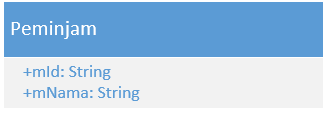
>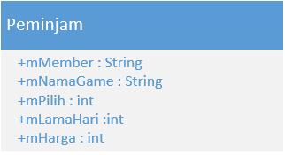

 

>2. Jawaban Tugas No-2 
>disini saya membuat program dengan kalkulasi sebagai berikut :
>>* jika dia member akan terkena potongan setengah harga
>>* jika tidak dia tidak akan mendapatkan potongan harga
>>* terdapat 3 pilihan game dengan harga yang bervariasi Rp2000, Rp3000, Rp4000

>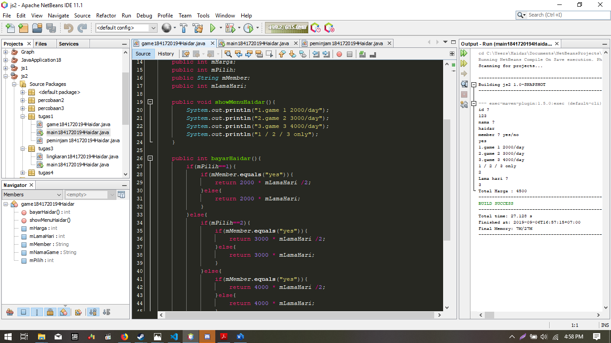
>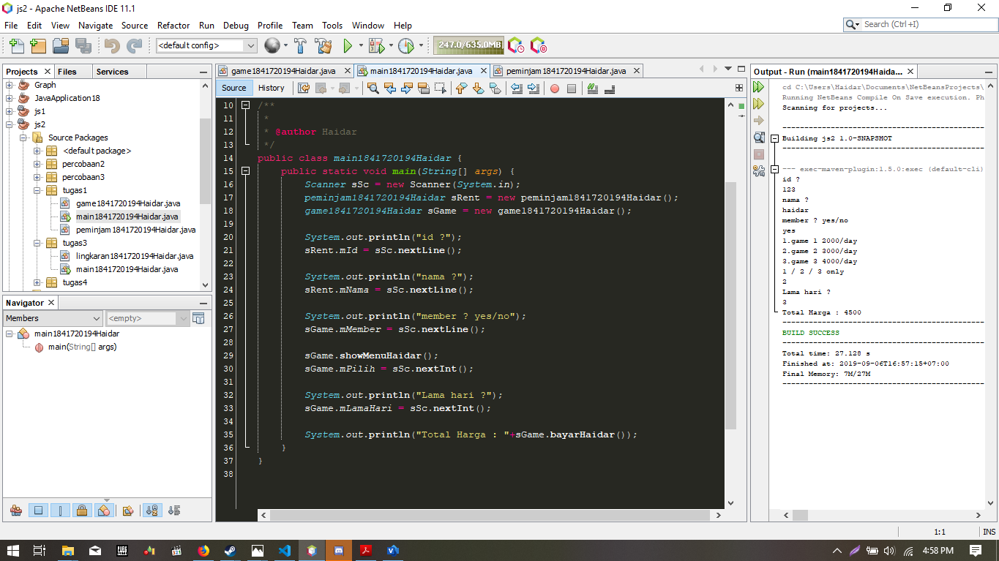
>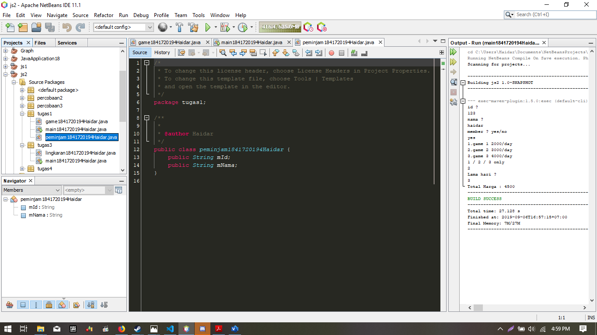

 

>3. Jawaban Tugas No-3

>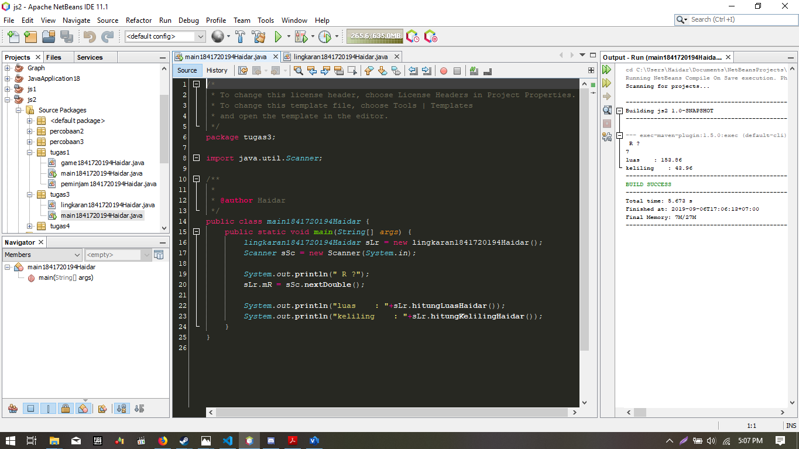
>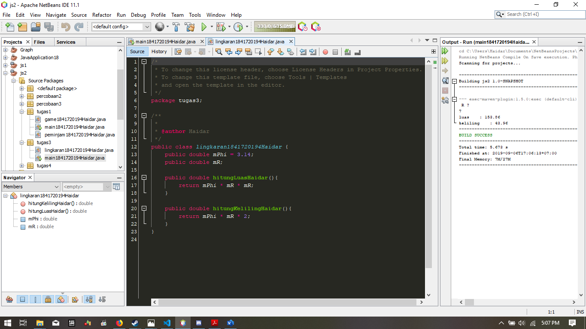

 

>4. Jawaban Tugas No-4

>
>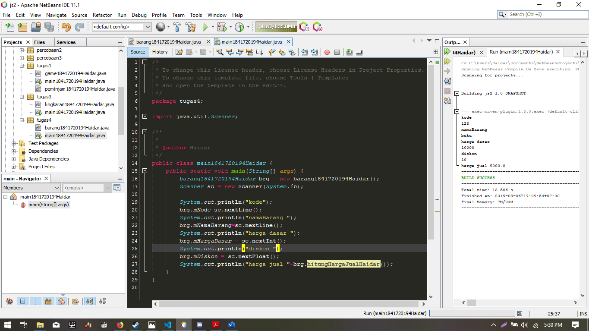

 

## Kesimpulan

1. Dari praktikum ini saya belajar cara instansiasi objek
2.  Dari praktikum ini saya belajar bagaimana cara memparsing nilai antara satu class dengan class lainnya
3.  Dari Praktikum ini saya belajar untuk bagaimana cara menyederhanakan program agar tidak menjadi sphageti code

## Pernyataan Diri

Saya menyatakan isi tugas, kode program, dan laporan praktikum ini dibuat oleh saya sendiri. Saya tidak melakukan plagiasi, kecurangan, menyalin/menggandakan milik orang lain.

Jika saya melakukan plagiasi, kecurangan, atau melanggar hak kekayaan intelektual, saya siap untuk mendapat sanksi atau hukuman sesuai peraturan perundang-undangan yang berlaku.

Ttd,

***(Haidar Sakti Oktafiansyah)***
