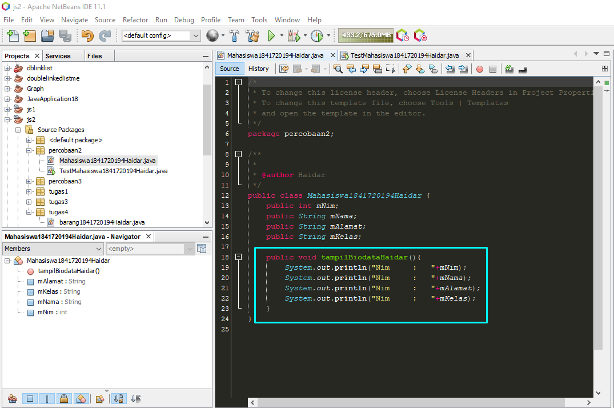

# Laporan Praktikum #1 - Pengantar Konsep PBO

## Kompetensi

1. Mahasiswa dapat memahami deskripsi dari class dan object
2. Mahasiswa memahami implementasi dari class
3. Mahasiswa dapat memahami implementasi dari attribute
4. Mahasiswa dapat memahami implementasi dari method
5. Mahasiswa dapat memahami implementasi dari proses instansiasi
6. Mahasiswa dapat memahami implementasi dari try-catch
7. Mahasiswa dapat memahami proses pemodelan class diagram menggunakan UML
## Ringkasan Materi

## Percobaan

### Percobaan 1

Studi Kasus 1:
Dalam suatu perusahaan salah satu data yang diolah adalah data karyawan. 

Setiap karyawan memiliki :
1. id
2. nama 
3. jenis kelamin 
4. jabatan, jabatan
5. gaji. 

Setiap mahasiswa juga bisa menampilkan data diri pribadi dan melihat gajinya.
 
 
###### SOAL
1. Gambarkan desain class diagram dari studi kasus 1!
>

2. Sebutkan Class apa saja yang bisa dibuat dari studi kasus 1!
>class karyawan cukup untuk mencakup kebutuhan studi kasus 1

3. Sebutkan atribut beserta tipe datanya yang dapat diidentifikasi dari masing-masing class dari studi kasus 1!
>* idKaryawan - String
>* nama - String
>* jenisKelamin - String
>* jabatan - String
>* gaji - Double

4. Sebutkan method-method yang sudah anda buat dari masing-masing class pada studi kasus 1!
>* showinfodiri();

### Percobaan 2

(percobaan kedua merupakan penjelasan instansisasi objek dan bagaiamana cara penggunaannya )

###### SOAL

1. Jalankan class TestMahasiswa
>
>

2. Jelaskan pada bagian mana proses pendeklarasian atribut pada program diatas!
>

3. Jelaskan pada bagian mana proses pendeklarasian method pada program diatas!
>

4. Berapa banyak objek yang di instansiasi pada program diatas!
> hanya satu

5. Apakah yang sebenarnya dilakukan pada sintaks program “mhs1.nim=101” ?
> mengisi atribut *nim* pada class **Mahasiswa1841720194Haidar** dengan "101"

6. Apakah yang sebenarnya dilakukan pada sintaks program “mhs1.tampilBiodata()” ?
> memanggil method *tampilBiodata*

7. instansiasi 2 objek lagi pada program diatas!
>

### Percobaan 3
1. Jalankan program tersebut!
>

2. Apakah fungsi argumen dalam suatu method?
> memparsing suatu nilai ke dalam suatu method

3. Ambil kesimpulan tentang kegunaan dari kata kunci return , dan kapan suatu method harus memiliki return!
> *  return di gunakan untuk memberi nilai output dari proses yang di lakukan suatu proses
> * return di gunakan ketika memproses suatu data yang membutuhkan hasil

## Tugas

tugas ini mngenai kipas di sertai penggunaan syntax extends yang di extends

kode program  : [program kipas](../../src/1_Pengantar_Konsep_PBO/kipas1841720194Haidar1.java) 
kode program  : [program kipas extend](../../src/1_Pengantar_Konsep_PBO/kipasEx1841720194Haidar.java) 
kode program  : [program kipas extend yang di extend](../../src/1_Pengantar_Konsep_PBO/kipasExEx1841720194Haidar.java) 
kode program  : [program main](../../src/1_Pengantar_Konsep_PBO/main1841720194Haidar.java)

## Kesimpulan

1. Dari praktikum ini saya belajar penyederhanaan program agar tidak terlalu terbelilit hingga kode program tidak terbaca
2. Dari Praktikum ini saya belajar bahwa inheritance akan sangat di butuhkan
3. dan yang terakhir bahwasanya sifat turunan bisa di turunkan pada turunan selanjutnya

## Pernyataan Diri

Saya menyatakan isi tugas, kode program, dan laporan praktikum ini dibuat oleh saya sendiri. Saya tidak melakukan plagiasi, kecurangan, menyalin/menggandakan milik orang lain.

Jika saya melakukan plagiasi, kecurangan, atau melanggar hak kekayaan intelektual, saya siap untuk mendapat sanksi atau hukuman sesuai peraturan perundang-undangan yang berlaku.

Ttd,

***(Haidar Sakti Oktafiansyah)***
