# Laporan Praktikum #3 - Enkapsulasi

## Kompetensi

Setelah melakukan percobaan pada modul ini, mahasiswa memahami konsep:
1. Konstruktor
2. Akses Modifier
3. Atribut/method pada class
4. Intansiasi atribut/method
5. Setter dan getter
6. Memahami notasi pada UML Class Diagram

  
## Ringkasan Materi

 * dari bab ini saya belajar tentang apa itu enkapsulasi
 * dari bab ini saya belajar bagaimana untuk memparsing data pada saat instansiasi object
 * dari bab ini saya belajar bagaimana untuk memanggil method dari class atau class lain
 * dari bab ini saya belajar bagaimana menerapkan program pada dunia nyata dengan cara melimitasi hak ases agar tidak saling bertubrukan pada saat pemrosesan
 * dari bab ini saya belajar bagiamana membuat getter dan setter 
 * dari bab ini saya belajar bagiamana membuat konstruktor agar membari nilai default pada suatu objek

## Percobaan 1

Penjelasan :  
* Pada praktikum ini kita di jelaskan penting nya salah satu pilar PBO yaitu enkapsulasi untuk menyimpan data sehingga lebih masuk akal pada implementasinya di dunia nyata 
*  Enkapsulasi merupakan salah satu cara untuk memberi batasan dalam implementasi program di dunia nyata

>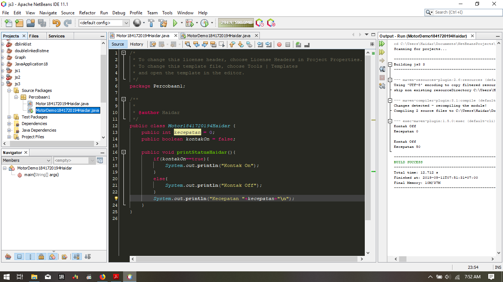   
>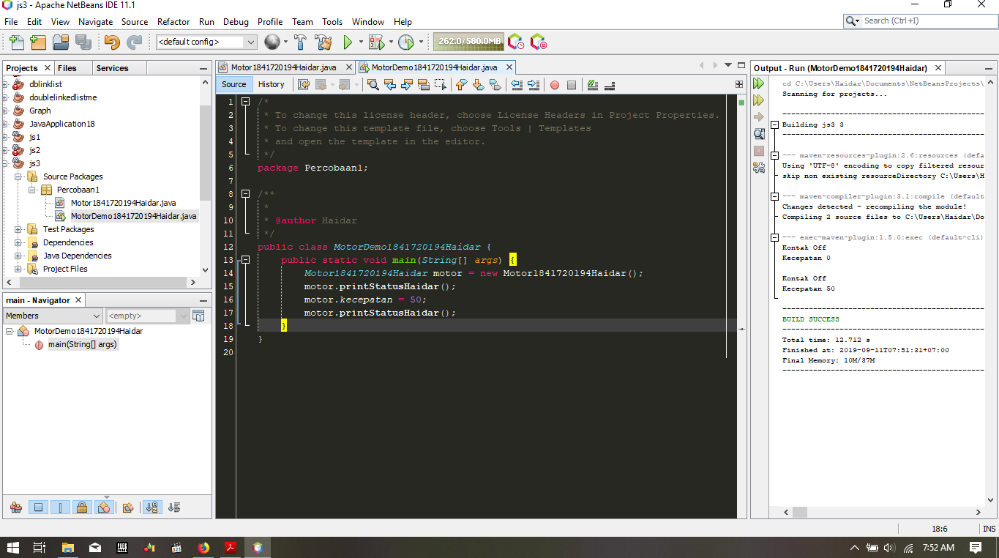 

  

Link Program Untuk Percobaan Pertama
>1.link kode program MotorDemo1841720194Haidar.java(Main) : [link ke kode program](../../src/3_Enkapsulasi/percobaan1/MotorDemo1841720194Haidar.java)

>2.link kode program Motor1841720194Haidar.java(objek) : [link ke kode program](../../src/3_Enkapsulasi/percobaan1/Motor1841720194Haidar.java)

  

## Percobaan 2

* percobaan kedua merupakan implementasi dari enkapsulasi pada program sepeda di mana kita akan melimitasi akses agar tidak bisa di akses oleh kelas lain
* sebagai contoh akses menambah kecepatan yang tidak akan bisa di jalankan jika mesin dalam kondisi mati
* dalam proses enkapsulasi ini kita dapat mengimplementasikan urutan progress yang harus di lakukan seperti layaknya di dunia nyata 

>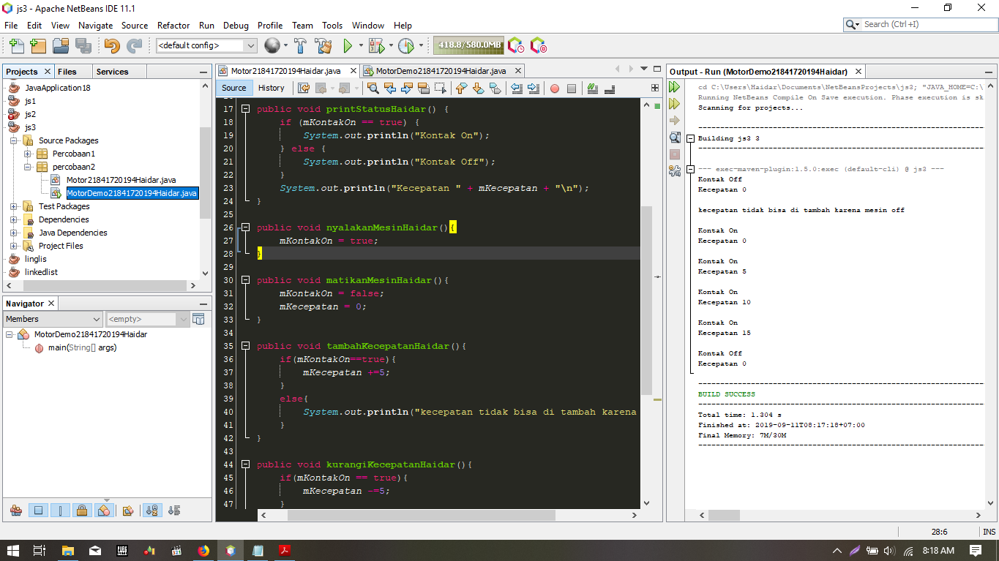
>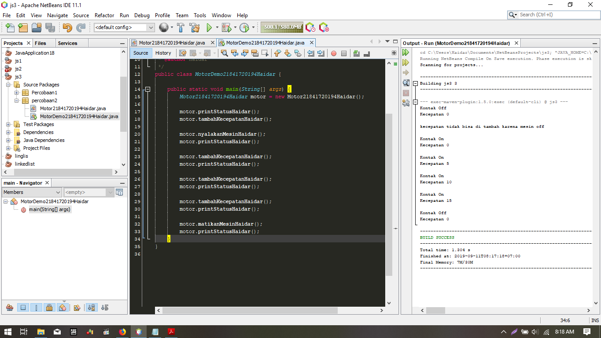
>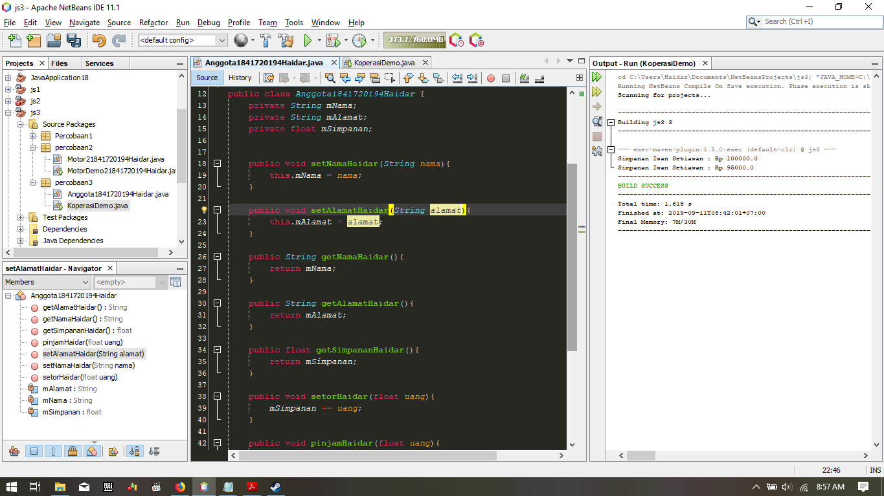

  

Link Program Untuk Percobaan Kedua
>1.link kode program MotorDemo1841720194Haidar.java(Main) : [link ke kode program](../../src/3_Enkapsulasi/percobaan2/MotorDemo1841720194Haidar.java)

>2.link kode program Motor1841720194Haidar.java(objek) : [link ke kode program](../../src/3_Enkapsulasi/percobaan2/Motor1841720194Haidar.java)

  

#### SOAL Percobaan 2

1. Pada class TestMobil, saat kita menambah kecepatan untuk pertama kalinya, mengapa muncul peringatan “Kecepatan tidak bisa bertambah karena Mesin Off!”?

>> karena pada saat ingin mengakses kecepatan terlebih dahulu kita harus menghidupkan mesin 

2. Mengapat atribut kecepatan dan kontakOn diset private?

>>karena jika tidak di akses private, atribut akan dapat di akses dari luar dan menyalahi aturan berjalan proses yang seharusnya

3. Ubah class Motor sehingga kecepatan maksimalnya adalah 100!

>>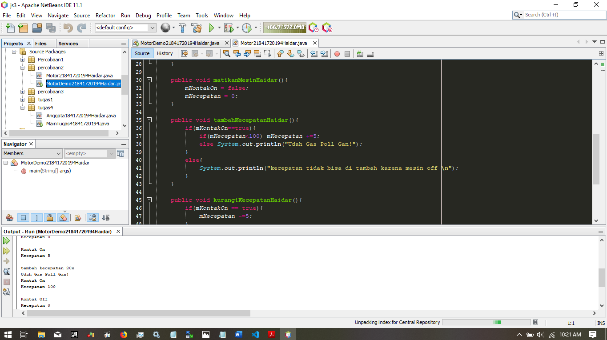

  

Link Program Untuk Percobaan Kedua
>1.link kode program MotorDemo1841720194Haidar.java(Main) : [link ke kode program](../../src/3_Enkapsulasi/percobaan2/MotorDemo1841720194Haidar.java)

>2.link kode program Motor1841720194Haidar.java(objek) : [link ke kode program](../../src/3_Enkapsulasi/percobaan2/Motor1841720194Haidar.java)

  

## Percobaan 3

* pada percobaan ini kita di eknalkan dengan method getter dan setter yang mana akan berfungsi : 
>* setter untuk men-set nilai suatu atribut yang di enkapsulasi
>* getter untuk mengambil / mengakses suatu atribut yang di enkapsulasi

>>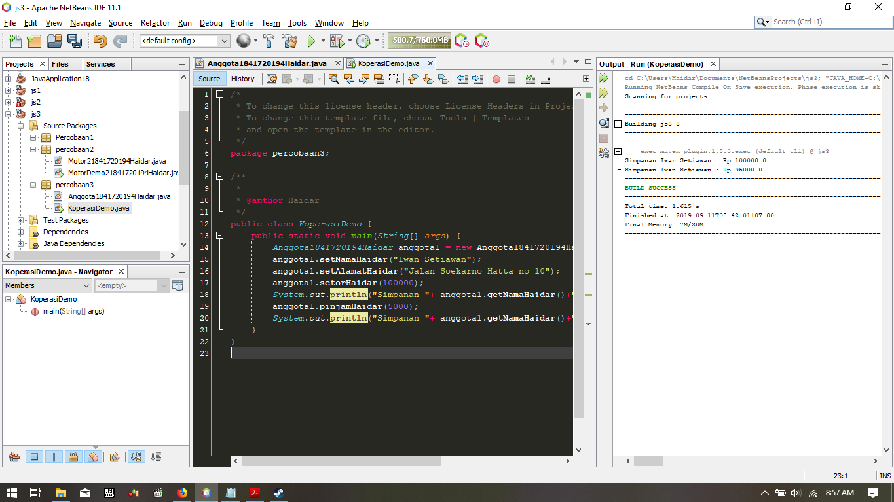
>>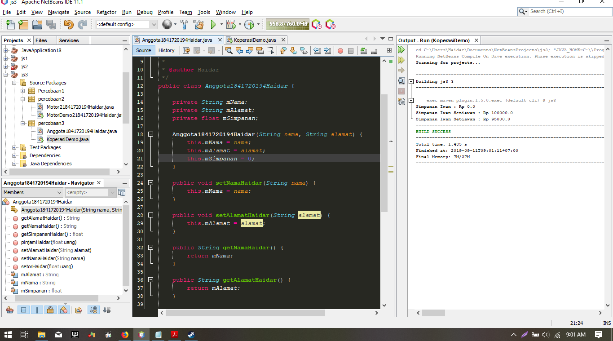

  

Link Program Untuk Percobaan Ketiga
>1.link kode program KoperasiDemo1841720194Haidar.java(Main) : [link ke kode program](../../src/3_Enkapsulasi/percobaan3/KoperasiDemo.java)

>2.link kode program Anggota1841720194Haidar.java(objek) : [link ke kode program](../../src/3_Enkapsulasi/percobaan3/Anggota1841720194Haidar.java)

  

## Percobaan 4

* pada percobaan ini kita di kenalkan dengan konstrutor yang berfungsi sebagai pemberi nilai default pada saat instansiasi objek dilakukan hal ini di lakukan jika atribut membutuhkan nilai spesifik yang di jadikan patokan

>>
>>

  

Link Program Untuk Percobaan Keempat
>1.link kode program KoperasiDemo1841720194Haidar.java(Main) : [link ke kode program](../../src/3_Enkapsulasi/percobaan3/KoperasiDemo.java)

>2.link kode program Anggota1841720194Haidar.java(objek) : [link ke kode program](../../src/3_Enkapsulasi/percobaan3/Anggota1841720194Haidar.java)

  

## Pertanyaan Percobaan 3 & 4

1. Apa yang dimaksud getter dan setter?
> getter merupakan salah satu method yang di gunakan untuk mengambil suatu nilai dari atribut yang sudah di enkapsulasi
> setter merupakan salah satu method yang di gunakan untuk memberikan suatu nilai dari atribut yang sudah di enkapsulasi
2. Apa kegunaan dari method getSimpanan()?
> mengambil nilai dari atribut simpanan
3. Method apa yang digunakan untk menambah saldo?
> setorHaidar()
4. Apa yand dimaksud konstruktor?
> Method khusus yang akan dieksekusi pada saat pembuatan objek (instansiasi).
5. Sebutkan aturan dalam membuat konstruktor?
>* Nama konstruktor harus sama dengan nama class
>* Konstruktor tidak memiliki tipe data return
>* Konstruktor tidak boleh menggunakan modifier abstract, static, final, dan syncronized
6. Apakah boleh konstruktor bertipe private?
> Konstruktor pada java boleh memiliki tipe private,protected, public or default.
7. Kapan menggunakan parameter dengan passsing parameter?
> pada saat instansiasi objek
8. Apa perbedaan atribut class dan instansiasi atribut?
> * Atribut class adalah suatu nilai data yang terdapat pada suatu objek yang berasal dari class
> * instansiasi atribut adalah variabel yang didefinisikan di dalam suatu metod dan hanya menjadi milik dari instance kelas
9. Apa perbedaan class method dan instansiasi method?
> * class method merupakan sebuah method di dalam suatu class
> * instansiasi method merupakan pemanggilan method dari class yang objeknya sudah di instansiasi

  

## Tugas

1. Jawaban Tugas No-1

>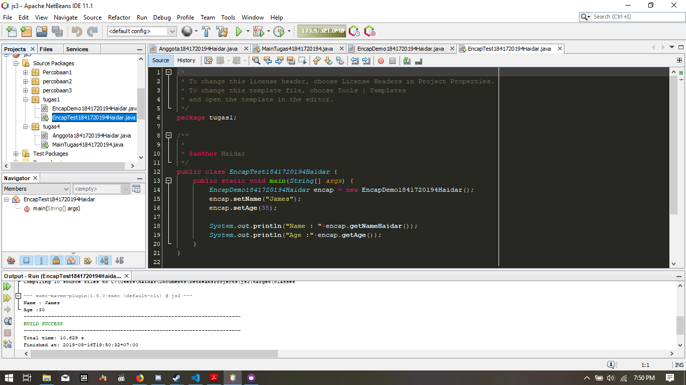
>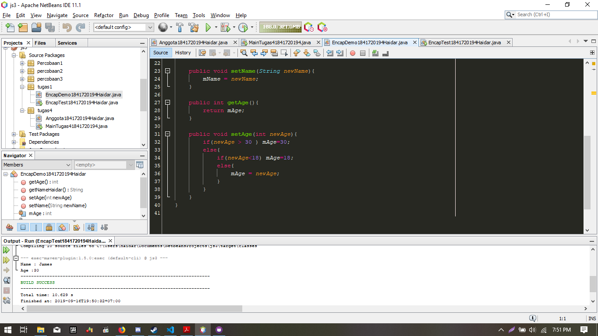

  

2. Pada program diatas, pada class EncapTest kita mengeset age dengan nilai 35, namun pada saat ditampilkan ke layar nilainya 30, jelaskan mengapa.

> karena pada kode program di set maksimal di umur 30 tepatnya pada gambar di bawah ini
> 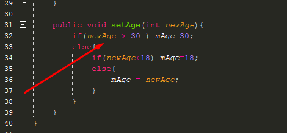

  

>3. Jawaban Tugas No-3

>
>link kode program : [link ke kode program](../../src/3_Enkapsulasi/tugas1/EncapDemo1841720194Haidar.java)

  

>4. Jawaban Tugas No-4 Dan No-5

>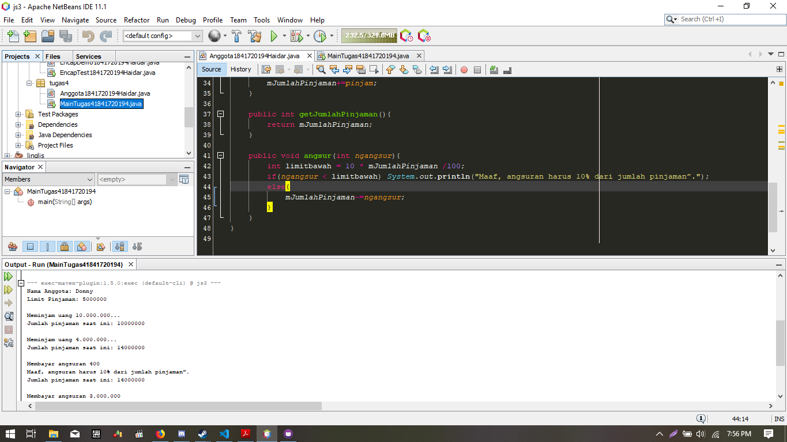
>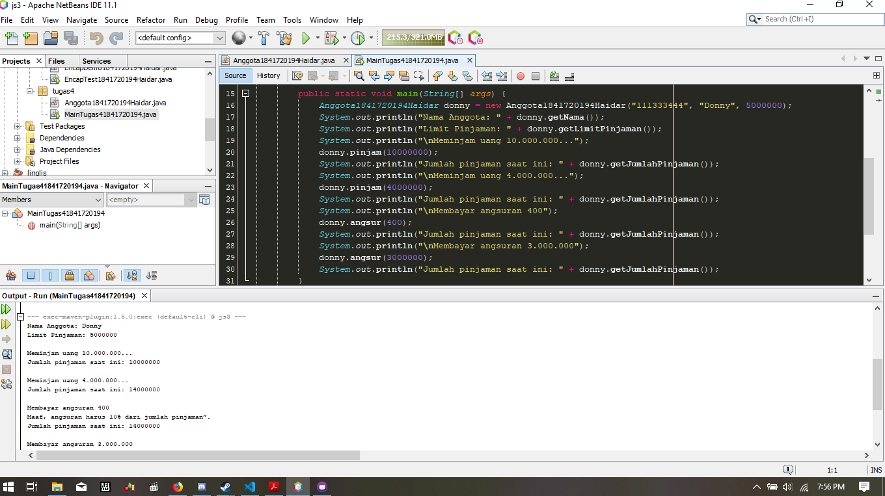
>link kode program main : [link ke kode program](../../src/3_Enkapsulasi/tugas4/MainTugas41841720194.java)
>link kode program object : [link ke kode program](../../src/3_Enkapsulasi/tugas4/Anggota1841720194Haidar.java)

  

>6. Jawaban Tugas No-6

>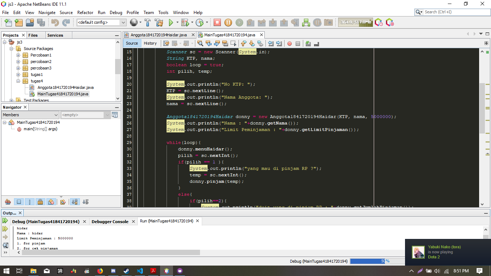
>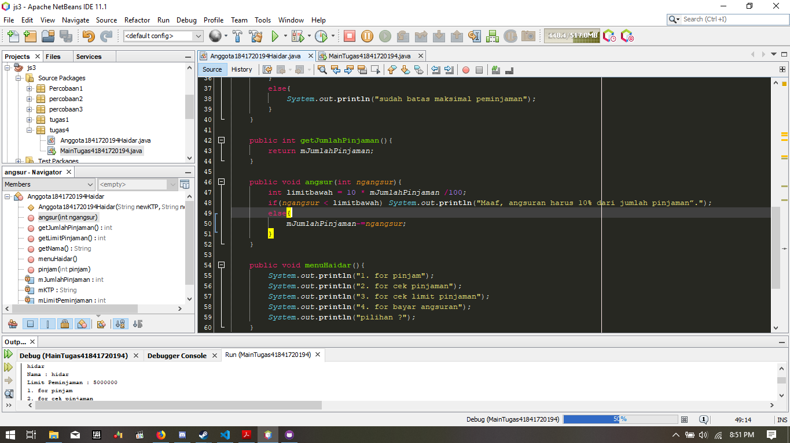
>link kode program main : [link ke kode program](../../src/3_Enkapsulasi/tugas6/MainTugas41841720194.java)
>link kode program object : [link ke kode program](../../src/3_Enkapsulasi/tugas6/Anggota1841720194Haidar.java)

## Kesimpulan

* Dari percobaan diatas, telah dipelajari kosep dari enkapsulasi, kontruktor, access modifier yang terdiri dari 4 jenis yaitu public, protected, default dan private. 
* Konsep atribut atau method class yang ada di dalam blok code class dan konsep instansiasi atribut atau method. 
* Cara penggunaan getter dan setter beserta fungsi dari getter dan setter. 
* terakhir, Dan juga telah dipelajari atau memahami notasi UML

## Pernyataan Diri

Saya menyatakan isi tugas, kode program, dan laporan praktikum ini dibuat oleh saya sendiri. Saya tidak melakukan plagiasi, kecurangan, menyalin/menggandakan milik orang lain.

Jika saya melakukan plagiasi, kecurangan, atau melanggar hak kekayaan intelektual, saya siap untuk mendapat sanksi atau hukuman sesuai peraturan perundang-undangan yang berlaku.

Ttd,

***(Haidar Sakti Oktafiansyah)***
