# Laporan Praktikum #4 - Relasi Kelas

## Kompetensi

Setelah menempuh pokok bahasan ini, mahasiswa mampu:
1. Memahami konsep relasi kelas;
2. Mengimplementasikan relasi has‑a dalam program.

## Ringkasan Materi

 * dari bab ini saya belajar tentang apa itu relasi antar class
 * dari bab ini saya belajar tentang penggambaran relasi antar class melalui representasi UML
 * dari bab ini saya lebih memahami implementasi getter setter dan constructor

   

## Percobaan 1

Penjelasan :

* pada praktikum ini kita di jelaskan pemahaman relasi antar class

>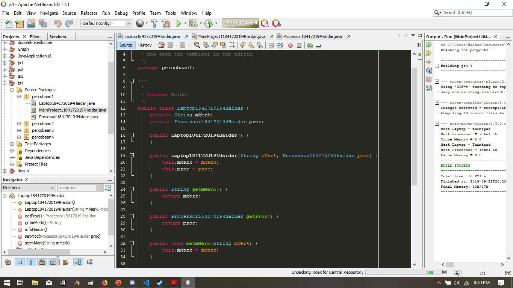
>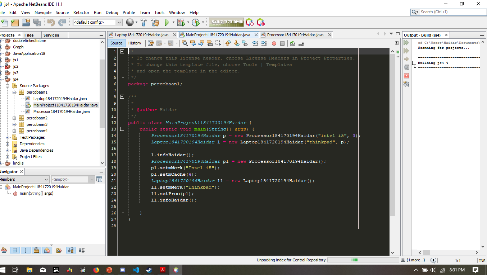
>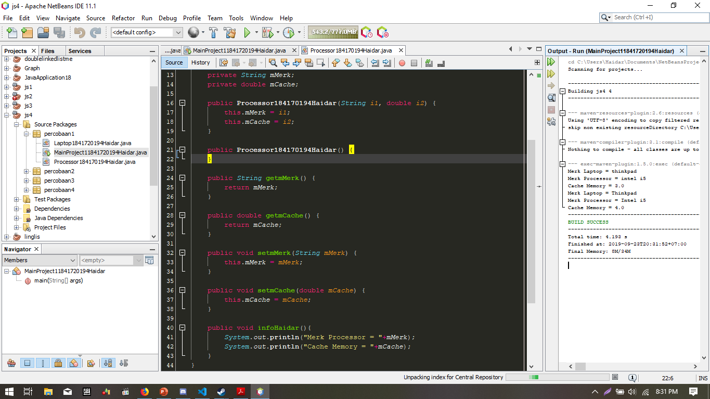

Link Program Untuk Percobaan Pertama
> 1. MainProject11841720194Haidar.java(Main) : [link ke kode program](../../src/4_Relasi_Class/percobaan1/MotorDemo1841720194Haidar.java)

> 2. Laptop1841720194Haidar.java(objek) : [link ke kode program](../../src/4_Relasi_Class/percobaan1/Motor1841720194Haidar.java)

> 3. Processor1841720194Haidar.java(objek) : [link ke kode program](../../src/4_Relasi_Class/percobaan1/Processor184170194Haidar.java)

## Pertanyaan Percobaan 1

Berdasarkan percobaan 1, jawablah pertanyaan‑pertanyaan yang terkait:
1. Di dalam class Processor dan class Laptop , terdapat method setter dan getter untuk masing‑masing atributnya. Apakah gunanya method setter dan getter tersebut ?

>* pada Laptop setter di gunakan untuk menset nilai dari atribut mMerk dan mProc
>* pada Laptop getter di gunakan untuk mengambil/mengembalikan nilai dari atribut mMerk dan mProc
>* pada Processor setter di gunakan untuk menset nilai dari atribut mMerk dan mCache
>* pada Processor getter di gunakan untuk mengambil/mengembalikan nilai dari atribut mMerk dan mCache

2. Di dalam class Processor dan class Laptop, masing‑masing terdapat konstruktor default dan konstruktor berparameter. Bagaimanakah beda penggunaan dari kedua jenis konstruktor tersebut ?

>* konstruktor tanpa berparameter di gunakan jika tidak ada nilai default yang ingin di set saat instansiasi objek
>* konstruktor berparameter di gunakan jika membutuhkan nilai default yang ingin kita set pada saat instansiasi objek

3. Perhatikan class Laptop, di antara 2 atribut yang dimiliki (merk dan proc), atribut manakah yang bertipe object ?

>proc

4. Perhatikan class Laptop, pada baris manakah yang menunjukan bahwa class Laptop memiliki relasi dengan class Processor ?

>private Processor184170194Haidar proc;

5. Perhatikan pada class Laptop , Apakah guna dari sintaks proc.info() ?

>memanggil method info yang ada pada class Processor

6. Pada class MainPercobaan1, terdapat baris kode:
Laptop l = new Laptop("Thinkpad", p);.
Apakah p tersebut ?

>objek berkelas processor dan bernama p yang akan di instansiasi pada object Laptop

Dan apakah yang terjadi jika baris kode tersebut diubah menjadi:
Laptop l = new Laptop("Thinkpad", new Processor("Intel i5", 3));
Bagaimanakah hasil program saat dijalankan, apakah ada perubahan ?

>tidak karena isinya sama dengan object yang bernama p
>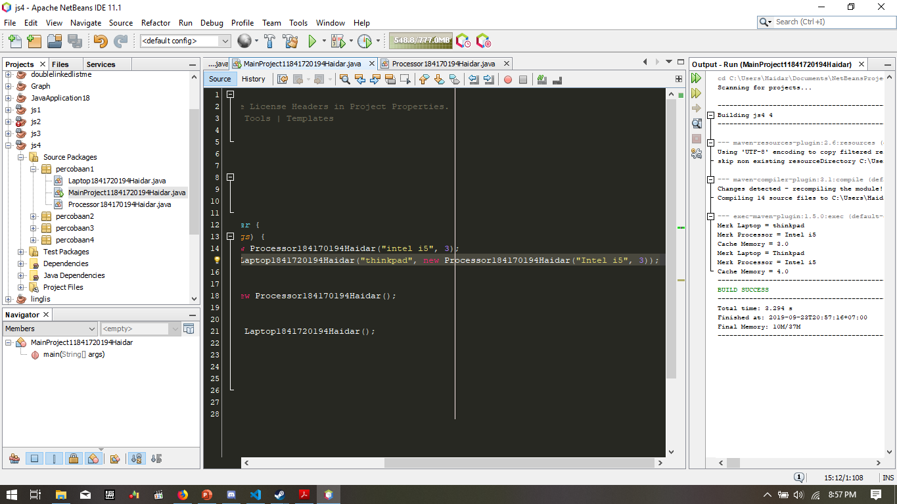

   

## Percobaan 2

* penerapan 3 relasi class dalam java

>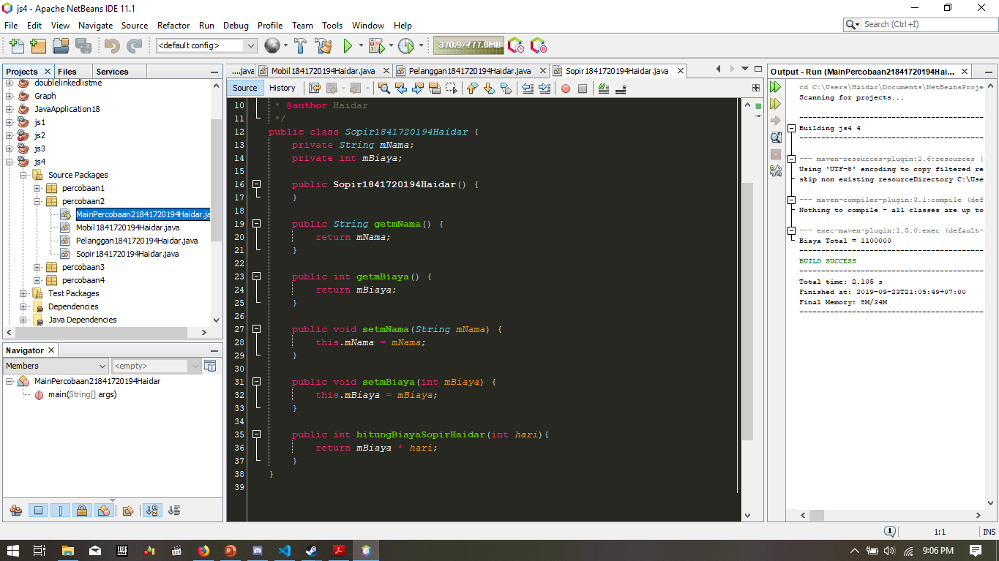
>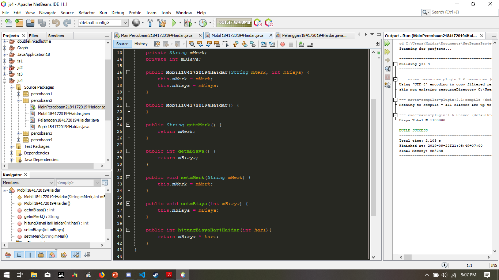
>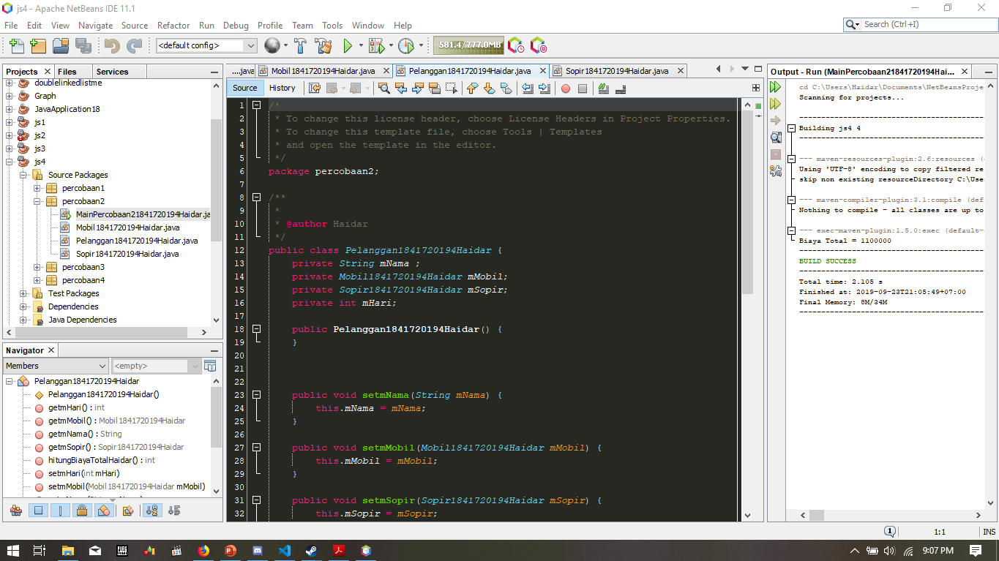
>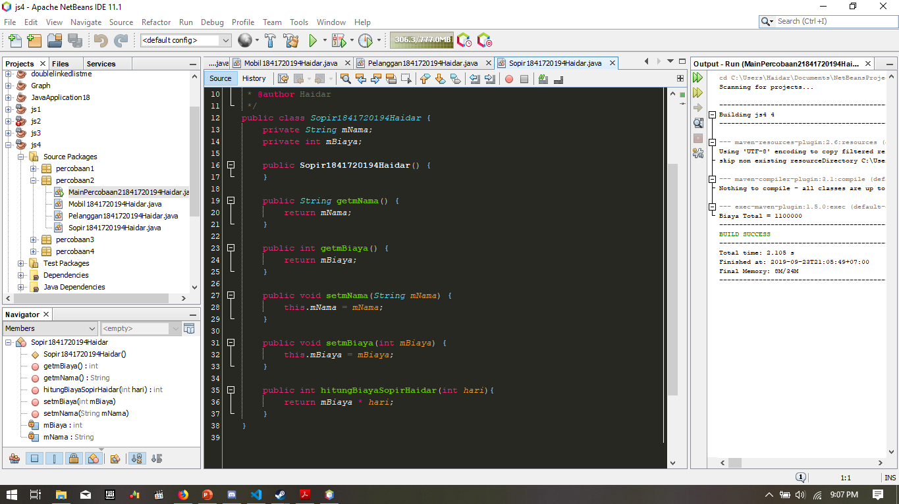

Link Program Untuk Percobaan kedua:

> 1. MainProject11841720194Haidar.java(Main) : [link ke kode program](../../src/4_Relasi_Class/percobaan2/MainPercobaan21841720194Haidar.java)

> 2. Pelanggan1841720194Haidar.java(objek) : [link ke kode program](../../src/4_Relasi_Class/percobaan2/Pelanggan1841720194Haidar.java)

> 3. Mobil21841720194Haidar.java(Objek) : [link ke kode program](../../src/4_Relasi_Class/percobaan2/Mobil1841720194Haidar.java)

> 4. Sopir21841720194Haidar.java(objek) : [link ke kode program](../../src/4_Relasi_Class/percobaan2/Sopir1841720194Haidar.java)

## Pertanyaan Percobaan 2

Pertanyaan
1. Perhatikan class Pelanggan. Pada baris program manakah yang menunjukan bahwa class Pelanggan memiliki relasi dengan class Mobil dan class Sopir ?

> private Mobil1841720194Haidar mMobil;
> private Sopir1841720194Haidar mSopir;

2. Perhatikan method hitungBiayaSopir pada class Sopir, serta method hitungBiayaMobil pada class Mobil. Mengapa menurut Anda method tersebut harus memiliki argument hari ?

>karena  untuk mengkalkulasi biaya total hari sangat di perlukan, sebagain acuan yang yg mengontrol nilai bayar untuk memparsing data di pada tiap fungsi maka di erikan argumen hari

3. Perhatikan kode dari class Pelanggan. Untuk apakah perintah mobil.hitungBiayaMobil(hari) dan sopir.hitungBiayaSopir(hari) ?

> keduanya di gunakan untuk menghitung biaya yang akan di kenakan pada pelanggan

4. Perhatikan class MainPercobaan2. Untuk apakah sintaks p.setMobil(m) dan p.setSopir(s) ?

>mengisi nilai pada atribut pelanggan yang memiliki class mobil dan sopir

5. Perhatikan class MainPercobaan2. Untuk apakah proses p.hitungBiayaTotal() tersebut ?

> memanggil fungsi hitung biaya total pada class pelanggan yang akan mengkalkulasikan semua biaya

6. Perhatikan class MainPercobaan2, coba tambahkan pada baris terakhir dari method main dan amati perubahan saat di‑run!
System.out.println(p.getMobil().getMerk());
Jadi untuk apakah sintaks p.getMobil().getMerk() yang ada di dalam method main tersebut?

> untuk mengambil nilai merk dari atribut dalam class mobil

   

## Percobaan 3

* dalam percobaan ini kita akan di kenalkan dengan multiplicity

>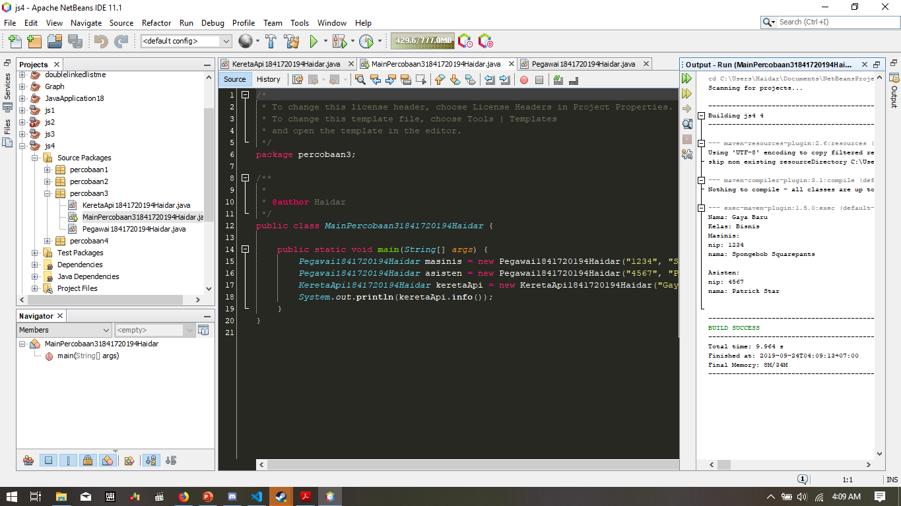
>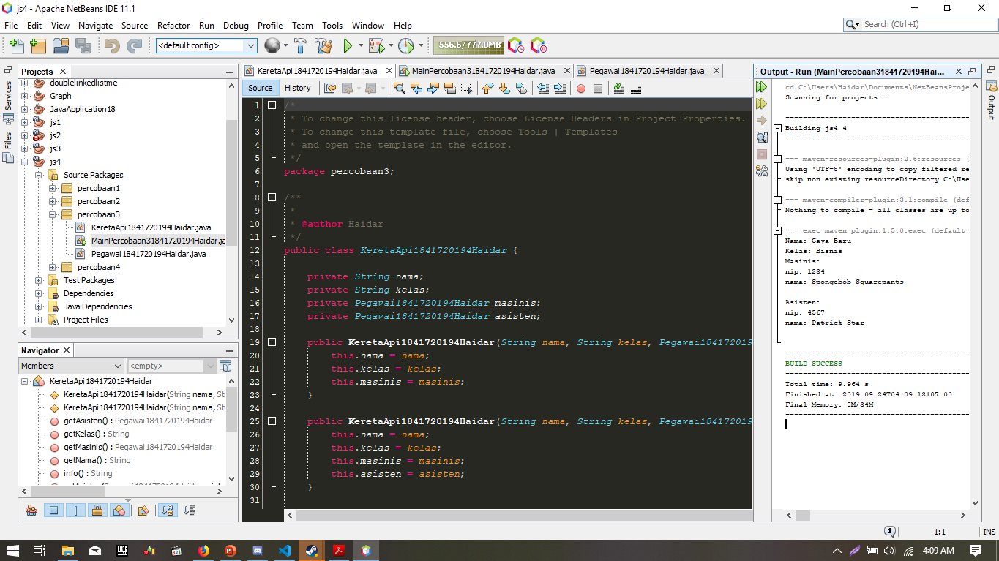
>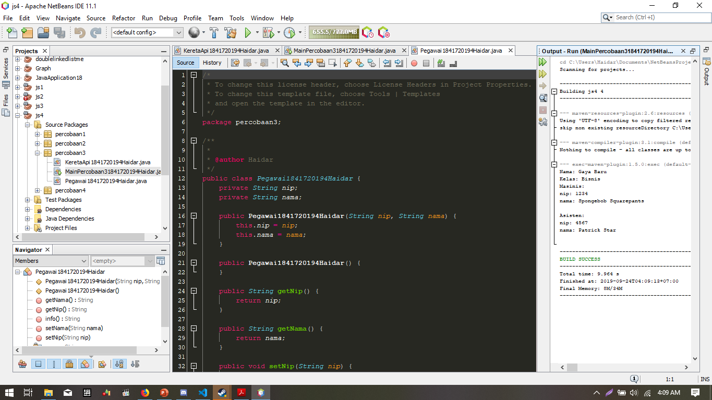

Link Program Untuk Percobaan Pertama
> 1. MainProject11841720194Haidar.java(Main) : [link ke kode program](../../src/4_Relasi_Class/percobaan3/MainPercobaan31841720194Haidar.java)

> 2. KeretaApi1841720194Haidar.java(objek) : [link ke kode program](../../src/4_Relasi_Class/percobaan2/KeretaApi1841720194Haidar.java)

> 3. Pegawai21841720194Haidar.java(Objek) : [link ke kode program](../../src/4_Relasi_Class/percobaan2/Pegawai1841720194Haidar.java)

## Pertanyaan Percobaan 3

1. Di dalam method info() pada class KeretaApi, baris this.masinis.info() dan this.asisten.info() digunakan untuk apa ?

> memanggil method info dalam class pegawai yang akan menampilkan nip dan nama pegawai 

2. Buatlah main program baru dengan nama class MainPertanyaan pada package yang sama. Tambahkan kode berikut pada method main() !
Pegawai masinis = new Pegawai("1234", "Spongebob Squarepants");
KeretaApi keretaApi = new KeretaApi("Gaya Baru", "Bisnis", masinis);
System.out.println(keretaApi.info());

>EROR
>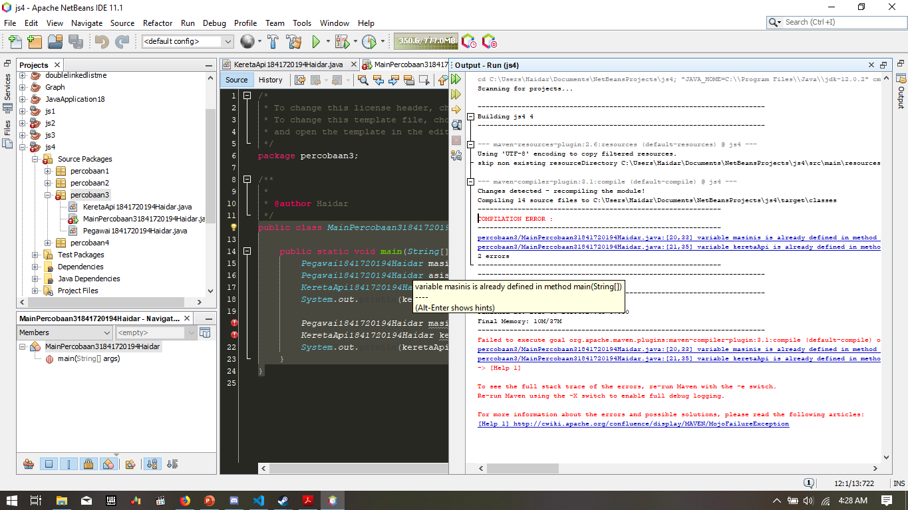 

3. Apa hasil output dari main program tersebut ? Mengapa hal tersebut dapat terjadi ?

>Terjadi tabrakan nama objek yang seharusnya sudah di instansi di atas

4. Perbaiki class KeretaApi sehingga program dapat berjalan !

>ya tinggal di ganti nama objeknya saja
>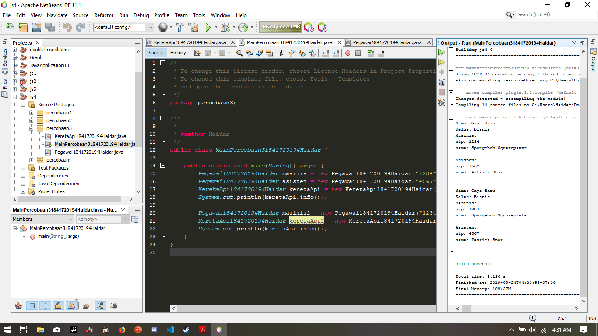 

   

## Percobaan 4

* pada percobaan ini kita di kenalkan dengan relasi yang beresali ke lainnya

>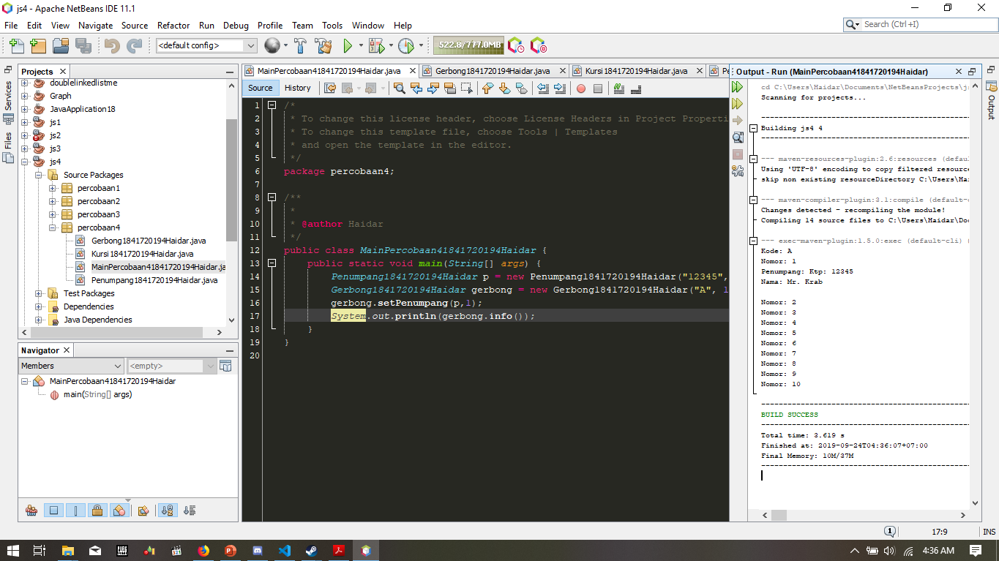
>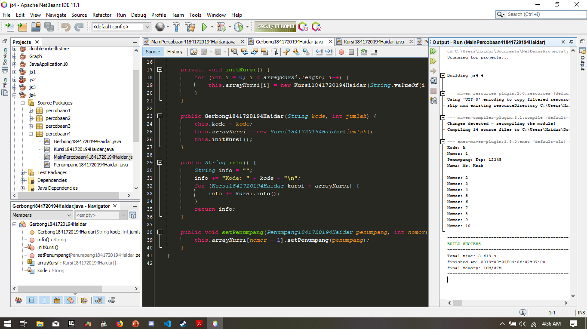
>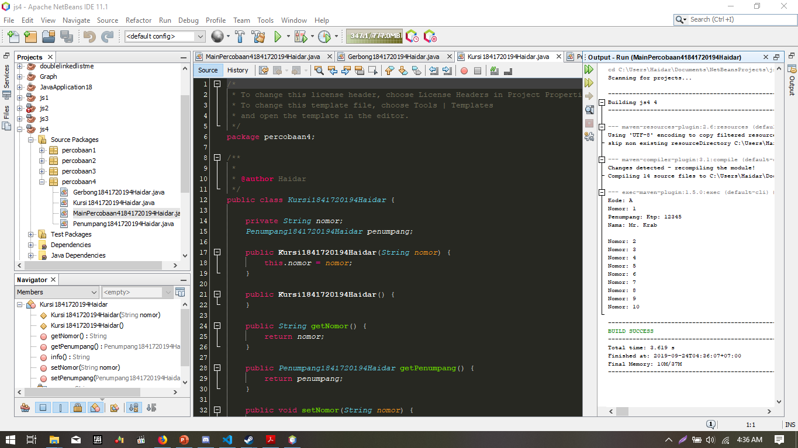
>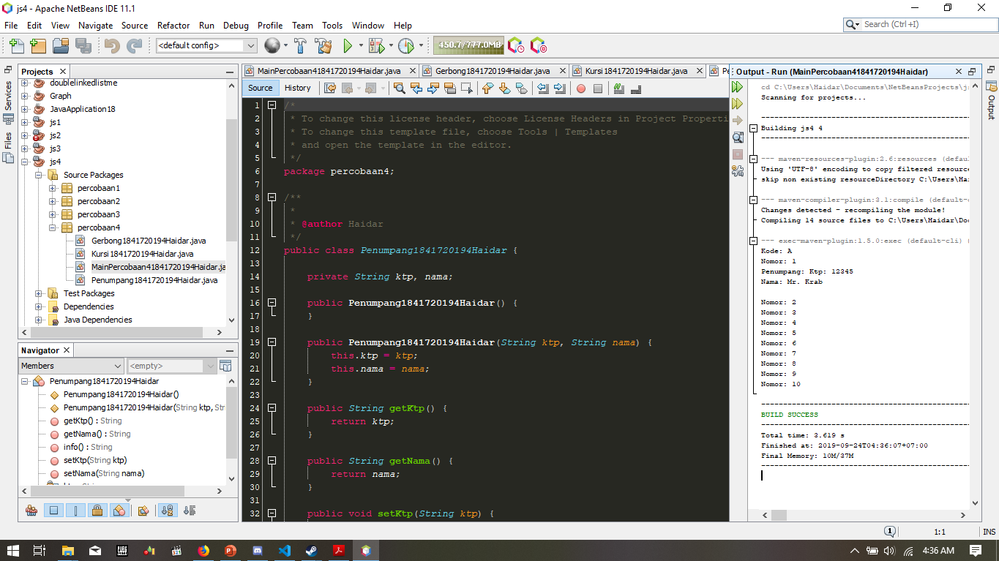

Link Program Untuk Percobaan Keempat

> 1. MainProject11841720194Haidar.java(Main) : [link ke kode program](../../src/4_Relasi_Class/percobaan4/MainPercobaan41841720194Haidar.java)

> 2. Pelanggan1841720194Haidar.java(objek) : [link ke kode program](../../src/4_Relasi_Class/percobaan4/Gerbong1841720194Haidar.java)

> 3. Mobil21841720194Haidar.java(Objek) : [link ke kode program](../../src/4_Relasi_Class/percobaan4/Kursi1841720194Haidar.java)

> 4. Sopir21841720194Haidar.java(objek) : [link ke kode program](../../src/4_Relasi_Class/percobaan4/Penumpang1841720194Haidar.java)

## Pertanyaan Percobaan 4

1. Pada main program dalam class MainPercobaan4, berapakah jumlah kursi dalam Gerbong A ?

> 10 gerbong

2. Perhatikan potongan kode pada method info() dalam class Kursi. Apa maksud kode tersebut ?
...
if (this.penumpang != null) {
info += "Penumpang: " + penumpang.info() + "\n";
}
...

> untuk menambahkan kata penumpang dan memanggil fungsi info dalam class yang nilai kembaliannya akan di masukkan pada string info 

3. Mengapa pada method setPenumpang() dalam class Gerbong, nilai nomor dikurangi dengan angka 1 ?

> karena rray start dari 0

4. Instansiasi objek baru budi dengan tipe Penumpang, kemudian masukkan objek baru tersebut pada gerbong dengan gerbong.setPenumpang(budi, 1). Apakah yang terjadi ?

>kursi satu ter-replace

5. Modifikasi program sehingga tidak diperkenankan untuk menduduki kursi yang sudah ada penumpang lain !

> 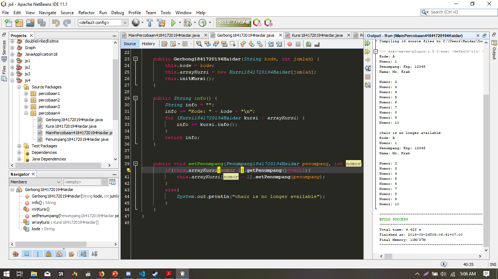
> if(this.arrayKursi[nomor-1].getPenumpang()==null){
>            this.arrayKursi[nomor - 1].setPenumpang(penumpang);
>      }
>      else{
>            System.out.println("chair is no longer available");
>      }

   

## Tugas

>
>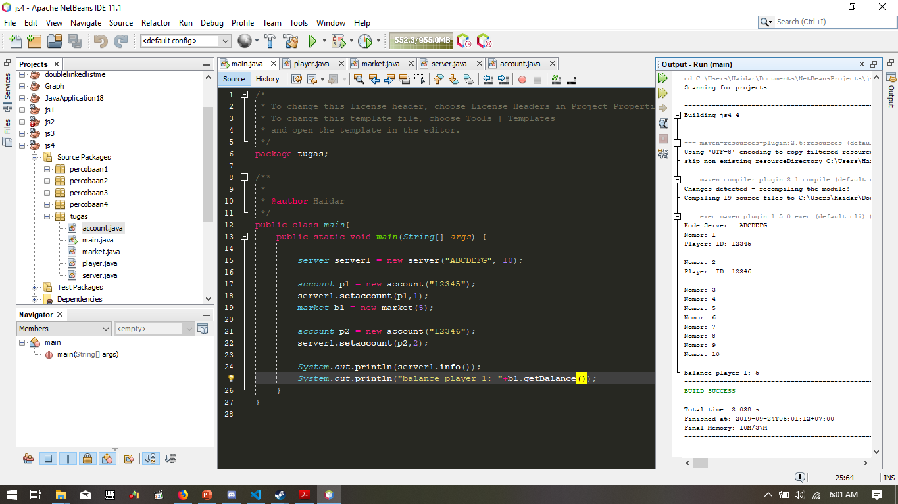
>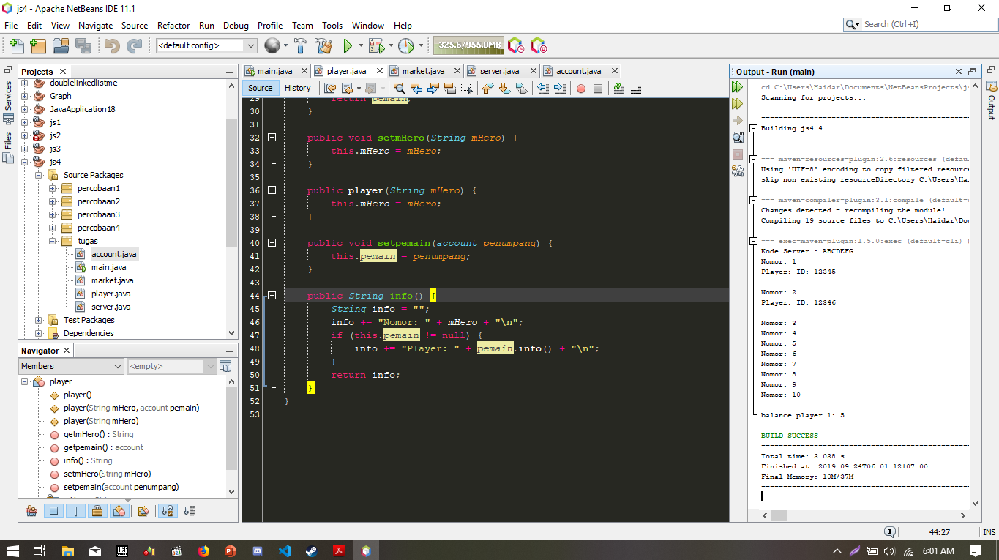
>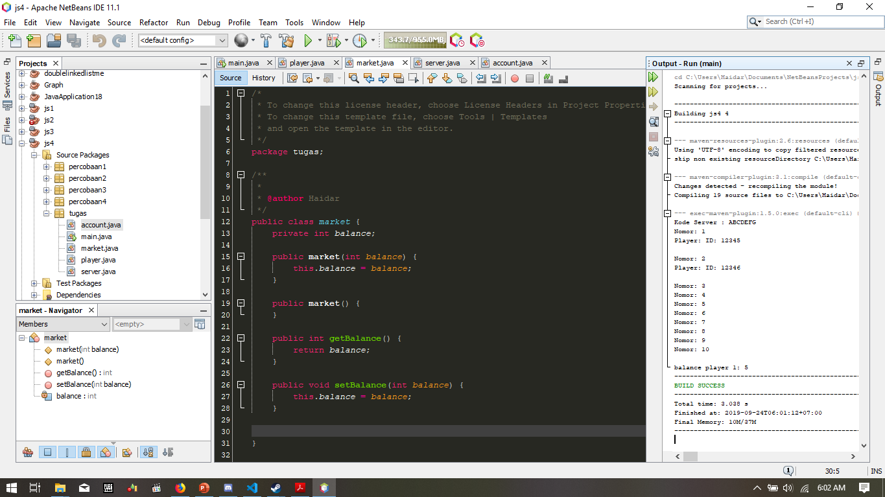
>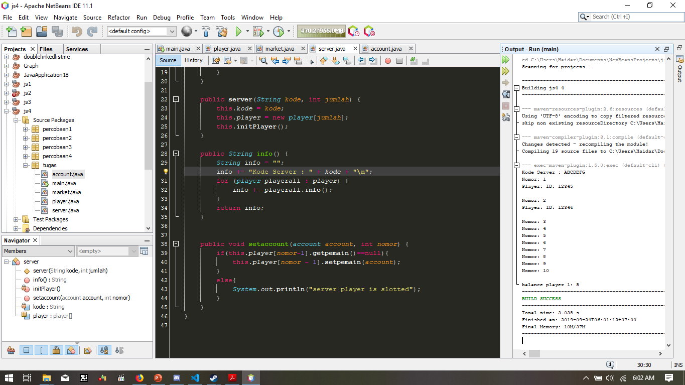

Link Program Untuk Tugas

> 1. main.java(Main) : [link ke kode program](../../src/4_Relasi_Class/tugas/main.java)

> 2. account.java(objek) : [link ke kode program](../../src/4_Relasi_Class/tugas/account.java)

> 3. market.java(Objek) : [link ke kode program](../../src/4_Relasi_Class/tugas/market.java)

> 4. player.java(objek) : [link ke kode program](../../src/4_Relasi_Class/tugas/player.java)

> 5. server.java(objek) : [link ke kode program](../../src/4_Relasi_Class/tugas/serverplayer.java)

## Kesimpulan

* Dari percobaan di atas telah di pelajari relasi antar class
* Dari percobaan di atas telah di pelajari lebih mendalam tentang pengaplikasiaan getter dan setter
* Dari percobaan di atas pengenalan konstruktor jenis baru
* Dari Percobaan di atas telah di jelaskan cara parsing berbagai macam data

## Pernyataan Diri

Saya menyatakan isi tugas, kode program, dan laporan praktikum ini dibuat oleh saya sendiri. Saya tidak melakukan plagiasi, kecurangan, menyalin/menggandakan milik orang lain.

Jika saya melakukan plagiasi, kecurangan, atau melanggar hak kekayaan intelektual, saya siap untuk mendapat sanksi atau hukuman sesuai peraturan perundang-undangan yang berlaku.

Ttd,

***(Haidar Sakti Oktafiansyah)***
