# Laporan Praktikum #6 - Inheritance

## Kompetensi

Setelah menempuh pokok bahasan ini, mahasiswa mampu:

1. Memahami konsep dasar inheritance atau pewarisan.
2. Mampu membuat suatu subclass dari suatu superclass tertentu.
3. Mampu mengimplementasikan konsep single dan multilevel inheritance.
4. Mampu membuat objek dari suatu  subclass dan melakukan pengaksesan terhadap atribut dan method baik yang dimiliki sendiri atau turunan dari superclass nya.

## Ringkasan Materi

konsep inheritance merupakan suatu cara untuk membuat class umum menjadi suatu class yang lebih spesifik. inheritance di buat agar bisa men-reuse suatu code di class yang berbeda dengan melimitasi hal-hal tertentu. dalam pewarisan modifier yang bisa di akses oleh subclassnya adalah protected dan public.

dalam pengimplementasian inheritance bisa di kenali dengan code sebagai berikut :
* super.namaAtribut
* super.namaMethod()
* super()
* super(parameter1, parameter2,dst)

   

## Percobaan 1

Penjelasan :

* Dalam Percobaan ini kita di berikan pemahaman tentang pengaplikasian extend class dengan cara menambahkan kata "extends" pada nama class yang akan di extend

>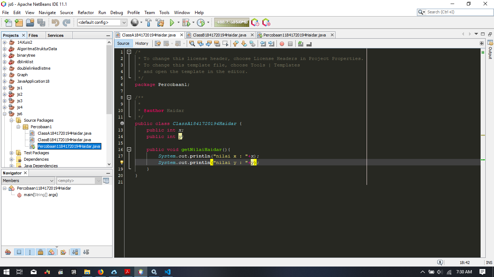
>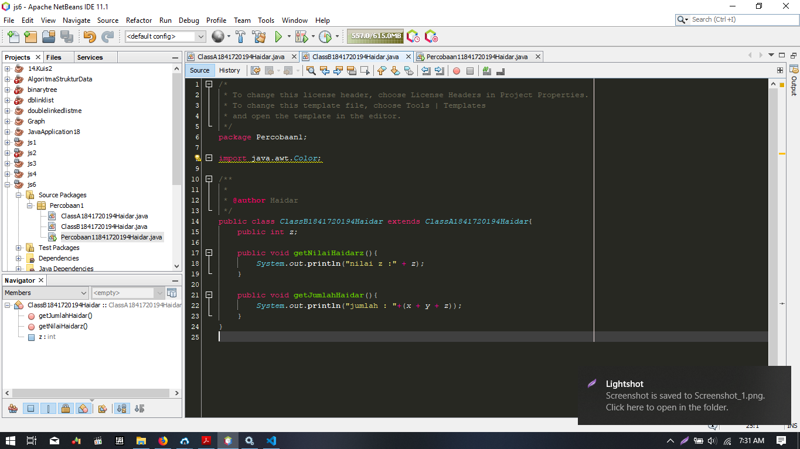
>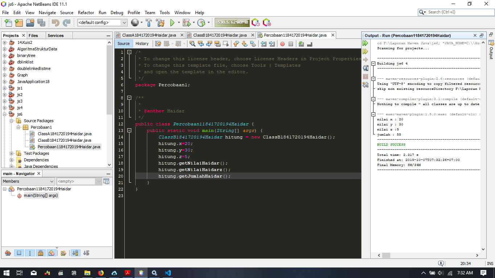

Link Program Untuk Percobaan Pertama
> 1. (ClassA) : [link ke kode program](../../src/6_Inheritance/Percobaan1/ClassA1841720194Haidar.java)

> 2. (ClassB) : [link ke kode program](../../src/6_Inheritance/Percobaan1/ClassB1841720194Haidar.java)

> 3. (Percobaan1) : [link ke kode program](../../src/6_Inheritance/Percobaan1/Percobaan1841720194Haidar.java)

## Pertanyaan Percobaan 1

1. Pada percobaan 1 diatas program yang dijalankan terjadi error, kemudian perbaiki sehingga program tersebut bisa dijalankan dan tidak error!

> public class ClassB1841720218Haidar extends ClassA1841720218Haidar{

2. Jelaskan apa penyebab program pada percobaan 1 ketika dijalankan terdapat error!

karena pada Percobaan11841720218Haidar mengharuskan pewarisan sifat dari classA... ke classB... yang mengharuskan fungsi extends, agar classB... bisa meng-akses fungsi dan atribut yang terdapat pada classA...

   

## Percobaan 2

Penjelasan :

* 

>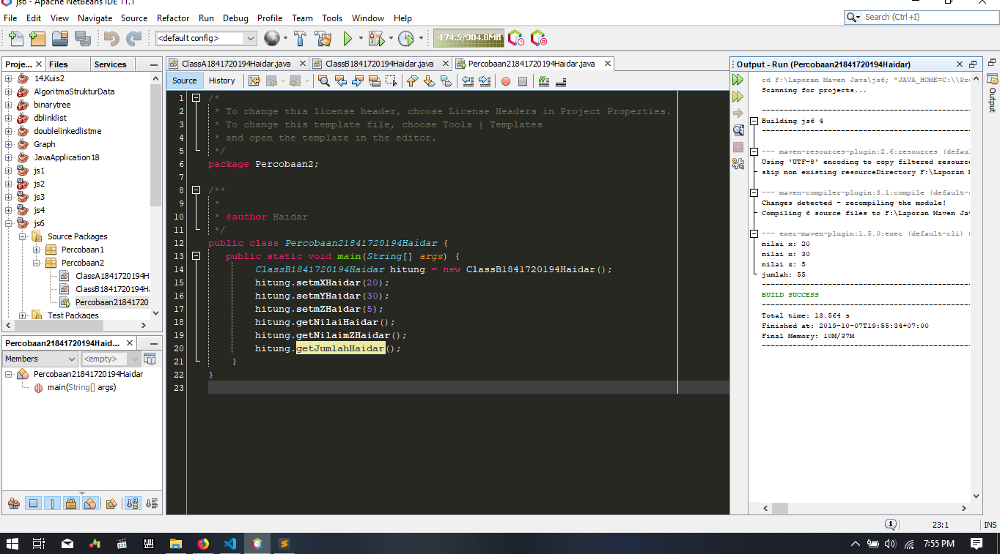
>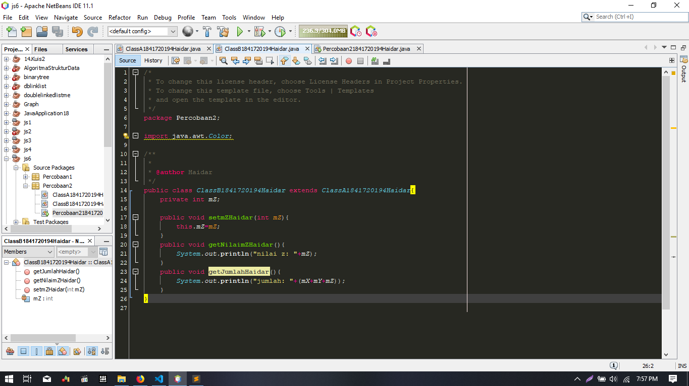
>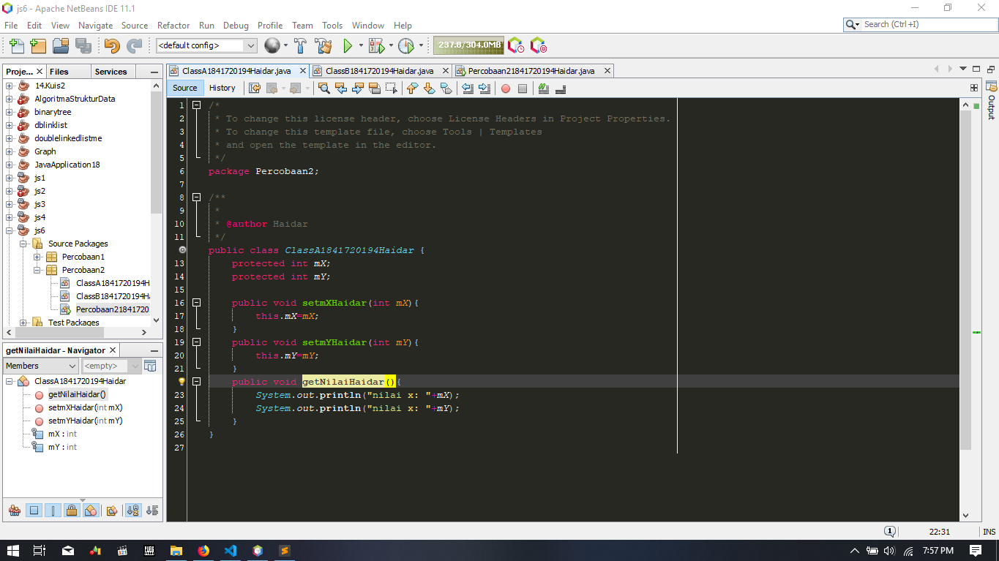

Link Program Untuk Percobaan kedua:

> 1. (ClassA) : [link ke kode program](../../src/6_Inheritance/percobaan2/ClassA1841720194Haidar.java)

> 2. (ClassB) : [link ke kode program](../../src/6_Inheritance/percobaan2/ClassB1841720194Haidar.java)

> 3. (Percobaan2) : [link ke kode program](../../src/6_Inheritance/percobaan2/Percobaan21841720194Haidar.java)

## Pertanyaan Percobaan 2

* Pada percobaan 2 diatas program yang dijalankan terjadi error, kemudian perbaiki sehingga program tersebut bisa dijalankan dan tidak error!

> protected int mX; protected int mY;

* jelaskan apa penyebab program pada percobaan 1 ketika dijalankan terdapat error!

> karena modifier atribut di setting sebagai private sehingga tidak bisa di akses oleh kelas lain yang bukan inheritence nya

   

## Percobaan 3

Penjelasan :

* pada percobaan 3 kita di jelaskan bagimana cara meng-akses atribut pada class parent yang telah di extend

>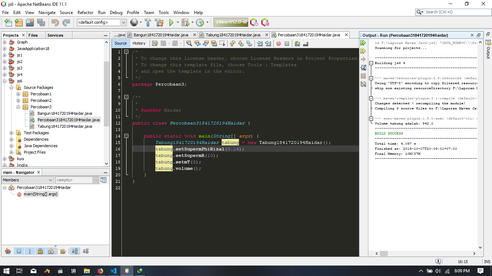
>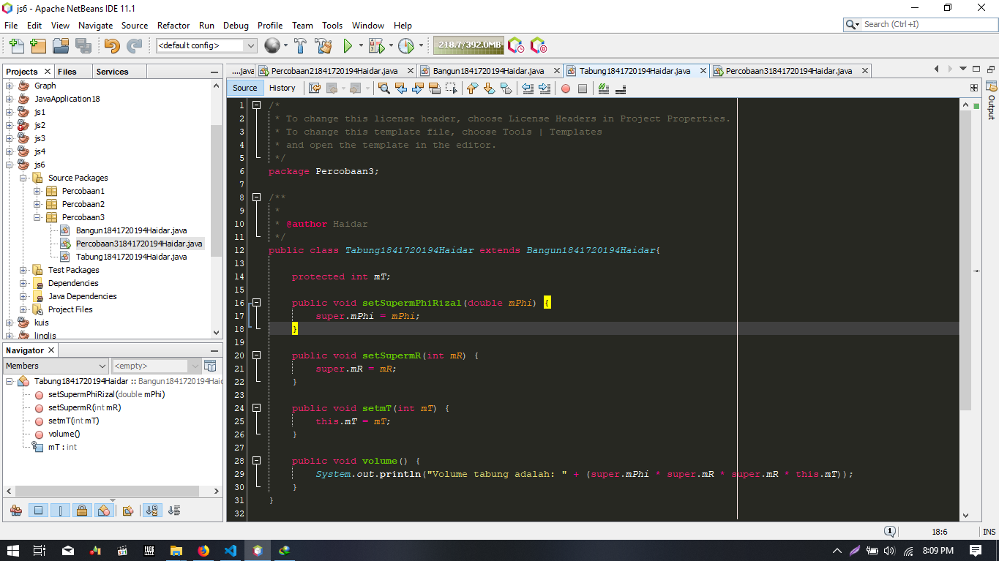
>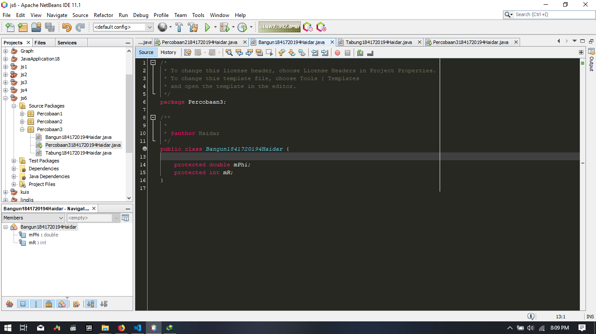

Link Program Untuk Percobaan Pertama Ketiga
> 1. (Percobaan3) : [link ke kode program](../../src/6_Inheritance/percobaan3/Percobaan31841720194Haidar.java)

> 2. (Bangun) : [link ke kode program](../../src/6_Inheritance/percobaan3/Bangun1841720194Haidar.java)

> 3. (Tabung) : [link ke kode program](../../src/6_Inheritance/percobaan3/Tabung1841720194Haidar.java)

## Pertanyaan Percobaan 3

1. Jelaskan fungsi “super” pada potongan program berikut di class Tabung!

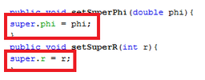

> super.namaatribut berfungsi untuk memanggil atribut pada class parent, 

2. Jelaskan fungsi “super” dan “this” pada potongan program berikut di class Tabung!

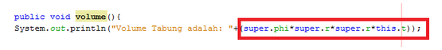

>super.namaatribut digunakan untuk memanggil atribut parent sedangkan this.namaatribut di gunakan untuk memanggil atribut class nya sendiri

3. Jelaskan mengapa pada class Tabung tidak dideklarasikan atribut “phi” dan “r” tetapi class tersebut dapat mengakses atribut tersebut!

>karena atribut phi dan r sudah terdapat pada class parent sehingga class tabung hanya memanggil atribut parent dan juga, kedua atribut tersebut di set dengan modifier protected sehingga bisa di akses oleh sub-classnya

   

## Percobaan 4

penjelasan :

* pada percobaan ini kita di ajarkan bagaimana cara men-test apakah konstruktor akan selalu berjalan pada tiap program yang di extend

>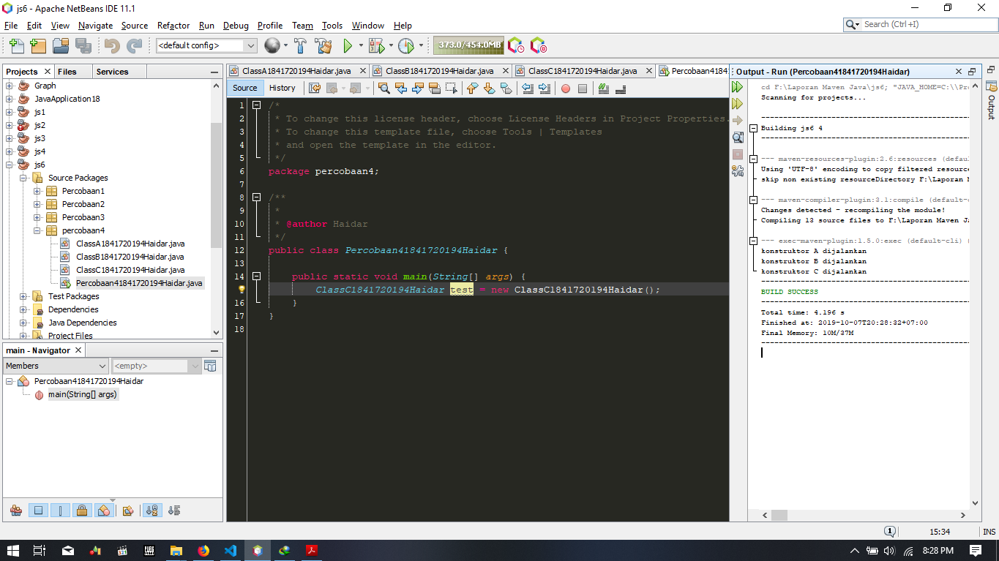
>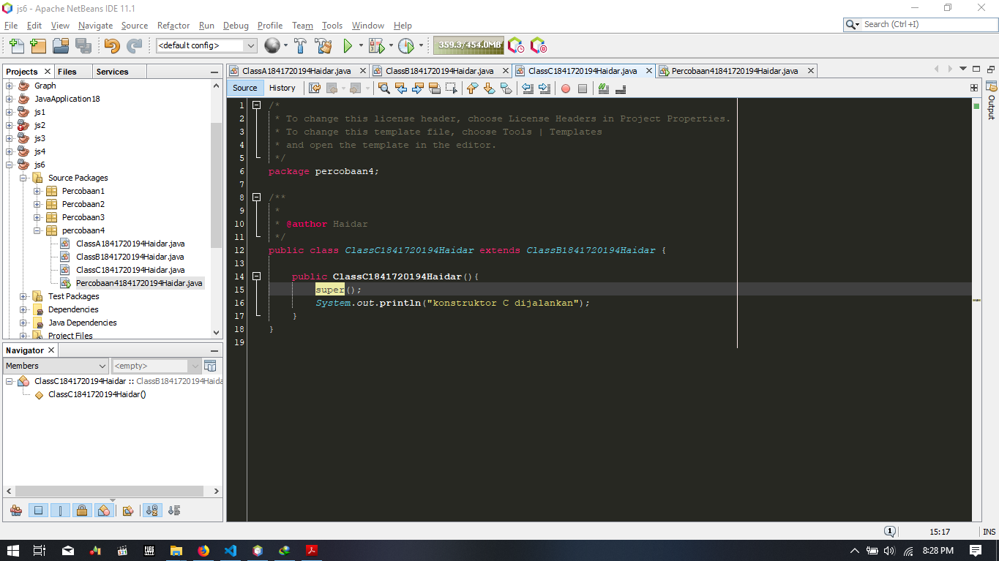
>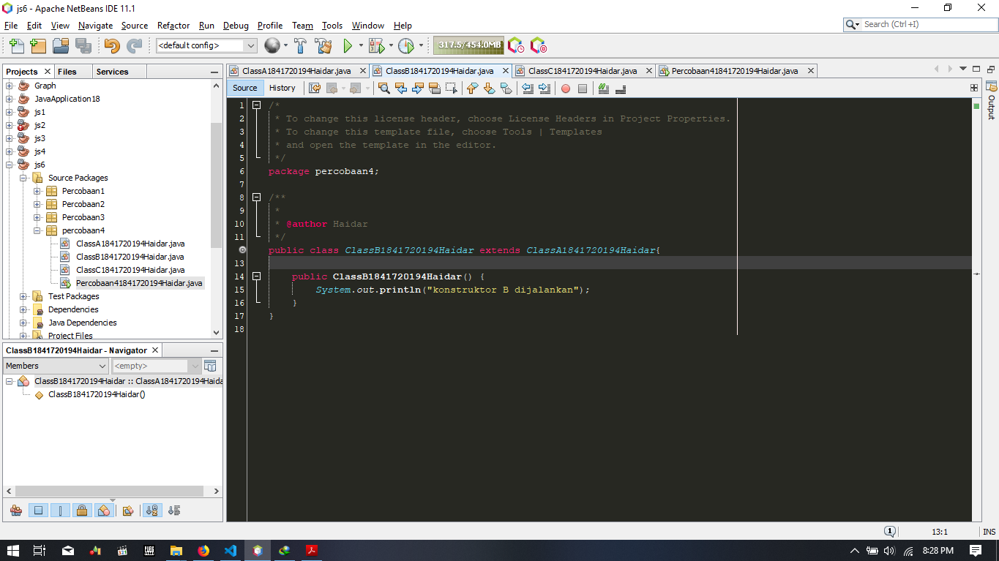
>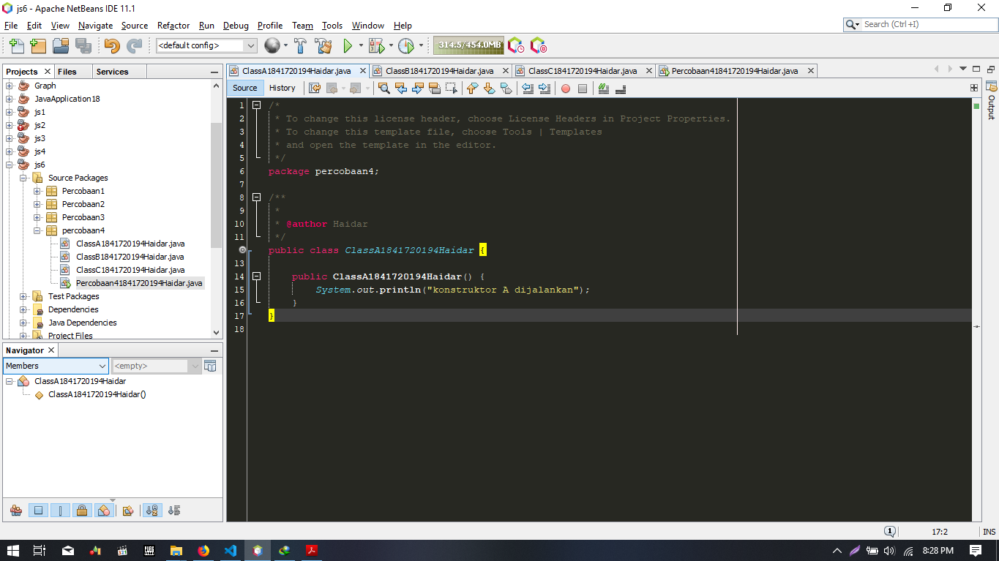
Link Program Untuk Percobaan Keempat

> 1. (Percobaan) : [link ke kode program](../../src/6_Inheritance/percobaan4/Percobaan41841720194Haidar.java)

> 2. (ClassA) : [link ke kode program](../../src/6_Inheritance/percobaan4/ClassA1841720194Haidar.java)

> 3. (ClassB) : [link ke kode program](../../src/6_Inheritance/percobaan4/ClassB1841720194Haidar.java)

> 4. (ClassC) : [link ke kode program](../../src/6_Inheritance/percobaan4/ClassC1841720194Haidar.java)

## Pertanyaan Percobaan 4

1. Pada percobaan 4 sebutkan mana class yang termasuk superclass dan subclass, kemudian jelaskan alasannya!

> superclass: ClassA1841720194Haidar
> subclass: ClassB1841720194Haidar, ClassC1841720194Haidar

2. Ubahlah isi konstruktor default ClassC seperti berikut:

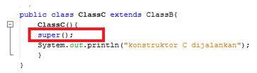

3. Ublah isi konstruktor default ClassC seperti berikut:

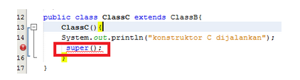

Ketika mengubah posisi super() dibaris kedua dalam kontruktor defaultnya dan terlihat ada error. Kemudian kembalikan super() kebaris pertama seperti sebelumnya, maka errornya akan hilang.

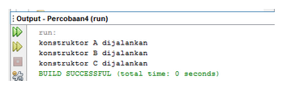

Perhatikan hasil keluaran ketika class Percobaan4 dijalankan. Kenapa bisa tampil output seperti berikut pada saat instansiasi objek test dari class ClassC, Jelaskan bagaimana urutan proses jalannya konstruktor saat objek test dibuat!

> urutan berjalannya contructor yaitu constructor parent teratas akan dijalankan pertama lalu constructor subclass dijalankan secara urut sesuai tingkatnya

4. Apakah fungsi super() pada potongan program dibawah ini di ClassC! 

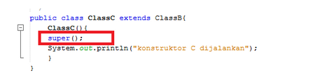

> memanggil konstruktor parent class /superclass

   

## Percobaan 5

penjelasan :

* pada percobaan ini kita di ajarkan bagaimana implementasi nyata program inheritance

>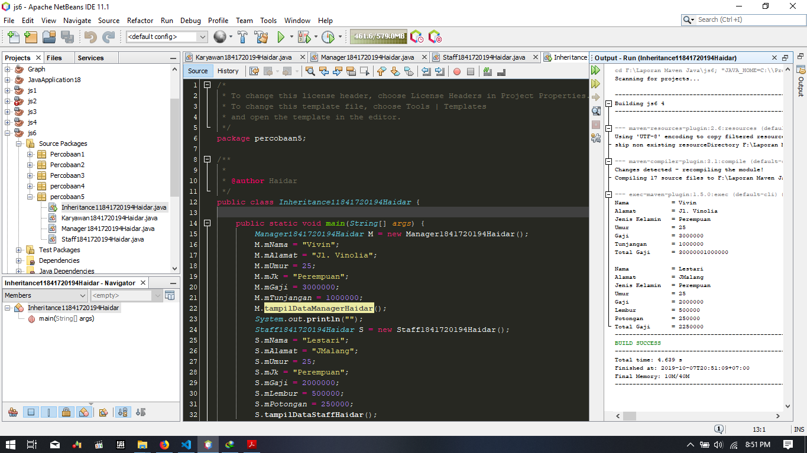
>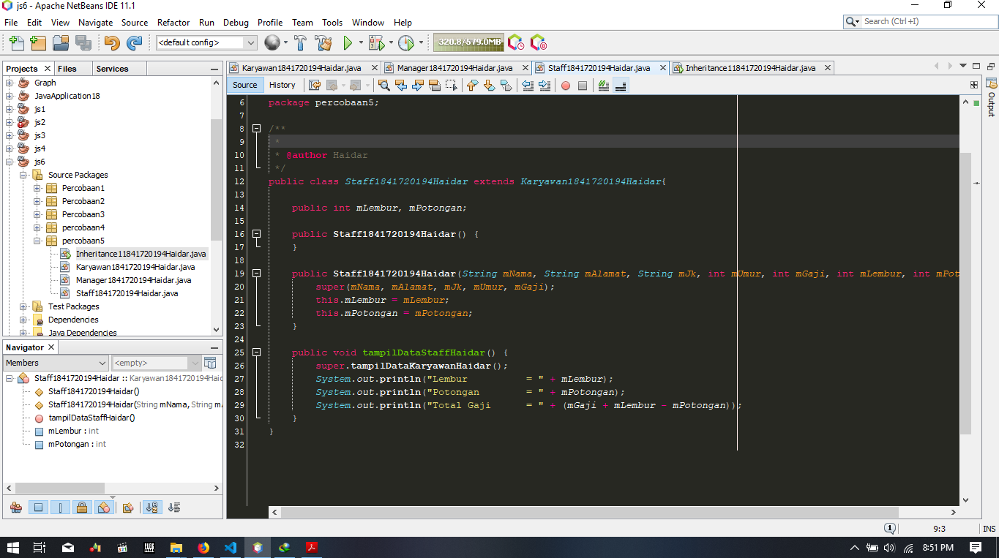
>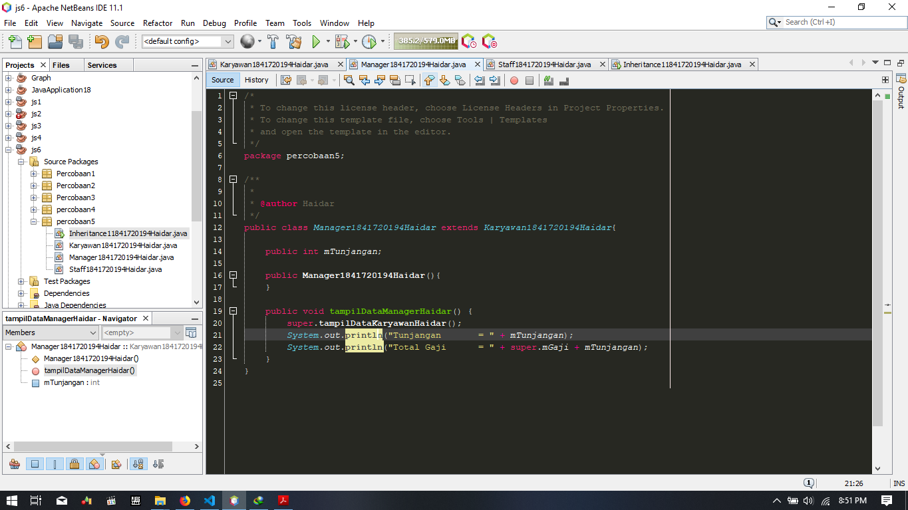
>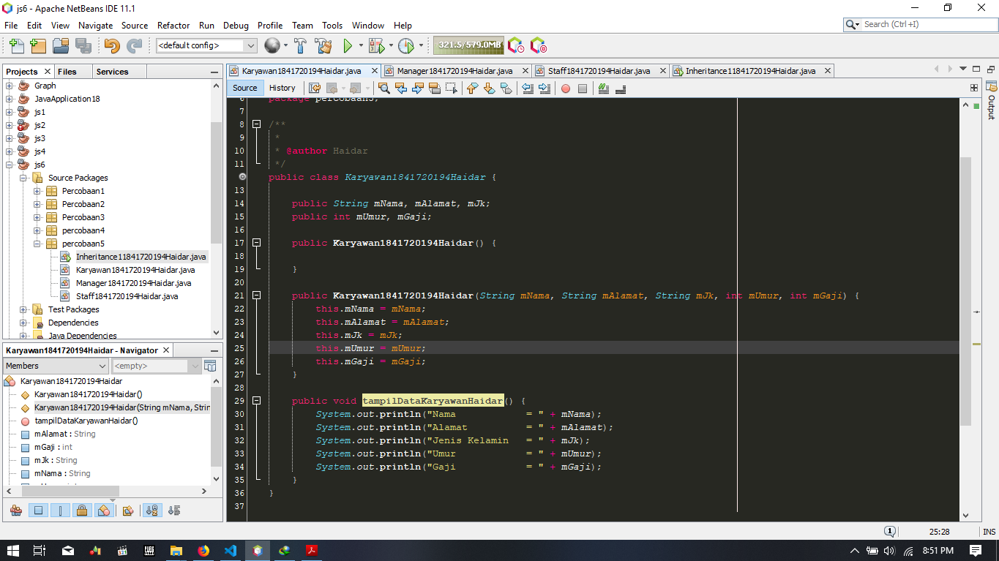

Link Program Untuk Percobaan Kelima

> 1. (Inheritance) : [link ke kode program](../../src/6_Inheritance/percobaan5/Inheritance11841720194Haidar.java)

> 2. (Karyawan) : [link ke kode program](../../src/6_Inheritance/percobaan5/Karyawan1841720194Haidar.java)

> 3. (Manager) : [link ke kode program](../../src/6_Inheritance/percobaan5/Manager1841720194Haidar.java)

> 4. (Staff) : [link ke kode program](../../src/6_Inheritance/percobaan5/Staff1841720194Haidar.java)

## Pertanyaan Percobaan 5

1. Sebutkan class mana yang termasuk super class dan sub class dari percobaan 1 diatas!

> superclass: Karyawan1841720194Haidar
> subclass: Manager1841720194Haidar, Staff1841720194Haidar

2. Kata kunci apakah yang digunakan untuk menurunkan suatu class ke class yang lain?

> extends

3. Perhatikan kode program pada class Manager, atribut apa saja yang dimiliki oleh class tersebut? Sebutkan atribut mana saja yang diwarisi dari class Karyawan!

> atribut classManager: mTunjangan
> atribut classSuper: mGaji

4. Jelaskan kata kunci super pada potongan program dibawah ini yang terdapat pada class Manager!

> karena digunaan untuk memanggil atribut parent classManager yaitu atribut classKaryawan

5. Program pada percobaan 1 diatas termasuk dalam jenis inheritance apa? Jelaskan alasannya!

> multiple inheritance karena karyawan mewariskan kepada dua subclass (mungkin)

   

## Percobaan 6

penjelasan : pengimplementasian program inheritance yang lebih besar

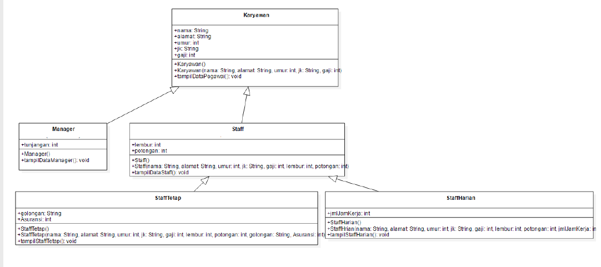

>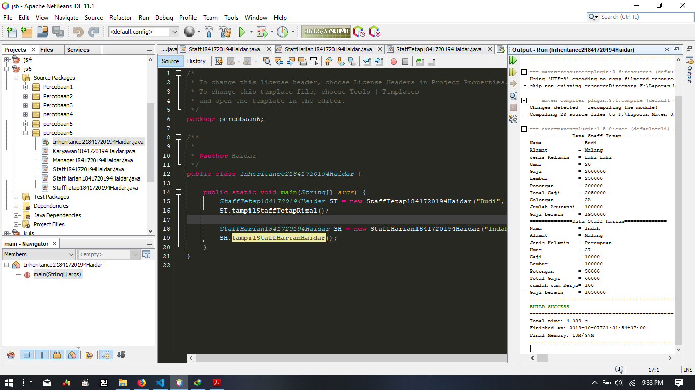
>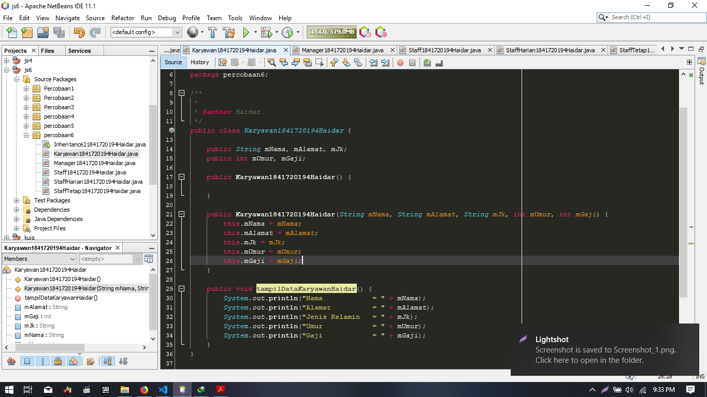
>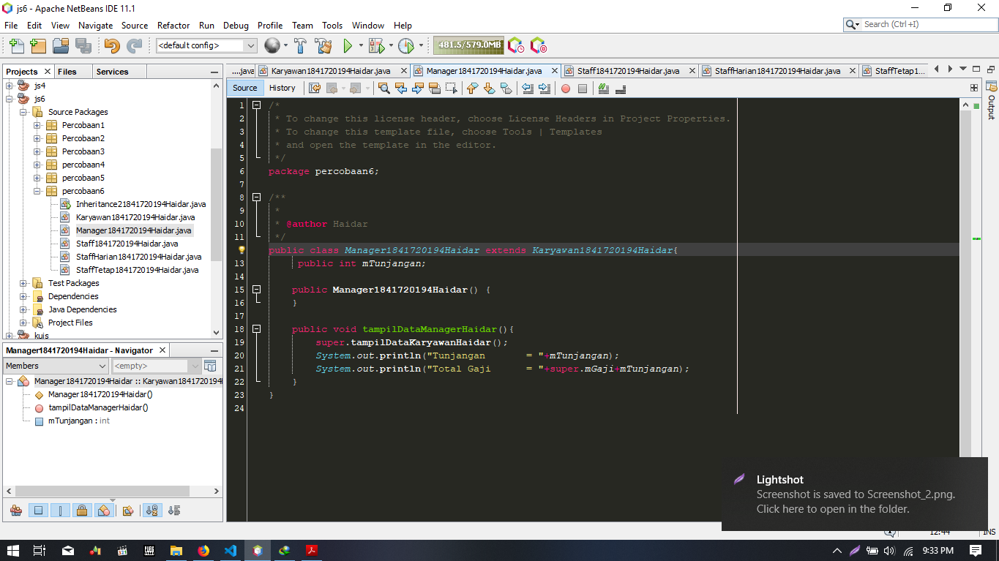
>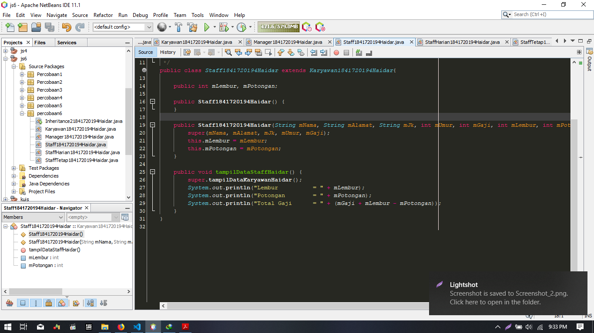
>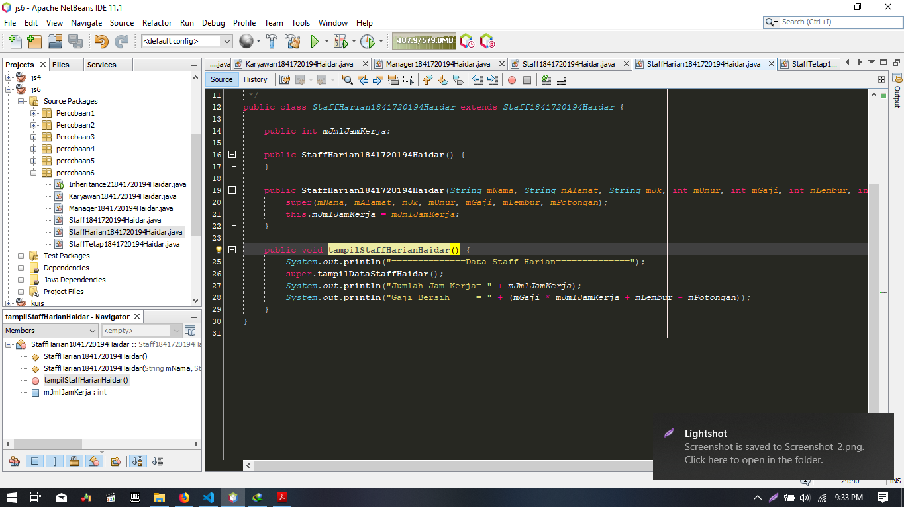
>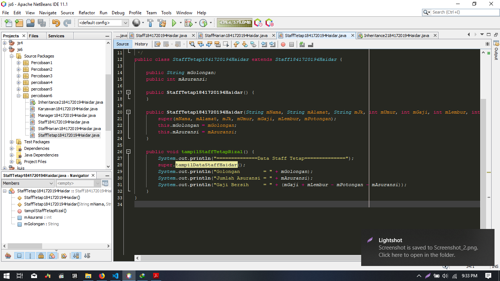

Link Program Untuk Percobaan Keenam :

> 1. (Inheritance) : [link ke kode program](../../src/6_Inheritance/percobaan6/Inheritance21841720194Haidar.java)

> 2. (Karyawan) : [link ke kode program](../../src/6_Inheritance/percobaan6/Karyawan1841720194Haidar.java)

> 3. (Manager) : [link ke kode program](../../src/6_Inheritance/percobaan6/Manager1841720194Haidar.java)

> 4. (Staff) : [link ke kode program](../../src/6_Inheritance/percobaan6/Staff1841720194Haidar.java)

> 5. (StaffHarian) : [link ke kode program](../../src/6_Inheritance/percobaan6/StaffHarian1841720194Haidar.java)

> 6. (StaffTetap) : [link ke kode program](../../src/6_Inheritance/percobaan6/StaffTetap1841720194Haidar.java)

## Pertanyaan Percobaan 6

1. Sebutkan class mana yang termasuk super class dan sub class dari percobaan 1 diatas!

> superclass: Karyawan1841720194Haidar
> subclass: Manager1841720194Haidar, Staff1841720194Haidar

2. Kata kunci apakah yang digunakan untuk menurunkan suatu class ke class yang lain?

> extends

3. Perhatikan kode program pada class Manager, atribut apa saja yang dimiliki oleh class tersebut? Sebutkan atribut mana saja yang diwarisi dari class Karyawan!

> atribut classManager: mTunjangan
> atribut classSuper: mGaji

4. Jelaskan kata kunci super pada potongan program dibawah ini yang terdapat pada class Manager!

> karena digunaan untuk memanggil atribut parent classManager yaitu atribut classKaryawan

5. Program pada percobaan 1 diatas termasuk dalam jenis inheritance apa? Jelaskan alasannya!

> multiple inheritance karena karyawan mewariskan kepada dua subclass (mungkin)

   

## Tugas
>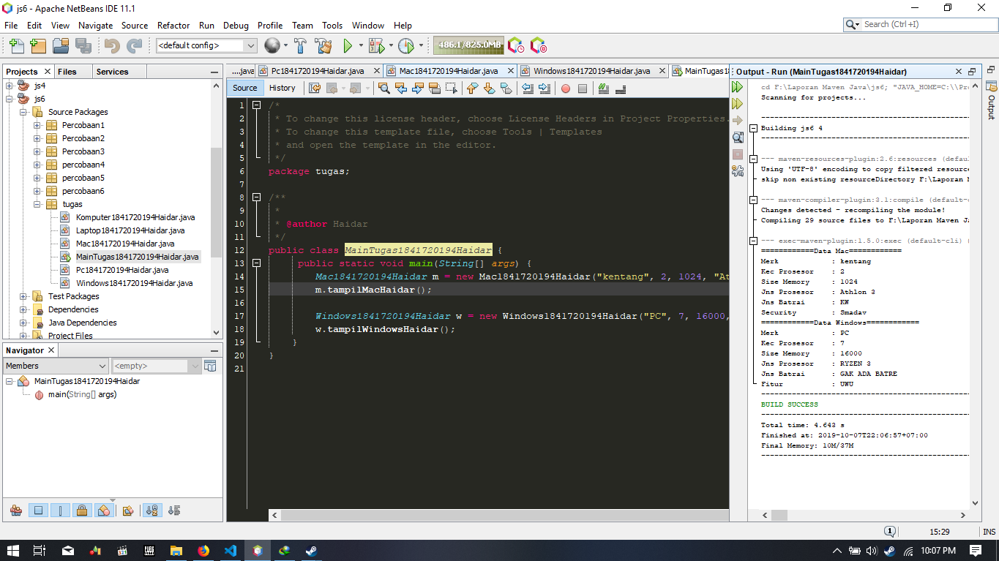
>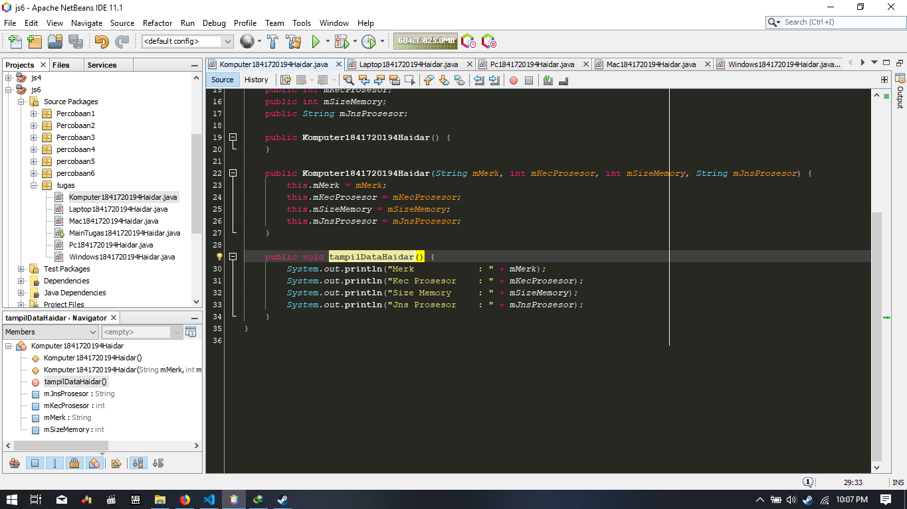
>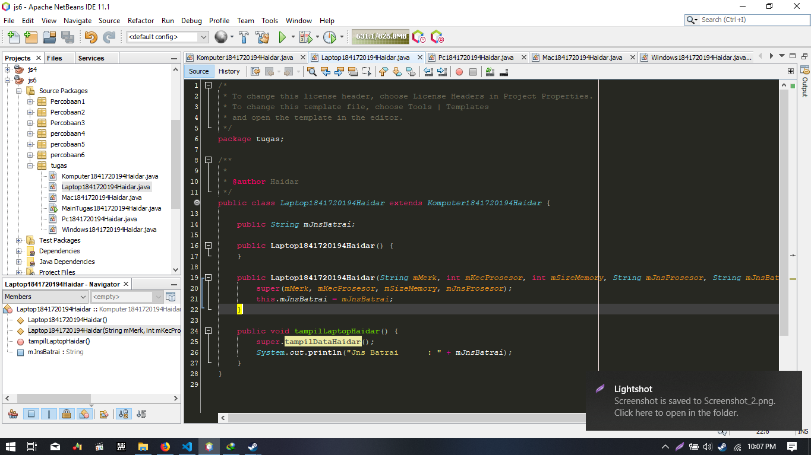
>
>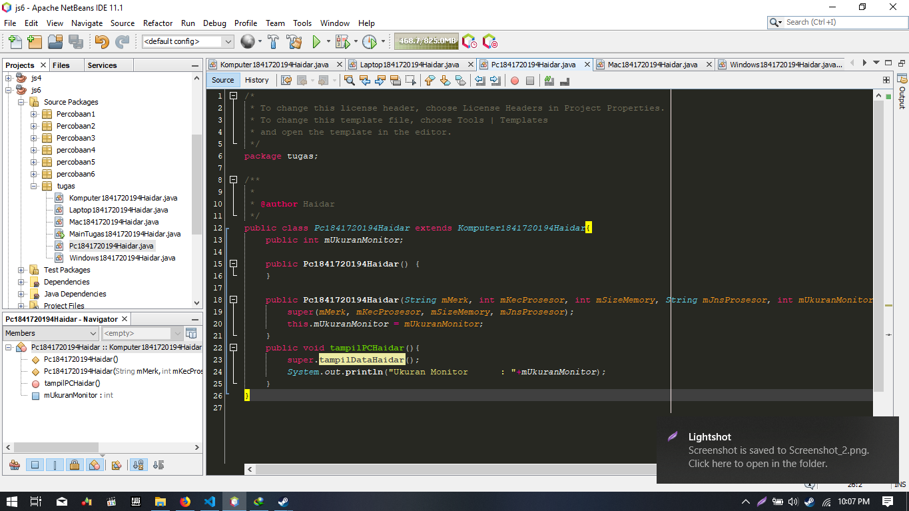
>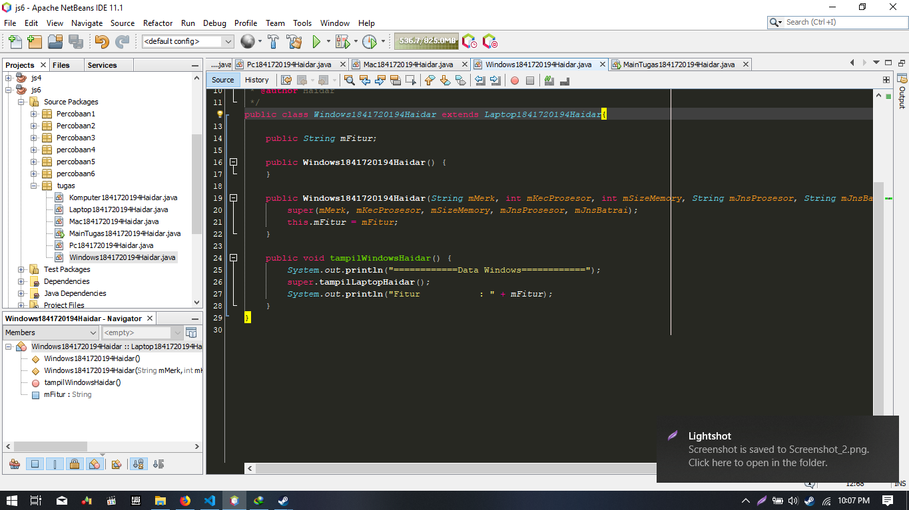

Link Program Untuk Tugas

> 1. (Komputer) : [link ke kode program](../../src/6_Inheritance/tugas/Komputer1841720194Haidar.java)

> 2. (Laptop) : [link ke kode program](../../src/6_Inheritance/tugas/Laptop1841720194Haidar.java)

> 3. (Mac) : [link ke kode program](../../src/6_Inheritance/tugas/Mac1841720194Haidar.java)

> 4. (MainTugas) : [link ke kode program](../../src/6_Inheritancetugas/MainTugas1841720194Haidar.java)

> 5. (Pc) : [link ke kode program](../../src/6_Inheritance/tugas/Pc1841720194Haidar.java)

> 6. (Windows) : [link ke kode program](../../src/6_Inheritance/tugas/Windows1841720194Haidar.java)

## Kesimpulan

* kita dapat mengenal apa itu inheritance di mulai dari analogi logika, class diagram, dan juga penggunaan inheritance melalui fungsi extends, super, dan yang terakhir urutan pemanggilan konstruktor class yang di extend oleh kelas lain

## Pernyataan Diri

Saya menyatakan isi tugas, kode program, dan laporan praktikum ini dibuat oleh saya sendiri. Saya tidak melakukan plagiasi, kecurangan, menyalin/menggandakan milik orang lain.

Jika saya melakukan plagiasi, kecurangan, atau melanggar hak kekayaan intelektual, saya siap untuk mendapat sanksi atau hukuman sesuai peraturan perundang-undangan yang berlaku.

Ttd,

***(Haidar Sakti Oktafiansyah)***
