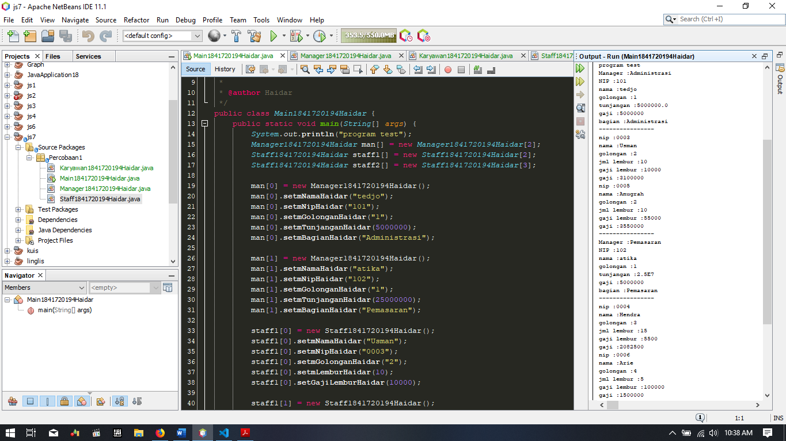
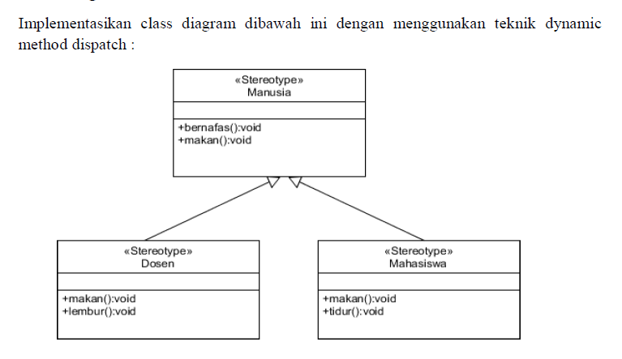
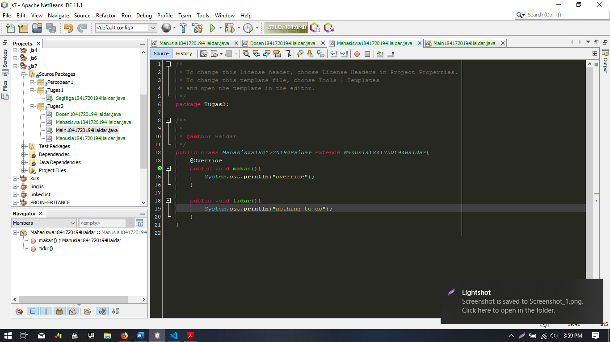

# Laporan Praktikum #7 - Overriding dan Overloading

## Kompetensi

Setelah menempuh pokok bahasan ini, mahasiswa mampu:

Setelah menempuh pokok bahasan ini, mahasiswa mampu :
1. Memahami konsep overloading dan overriding,
2. Memahami perbedaan overloading dan overriding,
3. Ketepatan dalam mengidentifikasi method overriding dan overloading
4. Ketepatan dalam mempraktekkan instruksi pada jobsheet 
5. Mengimplementasikan method overloading dan overriding.

   

## Percobaan 1

Penjelasan :

* Dalam percobaan ini kita akan melakukan beberapa hal yang merepresentasikan overriding dan overloading seperti tujuan dari jobhseet ini 

>
>
>

Link Program Untuk Percobaan Pertama
> 1. (Main) : [link ke kode program](../../src/7_Overriding_dan_Overloading/mavenproject3/src/main/java/Percobaan1/Main1841720194Haidar.java)

> 2. (Karayawan) : [link ke kode program](../../src/7_Overriding_dan_Overloading/mavenproject3/src/main/java/Percobaan1/Karyawan1841720194Haidar.java)

> 3. (Manager) : [link ke kode program](../../src/7_Overriding_dan_Overloading/mavenproject3/src/main/java/Percobaan1/Manager1841720194Haidar.java)

> 4. (Staff) : [link ke kode program](../../src/7_Overriding_dan_Overloading/mavenproject3/src/main/java/Percobaan1/Staff1841720194Haidar.java)

   

## Latihan

### Latihan 1

* Dari source coding diatas terletak dimanakah overloading?
> 

* Jika terdapat overloading ada berapa jumlah parameter yang berbeda?
> fungsi awal ada 2 dan untuk yang meng-overloading ada 3

 ----------------------------------------------------------------------------------------------------------------  

### Latihan 2

* Dari source coding diatas terletak dimanakah overloading?
> 

* Jika terdapat overloading ada berapa tipe parameter yang berbeda?
> ada 2 buah

 ----------------------------------------------------------------------------------------------------------------  

### Latihan 3

* Dari source coding diatas terletak dimanakah overriding?
>

* Jabarkanlah apabila sourcoding diatas jika terdapat overriding?
>  pada class ikan terdapat sebuah fungsi dengan nama swim dan tidak memiliki parameter, dan di buat sebuah class lain yang meng-extend class ikan dengan nama piranha, pada class tersebut terdapat pula sebuah fungsi bernama swin dan pula tidak memiliki parameter, maka pada saat pemanggilan fungsi swim dari class piranha pada class main, fungsi swim akan meng-override fungsi swim yang ada pada fungsi ikan sehingga akan memunculkan output "piranha makan daging" 

   

## Tugas
### Nomor 1 

>

>(Main) : [link ke kode program](../../src/7_Overriding_dan_Overloading/mavenproject3/src/main/java/Tugas1/Segitiga1841720194Haidar.java)

 ----------------------------------------------------------------------------------------------------------------  

### Nomor 2

> 
> 
> 
> 

>(Main) : [link ke kode program](../../src/7_Overriding_dan_Overloading/mavenproject3/src/main/java/Tugas2/Main1841720194Haidar.java)

>(Manusia) : [link ke kode program](../../src/7_Overriding_dan_Overloading/mavenproject3/src/main/java/Tugas2/Manusia1841720194Haidar.java)

>(Dosen) : [link ke kode program](../../src/7_Overriding_dan_Overloading/mavenproject3/src/main/java/Tugas2/Dosen1841720194Haidar.java)

>(Mahasiswa) : [link ke kode program](../../src/7_Overriding_dan_Overloading/mavenproject3/src/main/java/Tugas2/Mahasiswa1841720194Haidar.java)

## Kesimpulan

* pada jobsheet ini kita di perkenalkan override dan overload
* pada jobsheet ini kita di perkenalkan pengimplementasian override dan overload sehingga fungsi bisa di gunakan berulang dan menghemat memori otak dalam mengingat nama sebuah fungsi
* pada jobsheet ini kita di perkenalkan dengan metode dynamic dispatch
* pada jobsheet ini kita di buktikan penyederhanaan program dengan menggunakan object oriented programming

## Pernyataan Diri

Saya menyatakan isi tugas, kode program, dan laporan praktikum ini dibuat oleh saya sendiri. Saya tidak melakukan plagiasi, kecurangan, menyalin/menggandakan milik orang lain.

Jika saya melakukan plagiasi, kecurangan, atau melanggar hak kekayaan intelektual, saya siap untuk mendapat sanksi atau hukuman sesuai peraturan perundang-undangan yang berlaku.

Ttd,

***(Haidar Sakti Oktafiansyah)***
