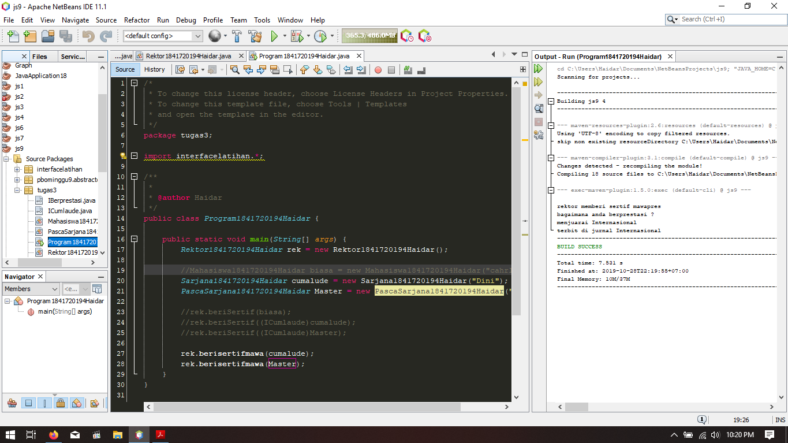

# Laporan Praktikum #7 - Overriding dan Overloading

## Kompetensi

Setelah menyelesaikan lembar kerja ini mahasiswa diharapkan mampu:
1. Menjelaskan maksud dan tujuan penggunaan Abstract Class;
2. Menjelaskan maksud dan tujuan penggunaan Interface;
3. Menerapkan Abstract Class dan Interface di dalam pembuatan program.

   

## Ringkasan Materi

   

## Percobaan 1

Penjelasan :

* Dalam percobaan ini kita akan melakukan beberapa hal yang mengimplementasikan abstract class
* Dalam Percobaan ini kita di kenalkan dengan bagaimana menggunakan abstract class dan syarat apa saja yang harus di penuhi untuk menggunakan abstract class 
* Dalam Percobaan ini terdapat pembuktian child suatu class yang mengextend class  abstract di hasruskan untuk mengoverride method abstract yang ada pada dalam class tersebut

>

Link Program Untuk Percobaan Pertama :
> 1. (Main) : [link ke kode program](../../src/9_Abstract_Class_dan_Interface/pbominggu9/abstractclass/Main1841720194Haidar.java)

> 2. (Hewan) : [link ke kode program](../../src/9_Abstract_Class_dan_Interface/pbominggu9/abstractclass/Hewan1841720194Haidar.java)

> 3. (Orang) : [link ke kode program](../../src/9_Abstract_Class_dan_Interface/pbominggu9/abstractclass/Orang1841720194Haidar.java)

> 4. (Ikan) : [link ke kode program](../../src/9_Abstract_Class_dan_Interface/pbominggu9/abstractclass/Ikn1841720194Haidar.java)

> 5. (Kucing) : [link ke kode program](../../src/9_Abstract_Class_dan_Interface/pbominggu9/abstractclass/Kucing1841720194Haidar.java)

## Pertanyaan Percobaan 1

1. Bolehkah apabila sebuah class yang meng-extend suatu abstract class tidak mengimplementasikan method abstract yang ada di class induknya? Buktikan!

Tidak Bisa 
>

   

## Percobaan 2

Penjelasan :

* Dalam Percobaan ini kita di kenalkan dengan class interface,cara pembuatannya dan bagaimana cara penggunaannya

>

Link Program Untuk Percobaan kedua:

> 1. (ICumlaude) : [link ke kode program](../../src/9_Abstract_Class_dan_Interface/pbominggu9/interfacelatihan/ICumlaude.java)

> 2. (Mahasiwa) : [link ke kode program](../../src/9_Abstract_Class_dan_Interface/pbominggu9/interfacelatihan/Mahasiswa1841720194Haidar.java)

> 3. (PascaSarjana) : [link ke kode program](../../src/9_Abstract_Class_dan_Interface/pbominggu9/interfacelatihan/PascaSarjana1841720194Haidar.java)

> 4. (Program) : [link ke kode program](../../src/9_Abstract_Class_dan_Interface/pbominggu9/interfacelatihan/Program1841720194Haidar.java)

> 5. (Rektor) : [link ke kode program](../../src/9_Abstract_Class_dan_Interface/pbominggu9/interfacelatihan/Rektor1841720194Haidar.java)

> 6. (Sarjana) : [link ke kode program](../../src/9_Abstract_Class_dan_Interface/pbominggu9/interfacelatihan/Sarjana1841720194Haidar.java)

## Pertanyaan Percobaan 2

1. Mengapa pada langkah nomor 9 terjadi error? Jelaskan!
> Karena pada class mahasiswa, dia tidak mengimplementasikan class Inteface ICumlaude, padahal parsing parameter pada fungsi rektor dia memiliki tipe data ICumlaude, sehingga tidak kompatibel untuk memparsing data bertipe mahasiswa yang tidak memiliki hubungan apapun dengan class ICumlaude 

2. Dapatkah method kuliahDiKampus() dipanggil dari objek sarjanaCumlaude di class Program? Mengapa demikian?
> bisa karena objek telah di kenalkan dengan nama cumalude(di program saya)

3. Dapatkah method kuliahDiKampus() dipanggil dari parameter mahasiswa di method beriSertifikatCumlaude() pada class Rektor? Mengapa demikian?
> Tidak Bisa Karena method tidak mengambalikan nilai yang bisa di simpan dalam bentuk objek Icumlaude

4. Modifikasilah method beriSertifikatCumlaude() pada class Rektor agar hasil eksekusi class Program menjadi seperti berikut ini:
>

   

## Percobaan 3

Penjelasan :

* pada percobaan ini kita akan di ajak mengimplementasikan multi value implement yang akan berguna di kedepannya

>

Link Program Untuk Percobaan Pertama Ketiga
> 1. (ICumlaude) : [link ke kode program](../../src/9_Abstract_Class_dan_Interface/pbominggu9/tugas3/ICumlaude.java)

> 2. (Mahasiwa) : [link ke kode program](../../src/9_Abstract_Class_dan_Interface/pbominggu9/tugas3/Mahasiswa1841720194Haidar.java)

> 3. (PascaSarjana) : [link ke kode program](../../src/9_Abstract_Class_dan_Interface/pbominggu9/tugas3/PascaSarjana1841720194Haidar.java)

> 4. (Program) : [link ke kode program](../../src/9_Abstract_Class_dan_Interface/pbominggu9/tugas3/Program1841720194Haidar.java)

> 5. (Rektor) : [link ke kode program](../../src/9_Abstract_Class_dan_Interface/pbominggu9/tugas3/Rektor1841720194Haidar.java)

> 6. (Sarjana) : [link ke kode program](../../src/9_Abstract_Class_dan_Interface/pbominggu9/tugas3/Sarjana1841720194Haidar.java)

> 7.(IBerprestasi) : [link ke kode program](../../src/9_Abstract_Class_dan_Interface/pbominggu9/tugas3/IBerprestasi.java)

## Pertanyaan Percobaan 3

1. Apabila Sarjana Berprestasi harus menjuarai kompetisi NASIONAL dan menerbitkan artikel di jurnal NASIONAL, maka modifikasilah class-class yang terkait pada aplikasi Anda agar di class Program objek pakRektor dapat memberikan sertifikat mawapres pada objek sarjanaCumlaude.

>>

   

## Kesimpulan

* saya mengerti cara pengenalan, pembuatan, penggunaan abstract class, interface class, dan interface multivalue class

## Pernyataan Diri

Saya menyatakan isi tugas, kode program, dan laporan praktikum ini dibuat oleh saya sendiri. Saya tidak melakukan plagiasi, kecurangan, menyalin/menggandakan milik orang lain.

Jika saya melakukan plagiasi, kecurangan, atau melanggar hak kekayaan intelektual, saya siap untuk mendapat sanksi atau hukuman sesuai peraturan perundang-undangan yang berlaku.

Ttd,

***(Haidar Sakti Oktafiansyah)***
